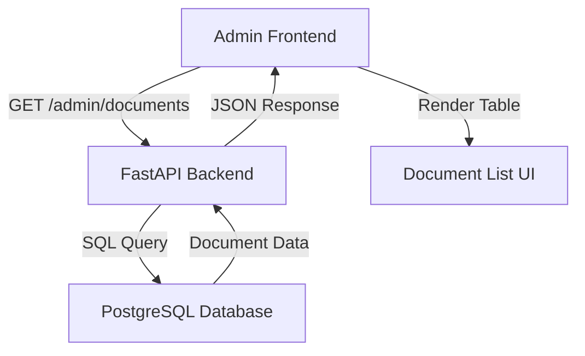

# Design Document

## Overview

This design addresses the critical regression where the admin document management page displays "0 documents" instead of the expected document list. The issue appears to be related to recent changes in the admin document edit functionality and requires investigation of both the frontend data fetching logic and the backend API endpoint.

## Architecture

The admin document management system follows a standard client-server architecture:



### Current Flow Analysis

1. **Frontend Request**: Admin page calls `fetchDocuments()` which makes GET request to `/admin/documents`
2. **Backend Processing**: FastAPI endpoint queries database and returns document list
3. **Frontend Rendering**: Response data populates the document table
4. **Issue**: Step 2 or 3 is failing, resulting in empty document list

## Components and Interfaces

### Frontend Component: DocumentsManagement

**Location**: `frontend/app/admin/documents/page.tsx`

**Key Functions**:
- `fetchDocuments(forceRefresh)`: Retrieves document list from API
- `useEffect()`: Handles initial data loading and filtering
- Document table rendering with pagination

**Current Implementation Issues**:
```typescript
// Potential issue: API endpoint construction
const endpoint = `${API_URL}/admin/documents${forceRefresh ? '?refresh=true' : ''}`;
const response = await apiClient.get(endpoint);
const data = response.data;
const docs = data.documents || []; // May be undefined if API structure changed
```

### Backend Endpoint: Admin Documents API

**Expected Location**: `backend/main.py` or separate admin routes file

**Expected Functionality**:
- Query documents table with joins to authors
- Return paginated document list with metadata
- Handle refresh parameter for cache invalidation

**Potential Issues**:
1. Endpoint may not exist or be misconfigured
2. Database query may be failing
3. Response format may have changed
4. Authentication/authorization issues

### Database Schema

**Primary Tables**:
- `documents`: Core document metadata
- `authors`: Author information  
- `document_authors`: Many-to-many relationship
- `books`: Extended metadata (may be used instead of documents)

**Query Requirements**:
```sql
-- Expected query structure
SELECT d.*, a.name as author_name, a.site_url
FROM documents d
LEFT JOIN document_authors da ON d.id = da.document_id  
LEFT JOIN authors a ON da.author_id = a.id
ORDER BY d.title;
```

## Data Models

### Frontend Document Interface

```typescript
interface Document {
  id?: number;
  filename: string;
  title: string;
  author?: string;           // Legacy field
  authors?: Author[];        // New multi-author support
  category?: string;
  total_pages?: string | number;
  uploaded_at?: string;
  mc_press_url?: string;
  article_url?: string;
  document_type?: 'book' | 'article';
  chunk_count?: number;
}

interface Author {
  id: number | null;
  name: string;
  site_url?: string | null;
}
```

### API Response Format

```typescript
// Expected response structure
interface AdminDocumentsResponse {
  documents: Document[];
  pagination?: {
    page: number;
    perPage: number;
    total: number;
    totalPages: number;
  };
}
```

## Root Cause Analysis

### Investigation Areas

1. **API Endpoint Verification**
   - Check if `/admin/documents` endpoint exists in backend
   - Verify endpoint is properly registered in FastAPI app
   - Test endpoint directly via curl/Postman

2. **Database Query Issues**
   - Verify documents exist in database
   - Check if table schema changes broke queries
   - Test query performance and results

3. **Frontend Data Processing**
   - Verify API response structure matches expectations
   - Check if `data.documents` path is correct
   - Ensure error handling doesn't mask real issues

4. **Authentication/CORS Issues**
   - Verify admin routes don't require authentication
   - Check CORS configuration for admin endpoints
   - Test with browser developer tools

### Diagnostic Steps

1. **Backend Verification**:
   ```bash
   # Test API endpoint directly
   curl -X GET "https://mcpress-chatbot-production.up.railway.app/admin/documents"
   
   # Check Railway logs for errors
   railway logs
   ```

2. **Database Verification**:
   ```sql
   -- Count total documents
   SELECT COUNT(*) FROM documents;
   
   -- Check recent documents
   SELECT filename, title, created_at FROM documents ORDER BY created_at DESC LIMIT 10;
   ```

3. **Frontend Debugging**:
   ```typescript
   // Add detailed logging to fetchDocuments
   console.log('API URL:', endpoint);
   console.log('Response:', response);
   console.log('Response data:', response.data);
   console.log('Documents array:', docs);
   ```

## Error Handling

### Enhanced Error Detection

```typescript
const fetchDocuments = useCallback(async (forceRefresh = false) => {
  try {
    setLoading(true);
    setError(null);
    
    const endpoint = `${API_URL}/admin/documents${forceRefresh ? '?refresh=true' : ''}`;
    console.log('Fetching from:', endpoint);
    
    const response = await apiClient.get(endpoint);
    console.log('API Response:', response);
    
    if (!response.data) {
      throw new Error('No data in API response');
    }
    
    const docs = response.data.documents || response.data || [];
    console.log('Documents found:', docs.length);
    
    if (!Array.isArray(docs)) {
      throw new Error('Documents data is not an array');
    }
    
    setAllDocuments(docs);
  } catch (err) {
    console.error('Fetch error details:', err);
    setError(`Failed to fetch documents: ${err.message}`);
    setAllDocuments([]);
  } finally {
    setLoading(false);
  }
}, []);
```

### Backend Error Handling

```python
@app.get("/admin/documents")
async def get_admin_documents(refresh: bool = False):
    try:
        # Log the request
        logger.info(f"Admin documents request, refresh={refresh}")
        
        # Query database
        query = """
        SELECT d.*, a.name as author_name, a.site_url as author_site_url
        FROM documents d
        LEFT JOIN document_authors da ON d.id = da.document_id
        LEFT JOIN authors a ON da.author_id = a.id
        ORDER BY d.title
        """
        
        results = await database.fetch_all(query)
        logger.info(f"Found {len(results)} documents")
        
        # Format response
        documents = [dict(row) for row in results]
        
        return {
            "documents": documents,
            "total": len(documents)
        }
        
    except Exception as e:
        logger.error(f"Error fetching admin documents: {e}")
        raise HTTPException(status_code=500, detail=str(e))
```

## Testing Strategy

### Manual Testing Steps

1. **Direct API Testing**:
   ```bash
   # Test the endpoint directly
   curl -v "https://mcpress-chatbot-production.up.railway.app/admin/documents"
   ```

2. **Database Verification**:
   ```bash
   # Connect to Railway database and verify data
   railway run python3 -c "
   import asyncpg
   import asyncio
   import os
   
   async def check_docs():
       conn = await asyncpg.connect(os.getenv('DATABASE_URL'))
       count = await conn.fetchval('SELECT COUNT(*) FROM documents')
       print(f'Total documents: {count}')
       await conn.close()
   
   asyncio.run(check_docs())
   "
   ```

3. **Frontend Console Testing**:
   - Open browser developer tools
   - Navigate to admin documents page
   - Check console for errors and API responses
   - Verify network tab shows successful API calls

### Automated Testing

```python
# Test script: test_admin_documents_api.py
import requests
import json

def test_admin_documents_endpoint():
    """Test the admin documents API endpoint"""
    url = "https://mcpress-chatbot-production.up.railway.app/admin/documents"
    
    try:
        response = requests.get(url, timeout=10)
        print(f"Status Code: {response.status_code}")
        print(f"Response Headers: {response.headers}")
        
        if response.status_code == 200:
            data = response.json()
            print(f"Response Keys: {data.keys()}")
            
            if 'documents' in data:
                docs = data['documents']
                print(f"Documents Count: {len(docs)}")
                if docs:
                    print(f"First Document Keys: {docs[0].keys()}")
            else:
                print("No 'documents' key in response")
                print(f"Full Response: {json.dumps(data, indent=2)}")
        else:
            print(f"Error Response: {response.text}")
            
    except Exception as e:
        print(f"Request failed: {e}")

if __name__ == "__main__":
    test_admin_documents_endpoint()
```

## Implementation Plan

### Phase 1: Diagnosis (Immediate)

1. **API Endpoint Verification**
   - Test `/admin/documents` endpoint directly
   - Check Railway deployment logs for errors
   - Verify endpoint exists in backend code

2. **Database Data Verification**
   - Query database directly to confirm documents exist
   - Check if recent changes affected document table structure
   - Verify document count matches expectations

3. **Frontend Debugging**
   - Add comprehensive logging to `fetchDocuments` function
   - Test API calls in browser developer tools
   - Check for JavaScript errors in console

### Phase 2: Fix Implementation

Based on diagnosis results, implement appropriate fix:

**Scenario A: API Endpoint Missing/Broken**
- Implement or fix `/admin/documents` endpoint in backend
- Ensure proper database queries and response formatting
- Deploy backend changes to Railway

**Scenario B: Frontend Data Processing Issue**
- Fix response data parsing in `fetchDocuments`
- Update document interface if API format changed
- Handle edge cases and error conditions

**Scenario C: Database Query Issue**
- Fix SQL queries to work with current schema
- Update joins if table relationships changed
- Optimize query performance

### Phase 3: Verification and Testing

1. **Functional Testing**
   - Verify document list displays correctly
   - Test pagination and search functionality
   - Confirm edit functionality still works

2. **Regression Testing**
   - Test all admin features together
   - Verify no other functionality was broken
   - Test with different document types and data

3. **Performance Testing**
   - Measure page load times
   - Test with large document sets
   - Verify responsive behavior

## Deployment Considerations

### Backend Changes
- Any backend fixes require Railway deployment
- Monitor deployment logs for errors
- Test endpoint immediately after deployment

### Frontend Changes  
- Frontend fixes require Netlify deployment
- Test in production environment
- Verify API calls work with deployed backend

### Database Changes
- Run any necessary migrations on Railway
- Backup data before schema changes
- Test queries in production environment

### Rollback Plan
- Keep previous working version available
- Document exact changes made for easy reversal
- Have database backup ready if needed

## Correctness Properties

*A property is a characteristic or behavior that should hold true across all valid executions of a system-essentially, a formal statement about what the system should do. Properties serve as the bridge between human-readable specifications and machine-verifiable correctness guarantees.*

Based on the prework analysis and property reflection to eliminate redundancy, the following properties ensure the admin document list functionality works correctly:

### Property 1: Document Count Consistency
*For any* database state with N documents, the admin document list API should return exactly N documents, and the frontend should display exactly N documents in the table.
**Validates: Requirements 1.1, 1.3, 2.2, 5.1**

### Property 2: API Response Completeness  
*For any* valid request to `/admin/documents`, the API should return a valid JSON response containing all required document fields (filename, title, authors, document_type) with proper data types and structure.
**Validates: Requirements 1.2, 2.1, 4.1, 4.2, 4.3**

### Property 3: Error Handling Robustness
*For any* error condition (network failure, database error, invalid response), the admin document list should display appropriate error messages, provide retry functionality, and log detailed error information without crashing.
**Validates: Requirements 1.4, 2.4, 3.1, 3.2, 3.3, 3.5**

### Property 4: Data Freshness After Updates
*For any* document modification (create, update, delete), the admin document list should reflect the changes after refresh, with cache invalidation working correctly to show current database state.
**Validates: Requirements 5.3, 5.4, 6.3, 6.4**

### Property 5: Multi-Author Data Integrity
*For any* document with multiple authors, the API should return all authors in the correct order with complete information (name, site_url), and the frontend should display them properly formatted.
**Validates: Requirements 4.3, 4.5**

### Property 6: HTTP Status Code Correctness
*For any* API request scenario (success, client error, server error), the `/admin/documents` endpoint should return appropriate HTTP status codes (200 for success, 4xx for client errors, 5xx for server errors).
**Validates: Requirements 2.3**

### Property 7: Null Value Handling
*For any* document with missing or null fields (title, author, URLs), the API should handle them gracefully without errors, and the frontend should display appropriate placeholders or fallback values.
**Validates: Requirements 4.4**

### Property 8: Pagination Functionality
*For any* pagination parameters (page, limit, offset), the API should return the correct subset of documents, and the frontend should display pagination controls and navigate correctly.
**Validates: Requirements 2.5, 7.5**

### Property 9: Feature Integration Stability
*For any* combination of admin operations (listing, editing, deleting), all features should work together without conflicts, and the document list should remain functional throughout.
**Validates: Requirements 6.1, 6.2, 6.5**

### Property 10: Performance Requirements
*For any* reasonable dataset size (up to 10,000 documents), the API should respond within 5 seconds, and the frontend should load and display documents without blocking the UI.
**Validates: Requirements 7.1, 7.2, 7.4**

### Property 11: Database Query Correctness
*For any* document with related data (authors, metadata), the API should use correct SQL joins to retrieve complete information without missing or duplicated records.
**Validates: Requirements 5.2, 5.5**

### Property 12: Loading State Management
*For any* API request in progress, the frontend should display appropriate loading indicators and disable user interactions until the request completes or fails.
**Validates: Requirements 3.4**

## Testing Strategy

### Dual Testing Approach

The testing strategy combines unit tests for specific scenarios with property-based tests for comprehensive coverage:

**Unit Tests** focus on:
- Specific error conditions and edge cases
- Integration points between frontend and backend
- Exact API response format validation
- User interface behavior verification

**Property-Based Tests** focus on:
- Universal properties across all document sets
- Comprehensive input coverage through randomization
- Data consistency across operations
- Performance characteristics under various loads

### Property-Based Testing Configuration

- **Testing Framework**: pytest with Hypothesis for Python backend, Jest with fast-check for TypeScript frontend
- **Test Iterations**: Minimum 100 iterations per property test
- **Test Tagging**: Each property test references its design document property
- **Tag Format**: **Feature: admin-document-list-fix, Property {number}: {property_text}**

### Testing Implementation

Each correctness property will be implemented as a separate property-based test:

1. **Property 1 Test**: Generate random document sets, verify count consistency
2. **Property 2 Test**: Generate various API requests, validate response structure  
3. **Property 3 Test**: Simulate random error conditions, verify error handling
4. **Property 4 Test**: Perform random document updates, verify data freshness
5. **Property 5 Test**: Generate multi-author documents, verify data integrity
6. **Property 6 Test**: Test various request scenarios, verify status codes
7. **Property 7 Test**: Generate documents with null fields, verify handling
8. **Property 8 Test**: Test random pagination parameters, verify correctness
9. **Property 9 Test**: Perform random operation combinations, verify stability
10. **Property 10 Test**: Test with various dataset sizes, verify performance
11. **Property 11 Test**: Generate complex document relationships, verify queries
12. **Property 12 Test**: Test concurrent requests, verify loading states

### Manual Testing Procedures

1. **Smoke Test**: Verify basic document list loading
2. **Regression Test**: Ensure edit functionality still works
3. **Performance Test**: Measure load times with realistic data
4. **Browser Compatibility**: Test across different browsers
5. **Network Conditions**: Test with slow/unreliable connections