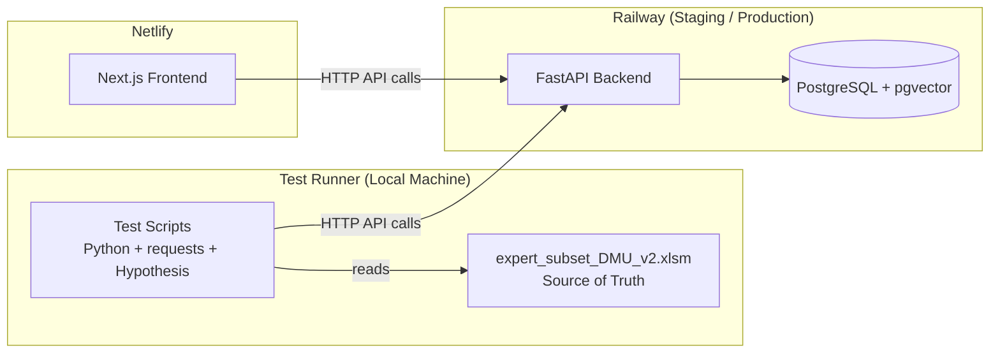

# Design Document: Admin Page Audit

## Overview

This design describes an audit test suite that verifies the MC Press Chatbot admin page accurately reflects database state, correctly persists edits, and aligns with the Excel source of truth. The audit is implemented as a collection of API-based test scripts (Python + `requests`) that run against the Railway-deployed backend — there is no local test environment.

The audit covers nine requirement areas: data accuracy vs. Excel, document listing, metadata editing, edit round-trip integrity, author management consistency, dashboard statistics, Excel verification, delete operations, and API-frontend endpoint alignment.

## Architecture

The audit is a pure test-time concern. It introduces no new runtime components. All verification is performed externally via HTTP against the existing FastAPI backend deployed on Railway.



### Key Design Decisions

1. **API-based testing only** — Per project constraints, all tests call Railway endpoints via `requests`. No local database, no local FastAPI server.
2. **Non-destructive by default** — Read-only checks (Requirements 1, 2, 5, 6, 7, 9) never mutate data. Write tests (Requirements 3, 4, 8) use dedicated test documents or restore original values after mutation.
3. **Hypothesis for property tests** — The Python `hypothesis` library generates random inputs for property-based tests. Each property test runs a minimum of 100 iterations.
4. **Excel parsed locally** — The test runner reads `expert_subset_DMU_v2.xlsm` with `openpyxl`/`pandas` locally and compares against API responses. No need to upload the file to the comparison endpoint for basic field checks.

## Components and Interfaces

### Existing Components (Under Test)

| Component | Location | Role |
|---|---|---|
| Admin Documents API | `backend/admin_documents_fixed.py` | `GET /admin/documents` — paginated listing with search, sort, multi-author joins |
| Metadata Update API | `backend/main.py` | `PUT /documents/{filename}/metadata` — updates title, author, category, URLs |
| Document Delete API | `backend/main.py` | `DELETE /documents/{filename}` — removes book + chunks |
| Author API | `backend/author_routes.py` | `PATCH /api/authors/{id}` — updates author name/site_url |
| Document-Author API | `backend/document_author_routes.py` | `GET/POST/DELETE /api/documents/{id}/authors` — manages relationships |
| Books API v2 | `backend/books_api.py` | `GET /api/v2/books` — multi-author book listing |
| Excel Import API | `backend/excel_import_routes.py` | `POST /api/excel/validate`, `POST /api/excel/import/books` |
| Dashboard Page | `frontend/app/admin/dashboard/page.tsx` | Fetches `/documents` for stats |
| Documents Page | `frontend/app/admin/documents/page.tsx` | Lists, edits, deletes documents via API |

### New Test Components (To Be Created)

| Component | Purpose |
|---|---|
| `tests/conftest.py` | Shared fixtures: API_URL, Excel data loader, HTTP session, test document helpers |
| `tests/test_data_accuracy.py` | Requirement 1 — Excel vs. database field comparisons |
| `tests/test_document_listing.py` | Requirement 2 — listing, search, pagination, sort verification |
| `tests/test_metadata_editing.py` | Requirement 3 — edit operations and validation |
| `tests/test_edit_roundtrip.py` | Requirement 4 — save-then-read integrity |
| `tests/test_author_consistency.py` | Requirement 5 — author data consistency |
| `tests/test_dashboard_stats.py` | Requirement 6 — dashboard statistics accuracy |
| `tests/test_excel_verification.py` | Requirement 7 — Excel comparison and discrepancy detection |
| `tests/test_delete_operations.py` | Requirement 8 — delete and cascade verification |
| `tests/test_endpoint_alignment.py` | Requirement 9 — frontend-backend contract verification |

### API Endpoints Used by Tests

| Endpoint | Method | Used By |
|---|---|---|
| `/admin/documents` | GET | Listing, search, pagination, sort tests |
| `/documents/{filename}/metadata` | PUT | Edit and round-trip tests |
| `/documents/{filename}` | DELETE | Delete tests |
| `/api/authors/{id}` | GET, PATCH | Author consistency tests |
| `/api/authors/search` | GET | Author search tests |
| `/api/documents/{id}` | GET | Document-author relationship tests |
| `/api/documents/{id}/authors` | POST, DELETE | Author relationship tests |
| `/api/v2/books` | GET | Data accuracy cross-check |
| `/api/excel/validate` | POST | Excel validation tests |
| `/documents` | GET | Dashboard stats tests |

## Data Models

### Existing Database Schema (Under Test)

```sql
-- books table (primary document metadata)
CREATE TABLE books (
    id SERIAL PRIMARY KEY,
    filename TEXT UNIQUE NOT NULL,
    title TEXT,
    author TEXT,              -- legacy single-author field
    category TEXT,
    subcategory TEXT,
    description TEXT,
    tags TEXT[],
    mc_press_url TEXT,
    article_url TEXT,
    document_type TEXT DEFAULT 'book',
    year INTEGER,
    total_pages INTEGER,
    file_hash TEXT,
    processed_at TIMESTAMP DEFAULT CURRENT_TIMESTAMP,
    created_at TIMESTAMP DEFAULT CURRENT_TIMESTAMP
);

-- authors table (normalized author records)
CREATE TABLE authors (
    id SERIAL PRIMARY KEY,
    name TEXT UNIQUE NOT NULL,
    site_url TEXT,
    created_at TIMESTAMP DEFAULT CURRENT_TIMESTAMP,
    updated_at TIMESTAMP DEFAULT CURRENT_TIMESTAMP
);

-- document_authors junction table
CREATE TABLE document_authors (
    book_id INTEGER REFERENCES books(id) ON DELETE CASCADE,
    author_id INTEGER REFERENCES authors(id),
    author_order INTEGER DEFAULT 0,
    PRIMARY KEY (book_id, author_id)
);
```

### Excel Source Schema (expert_subset_DMU_v2.xlsm)

The Excel file contains columns that map to database fields:

| Excel Column | Maps To | Table |
|---|---|---|
| Title | `books.title` | books |
| Author | `authors.name` via `document_authors` | authors |
| URL (mc_press) | `books.mc_press_url` | books |
| Article URL | `books.article_url` | books |
| Author Site URL | `authors.site_url` | authors |

### Test Data Models

```python
@dataclass
class ExcelBookRecord:
    """A single row from the Excel source of truth"""
    title: str
    author: str
    mc_press_url: Optional[str]
    article_url: Optional[str]
    author_site_url: Optional[str]
    document_type: str  # 'book' or 'article'

@dataclass
class ApiDocumentRecord:
    """A document as returned by GET /admin/documents"""
    id: int
    filename: str
    title: str
    author: str
    authors: List[dict]  # [{name, site_url, order}]
    document_type: str
    mc_press_url: Optional[str]
    article_url: Optional[str]

@dataclass
class FieldMismatch:
    """A discrepancy between Excel and database"""
    title: str
    field_name: str
    excel_value: Optional[str]
    database_value: Optional[str]
```


## Correctness Properties

*A property is a characteristic or behavior that should hold true across all valid executions of a system — essentially, a formal statement about what the system should do. Properties serve as the bridge between human-readable specifications and machine-verifiable correctness guarantees.*

### Property 1: Excel-to-database field accuracy

*For any* book row in the Excel source file, the database record matched by title should have matching values for author, mc_press_url (if present), article_url (if present), and the associated author's site_url (if present).

**Validates: Requirements 1.1, 1.2, 1.3, 1.4, 1.5, 7.2, 7.3**

### Property 2: Listing returns complete document fields

*For any* document returned by `GET /admin/documents`, the response should include non-null values for id, filename, title, author (or authors array), and document_type, and these values should be consistent with the underlying books table record.

**Validates: Requirements 2.1**

### Property 3: Multi-author documents return all authors in order

*For any* document that has entries in the document_authors table, the `GET /admin/documents` response should include all associated authors from the authors table (not the legacy books.author column), and the authors array should be sorted by author_order ascending.

**Validates: Requirements 2.2, 5.1, 5.2**

### Property 4: Search returns only matching results

*For any* non-empty search term passed to `GET /admin/documents?search=X`, every document in the response should contain the search term (case-insensitive) in either its title or one of its author names.

**Validates: Requirements 2.3**

### Property 5: Pagination arithmetic is correct

*For any* valid page and per_page parameters passed to `GET /admin/documents`, the response should satisfy: `total_pages == ceil(total / per_page)`, the number of returned documents should be `min(per_page, total - (page-1)*per_page)`, and `page` should match the requested page.

**Validates: Requirements 2.4**

### Property 6: Sort order is correct

*For any* valid sort_by field and sort_direction passed to `GET /admin/documents`, the returned documents should be ordered according to the specified field and direction (ascending or descending).

**Validates: Requirements 2.5**

### Property 7: Metadata edit round-trip

*For any* document and any valid combination of editable field values (title, author, mc_press_url, article_url), saving via `PUT /documents/{filename}/metadata` then reading back via `GET /admin/documents?search={title}&refresh=true` should return the exact values that were saved. Similarly, for author_site_url, saving via `PATCH /api/authors/{id}` then reading via `GET /api/authors/{id}` should return the saved site_url.

**Validates: Requirements 3.1, 3.2, 3.3, 3.4, 3.5, 4.1, 4.2, 4.3, 5.4**

### Property 8: Empty and whitespace titles are rejected

*For any* string composed entirely of whitespace (including the empty string), submitting it as the title in a `PUT /documents/{filename}/metadata` request should return HTTP 400 and the document's title should remain unchanged.

**Validates: Requirements 3.6**

### Property 9: Author name update propagates to all documents

*For any* author with associated documents, updating the author's name via `PATCH /api/authors/{id}` should cause all documents associated with that author (retrieved via `GET /admin/documents` with refresh) to display the new author name.

**Validates: Requirements 5.3**

### Property 10: Delete removes document and cascades to associations

*For any* document, deleting it via `DELETE /documents/{filename}` should cause it to no longer appear in `GET /admin/documents` results, and the document_authors entries for that document should also be removed (verified via `GET /api/documents/{id}` returning 404).

**Validates: Requirements 8.1, 8.2, 8.3**

## Error Handling

### API Error Responses

| Scenario | Endpoint | Expected Status | Expected Body |
|---|---|---|---|
| Empty/whitespace title on edit | `PUT /documents/{filename}/metadata` | 400 | `{"detail": "Title is required and cannot be empty"}` |
| Invalid URL format on edit | `PUT /documents/{filename}/metadata` | 400 | `{"detail": "...URL must start with http:// or https://"}` |
| Delete non-existent document | `DELETE /documents/{filename}` | 500 (current) / 404 (ideal) | Error detail |
| Update non-existent author | `PATCH /api/authors/{id}` | 400 | `{"detail": "Author with ID {id} not found"}` |
| Remove last author from document | `DELETE /api/documents/{id}/authors/{aid}` | 400 | `{"detail": "Cannot remove last author..."}` |
| Add duplicate author to document | `POST /api/documents/{id}/authors` | 400 | `{"detail": "Author {id} is already associated..."}` |
| Invalid Excel file format | `POST /api/excel/validate` | 400 | `{"detail": "File must be .xlsm format"}` |

### Test Error Handling Strategy

- Tests that verify error conditions should assert both the HTTP status code and that the response body contains a meaningful error message.
- Write tests should always restore original state on failure (try/finally pattern) to avoid polluting the shared database.
- Network errors and timeouts should be caught and reported clearly, not silently swallowed.

## Testing Strategy

### Dual Testing Approach

This audit uses both unit-style example tests and property-based tests:

- **Unit/example tests**: Verify specific known scenarios (e.g., dashboard count matches, Excel validation succeeds, specific endpoint contracts).
- **Property-based tests**: Verify universal properties across generated inputs using the `hypothesis` library (e.g., round-trip integrity for random valid titles, search correctness for random substrings).

Both are complementary — unit tests catch concrete bugs in known scenarios, property tests verify general correctness across the input space.

### Property-Based Testing Configuration

- **Library**: `hypothesis` (Python) — the standard PBT library for Python
- **Minimum iterations**: 100 per property test (configured via `@settings(max_examples=100)`)
- **Each property test references its design property** via a tag comment:
  ```python
  # Feature: admin-page-audit, Property 7: Metadata edit round-trip
  ```
- **Each correctness property is implemented by a single property-based test function**

### Test Organization

```
tests/
├── conftest.py                  # Shared fixtures, API_URL, Excel loader, HTTP helpers
├── test_data_accuracy.py        # Property 1 (Excel vs DB)
├── test_document_listing.py     # Properties 2, 3, 4, 5, 6
├── test_metadata_editing.py     # Properties 7, 8
├── test_author_consistency.py   # Property 9
├── test_dashboard_stats.py      # Requirement 6 (example tests)
├── test_excel_verification.py   # Requirement 7 (example tests)
├── test_delete_operations.py    # Property 10
└── test_endpoint_alignment.py   # Requirement 9 (example tests)
```

### Test Execution

All tests run locally via `python3 -m pytest tests/` and make HTTP calls to the Railway staging or production API. No local database or server is needed.

```bash
# Run all audit tests against staging
API_URL=https://mcpress-chatbot-staging.up.railway.app python3 -m pytest tests/ -v

# Run only property tests
API_URL=https://mcpress-chatbot-staging.up.railway.app python3 -m pytest tests/ -v -k "property"
```

### Unit Test Focus Areas

- Dashboard document count matches admin listing total (Req 6.1)
- Dashboard last upload date is a real date from document data (Req 6.2)
- Excel validation endpoint accepts the source file without errors (Req 7.1)
- Comparison output includes field_name, excel_value, database_value (Req 7.4)
- DELETE for non-existent document returns 404 (Req 8.4)
- Endpoint contract tests for all four frontend-used endpoints (Req 9.1-9.4)

### Property Test Focus Areas

- Excel-to-database accuracy across all rows (Property 1)
- Listing completeness and field correctness (Property 2)
- Multi-author ordering and source (Property 3)
- Search result relevance (Property 4)
- Pagination math (Property 5)
- Sort correctness (Property 6)
- Edit round-trip integrity (Property 7)
- Whitespace title rejection (Property 8)
- Author update propagation (Property 9)
- Delete cascade completeness (Property 10)

### Write Test Safety

Tests that mutate data (Properties 7, 8, 9, 10) must:
1. Use a dedicated test document or author created specifically for the test
2. Restore original values in a `finally` block after each test
3. Never modify production-critical records without restoration
4. Run against staging first before production
