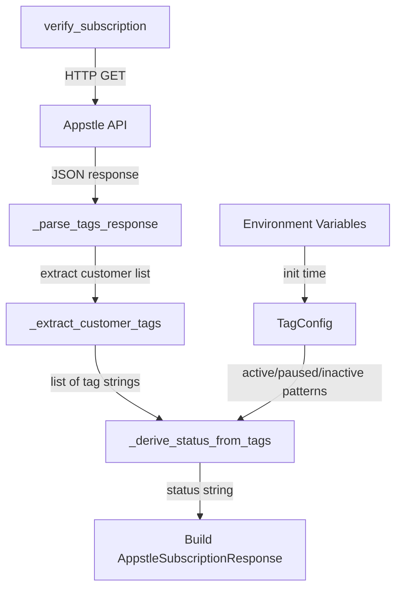

# Design Document: Appstle Customer Tag Authentication

## Overview

This design replaces the contract-status-based subscription verification in `SubscriptionAuthService` with a customer-tag-based approach. Instead of inspecting `subscriptionContracts` and `activeSubscriptions` fields from the Appstle API response, the system will extract customer tags (string labels) and match them against configurable patterns to derive subscription status.

The change is scoped to the parsing/status-derivation layer. The login flow, token refresh, JWT creation, and route handlers remain unchanged. The `_parse_subscription_response` method and `_extract_contracts` helper are replaced by a new `_parse_tags_response` method and supporting tag-matching logic.

### Key Design Decisions

1. **Pure function for tag parsing**: The tag extraction and status derivation logic is implemented as a pure function (`_derive_status_from_tags`) that takes a list of tags and configured patterns, returning a status string. This makes it trivially testable without mocking HTTP calls.
2. **Environment-variable-driven configuration**: Tag patterns are read from `SUBSCRIPTION_TAG_ACTIVE`, `SUBSCRIPTION_TAG_PAUSED`, `SUBSCRIPTION_TAG_INACTIVE` at service init time, with sensible defaults and comma-separated multi-value support.
3. **Minimal surface area change**: Only `_parse_subscription_response` and `_extract_contracts` are replaced. The `verify_subscription` method's HTTP call and the `AppstleSubscriptionResponse` model remain the same, preserving the existing contract between the auth service and its callers.

## Architecture

The change is contained within `backend/subscription_auth.py`. No new files or modules are introduced.



### Flow Summary

1. `verify_subscription(email)` calls the Appstle API (unchanged).
2. The JSON response is passed to `_parse_tags_response(data, email)` instead of `_parse_subscription_response`.
3. `_parse_tags_response` extracts the customer list from the response (same normalization as before: handles list, paginated dict, single-customer dict).
4. For each customer, `_extract_customer_tags(customer)` pulls tags from `customerTags`, `tags`, or similar fields, returning a `list[str]`.
5. `_derive_status_from_tags(tags, tag_config)` performs case-insensitive matching against configured patterns and returns one of `"active"`, `"paused"`, `"inactive"`, or `"not_found"`.
6. The result is mapped to an `AppstleSubscriptionResponse` with appropriate `is_valid` and `subscription_status` values.

## Components and Interfaces

### TagConfig (dataclass or NamedTuple)

Holds the parsed tag patterns loaded from environment variables at `__init__` time.

```python
from dataclasses import dataclass, field

@dataclass(frozen=True)
class TagConfig:
    active_patterns: list[str] = field(default_factory=lambda: ["active-subscriber"])
    paused_patterns: list[str] = field(default_factory=lambda: ["paused-subscriber"])
    inactive_patterns: list[str] = field(default_factory=lambda: ["inactive-subscriber"])
```

### load_tag_config() → TagConfig

Reads environment variables and returns a `TagConfig`. Handles:
- Missing env vars → use defaults
- Comma-separated values → split and strip
- Whitespace-only values after split → fall back to defaults
- All patterns stored lowercase for case-insensitive matching

```python
def load_tag_config() -> TagConfig:
    def _parse_env(var_name: str, default: list[str]) -> list[str]:
        raw = os.getenv(var_name, "")
        patterns = [p.strip().lower() for p in raw.split(",") if p.strip()]
        return patterns if patterns else [d.lower() for d in default]
    
    return TagConfig(
        active_patterns=_parse_env("SUBSCRIPTION_TAG_ACTIVE", ["active-subscriber"]),
        paused_patterns=_parse_env("SUBSCRIPTION_TAG_PAUSED", ["paused-subscriber"]),
        inactive_patterns=_parse_env("SUBSCRIPTION_TAG_INACTIVE", ["inactive-subscriber"]),
    )
```

### _extract_customer_tags(customer: dict) → list[str]

Extracts tag strings from a customer record. Checks multiple possible field names (`customerTags`, `tags`) and handles both list-of-strings and list-of-dicts (where each dict has a `name` or `value` key). Returns an empty list on malformed data and logs a warning.

```python
def _extract_customer_tags(customer: dict) -> list[str]:
    """Extract tag strings from a customer record."""
    raw_tags = customer.get("customerTags") or customer.get("tags")
    
    if raw_tags is None:
        return []
    
    if not isinstance(raw_tags, list):
        logger.warning("Unexpected tags structure: %s", type(raw_tags))
        return []
    
    tags = []
    for item in raw_tags:
        if isinstance(item, str):
            tags.append(item)
        elif isinstance(item, dict):
            tag_value = item.get("name") or item.get("value") or item.get("tag")
            if tag_value and isinstance(tag_value, str):
                tags.append(tag_value)
        else:
            logger.warning("Unexpected tag item type: %s", type(item))
    
    return tags
```

### _derive_status_from_tags(tags: list[str], config: TagConfig) → str

Pure function. Performs case-insensitive matching of tags against config patterns. Priority order: active > paused > inactive > not_found.

```python
def _derive_status_from_tags(tags: list[str], config: TagConfig) -> str:
    """Derive subscription status from customer tags. Returns one of: active, paused, inactive, not_found."""
    lower_tags = [t.lower() for t in tags]
    
    for tag in lower_tags:
        if tag in config.active_patterns:
            return "active"
    
    for tag in lower_tags:
        if tag in config.paused_patterns:
            return "paused"
    
    for tag in lower_tags:
        if tag in config.inactive_patterns:
            return "inactive"
    
    return "not_found"
```

### _parse_tags_response(data, email) → AppstleSubscriptionResponse

Replaces `_parse_subscription_response`. Extracts customer list from the API response (same normalization logic), then uses `_extract_customer_tags` and `_derive_status_from_tags` to build the response.

Status-to-response mapping:
| Derived Status | `is_valid` | `subscription_status` |
|---|---|---|
| `active` | `True` | `"ACTIVE"` |
| `paused` | `False` | `"PAUSED"` |
| `inactive` | `False` | `"CANCELLED"` |
| `not_found` | `False` | `None` |

### Changes to SubscriptionAuthService

- `__init__`: Add `self.tag_config = load_tag_config()` and log the loaded patterns.
- `verify_subscription`: Replace `self._parse_subscription_response(data, email)` call with `self._parse_tags_response(data, email)`.
- Remove `_parse_subscription_response` and `_extract_contracts` methods.
- Add `_parse_tags_response`, `_extract_customer_tags` as instance methods (they use `self.tag_config` and `logger`).

### Unchanged Components

- `AppstleSubscriptionResponse` model (no schema changes)
- `create_token`, `verify_token`
- `login`, `refresh` methods (they consume `AppstleSubscriptionResponse` which keeps the same interface)
- `subscription_auth_routes.py` (no changes)
- `_normalize_status`, `_get_denial_message` helper functions
- `DENIAL_MESSAGES` dict

## Data Models

### TagConfig

```python
@dataclass(frozen=True)
class TagConfig:
    active_patterns: list[str]   # e.g. ["active-subscriber", "active-member"]
    paused_patterns: list[str]   # e.g. ["paused-subscriber"]
    inactive_patterns: list[str] # e.g. ["inactive-subscriber"]
```

### AppstleSubscriptionResponse (unchanged)

```python
class AppstleSubscriptionResponse(BaseModel):
    is_valid: bool
    subscription_status: Optional[str] = None
    expiration_date: Optional[datetime] = None
    customer_email: Optional[str] = None
```

### Environment Variables

| Variable | Default | Description |
|---|---|---|
| `SUBSCRIPTION_TAG_ACTIVE` | `"active-subscriber"` | Comma-separated tag patterns for active status |
| `SUBSCRIPTION_TAG_PAUSED` | `"paused-subscriber"` | Comma-separated tag patterns for paused status |
| `SUBSCRIPTION_TAG_INACTIVE` | `"inactive-subscriber"` | Comma-separated tag patterns for inactive status |

### Example Appstle API Response with Tags

```json
{
  "content": [
    {
      "email": "user@example.com",
      "customerTags": ["active-subscriber", "premium"],
      "activeSubscriptions": 1,
      "subscriptionContracts": { "edges": [] }
    }
  ]
}
```


## Correctness Properties

*A property is a characteristic or behavior that should hold true across all valid executions of a system — essentially, a formal statement about what the system should do. Properties serve as the bridge between human-readable specifications and machine-verifiable correctness guarantees.*

### Property 1: Tag extraction preserves all tags

*For any* customer record containing a `customerTags` or `tags` field with a list of strings (or list of dicts with `name`/`value` keys), `_extract_customer_tags` should return a list containing every tag value from that field. For records with missing, empty, or malformed tag fields, it should return an empty list.

**Validates: Requirements 1.1, 1.2, 1.4**

### Property 2: Case-insensitive tag matching

*For any* list of tags and any TagConfig, applying an arbitrary case transformation (upper, lower, mixed) to the tags should not change the result of `_derive_status_from_tags`. That is, `_derive_status_from_tags(tags, config) == _derive_status_from_tags(case_transform(tags), config)` for all valid case transformations.

**Validates: Requirements 1.3**

### Property 3: Status derivation priority

*For any* list of customer tags and any TagConfig:
- If any tag matches an active pattern, the result is `"active"` (regardless of other tags present).
- Else if any tag matches a paused pattern, the result is `"paused"`.
- Else if any tag matches an inactive pattern, the result is `"inactive"`.
- Else the result is `"not_found"`.

**Validates: Requirements 2.1, 2.2, 2.3, 2.4, 2.5**

### Property 4: Environment variable config round-trip

*For any* set of comma-separated tag pattern strings assigned to `SUBSCRIPTION_TAG_ACTIVE`, `SUBSCRIPTION_TAG_PAUSED`, and `SUBSCRIPTION_TAG_INACTIVE`, `load_tag_config()` should produce a `TagConfig` whose pattern lists contain exactly the non-empty, stripped, lowercased tokens from each env var. When an env var is unset or contains only whitespace after splitting, the corresponding pattern list should equal the default patterns.

**Validates: Requirements 3.1, 3.2, 3.3, 3.4**

### Property 5: Status-to-response mapping

*For any* derived status string and email, `_parse_tags_response` should produce an `AppstleSubscriptionResponse` where `is_valid` is `True` if and only if the derived status is `"active"`, and `subscription_status` maps as: `"active"→"ACTIVE"`, `"paused"→"PAUSED"`, `"inactive"→"CANCELLED"`, `"not_found"→None`.

**Validates: Requirements 4.2, 4.3, 4.4, 4.5**

## Error Handling

### Malformed Tags Structure
- If `customerTags`/`tags` is not a list (e.g. a string, int, or nested dict), `_extract_customer_tags` logs a warning and returns `[]`.
- If individual tag items are neither strings nor dicts with expected keys, they are skipped with a warning log.

### Empty/Missing API Response
- If the Appstle API returns an empty customer list, `_parse_tags_response` returns `AppstleSubscriptionResponse(is_valid=False, subscription_status=None)` — same behavior as the current implementation.

### Invalid Environment Variables
- Whitespace-only or empty env var values fall back to defaults. No error is raised.
- Non-string env var values are not possible (os.getenv always returns str or None).

### HTTP/Network Errors
- Unchanged. `verify_subscription` already handles `aiohttp.ClientError`, `asyncio.TimeoutError`, and `ValueError` for malformed JSON. These propagate to the `login`/`refresh` methods which return appropriate 503/500 responses.

## Testing Strategy

### Property-Based Testing

Use **Hypothesis** (Python property-based testing library) to implement the 5 correctness properties.

Each property test must:
- Run a minimum of 100 iterations
- Reference its design property in a comment tag
- Use Hypothesis strategies to generate random inputs

Tag format: `# Feature: appstle-customer-tag-auth, Property {N}: {title}`

#### Test File: `backend/test_tag_auth_properties.py`

| Property | Strategy | Generators |
|---|---|---|
| 1: Tag extraction | Generate customer dicts with random tag structures (list of strings, list of dicts, None, non-list) | `st.lists(st.text())`, `st.none()`, `st.dictionaries()` |
| 2: Case-insensitive matching | Generate tag lists, apply random case transforms, compare results | `st.lists(st.sampled_from(known_patterns))`, random case function |
| 3: Status derivation priority | Generate tag lists containing combinations of active/paused/inactive/unrecognized tags | `st.lists(st.sampled_from(all_patterns + random_strings))` |
| 4: Config round-trip | Generate comma-separated env var strings with random patterns | `st.lists(st.text(min_size=1)).map(",".join)` |
| 5: Status-to-response mapping | Generate derived status strings and verify response fields | `st.sampled_from(["active", "paused", "inactive", "not_found"])` |

### Unit Testing

Unit tests cover specific examples, edge cases, and integration points. These go in `backend/test_tag_auth_unit.py`.

Key unit test cases:
- Tag extraction from a real-shaped Appstle API response
- Default config values when no env vars are set
- Login flow with mocked Appstle API returning tagged customer (integration test with mocks)
- Refresh flow with mocked Appstle API returning non-active tags
- Logging output verification (captured log assertions)
- Edge case: customer with both `customerTags` and `tags` fields (first one wins)
- Edge case: empty string tags in the list are ignored

### Test Configuration

```python
from hypothesis import given, settings, strategies as st

@settings(max_examples=100)
@given(...)
def test_property_N(...):
    # Feature: appstle-customer-tag-auth, Property N: title
    ...
```
