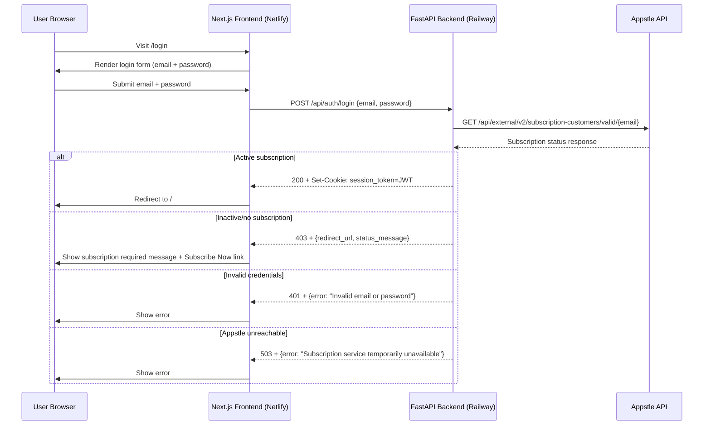
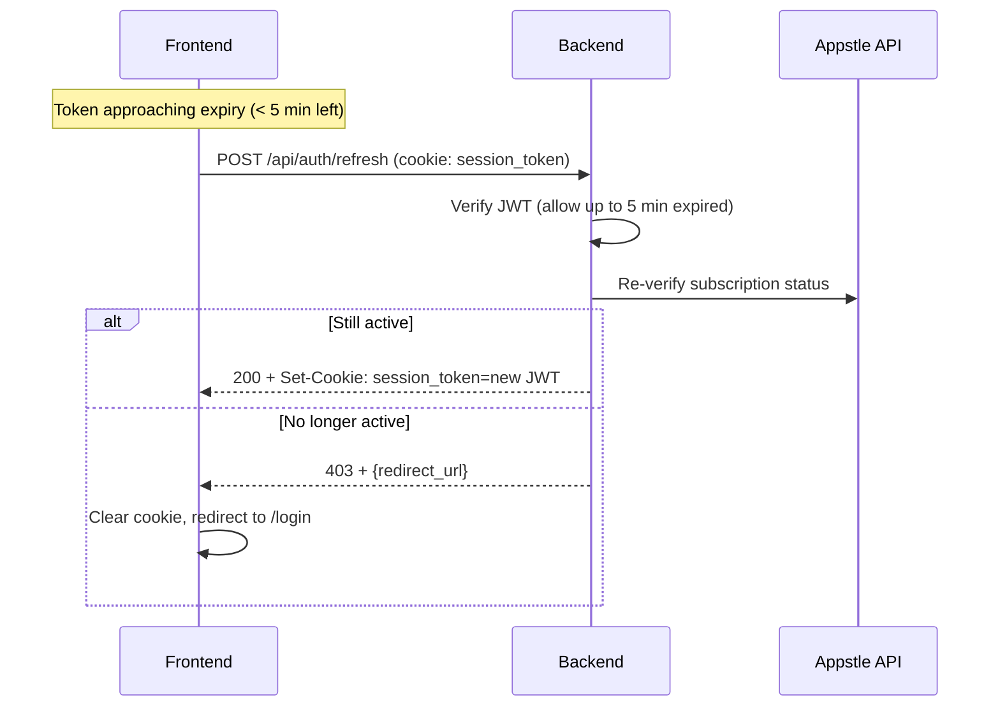

# Design Document: Appstle Subscription Authentication

## Overview

This design replaces the current demo password login (`demo_auth` cookie) with Appstle subscription-based authentication. Users log in with email and password, the backend calls the Appstle API to verify an active subscription, and on success issues a 1-hour JWT stored in an HTTP-only cookie. A silent refresh mechanism keeps sessions alive, and users without valid subscriptions are directed to a signup page.

**Scope**: Customer authentication only. The existing admin auth system (`/api/admin/*` routes, localStorage-based JWT, bcrypt password verification) remains completely unchanged.

### Key Design Decisions

1. **Direct Appstle API verification** — no local password storage for customers. The Appstle API is the single source of truth for credentials and subscription status.
2. **HTTP-only cookie for JWT** — replaces the current `demo_auth` cookie with a signed JWT containing subscription claims. More secure than localStorage.
3. **Next.js middleware for route protection** — the middleware reads the `session_token` cookie and redirects unauthenticated users to `/login`. This replaces the current client-side `adminToken` check on the chat page.
4. **Separate route prefix** — customer auth lives at `/api/auth/*`, completely separate from admin auth at `/api/admin/*`.
5. **In-memory rate limiter** — reuses the existing `RateLimiter` class from `backend/auth.py` for login attempt throttling.
6. **5-minute grace window on refresh** — allows expired tokens (within 5 minutes) to be refreshed without forcing re-login.

## Architecture

### High-Level Flow



### Token Refresh Flow



### Component Diagram

```
┌──────────────────────────────────────────────────────────┐
│                    Frontend (Netlify)                      │
│  ┌──────────────┐  ┌──────────────┐  ┌───────────────┐  │
│  │ /login        │  │ / (Chat)     │  │ middleware.ts  │  │
│  │ Email+Pass    │  │ Logout btn   │  │ Cookie check   │  │
│  │ Subscribe CTA │  │ Chat UI      │  │ Route guard    │  │
│  └──────────────┘  └──────────────┘  └───────────────┘  │
│  ┌──────────────────────────────────────────────────────┐│
│  │ /api/auth/login (Next.js route → proxy to Railway)   ││
│  │ /api/auth/logout (Next.js route → clear cookie)      ││
│  │ /api/auth/refresh (Next.js route → proxy to Railway) ││
│  └──────────────────────────────────────────────────────┘│
└──────────────────────────────────────────────────────────┘
                            │ HTTPS
                            ▼
┌──────────────────────────────────────────────────────────┐
│                   Backend (Railway)                        │
│  ┌────────────────────────────────────────────────────┐  │
│  │ FastAPI Application                                │  │
│  │                                                    │  │
│  │  ┌──────────────────┐  ┌────────────────────────┐ │  │
│  │  │ /api/auth/*       │  │ /api/admin/* (UNCHANGED)│ │  │
│  │  │ Customer auth     │  │ Admin auth              │ │  │
│  │  └────────┬─────────┘  └────────────────────────┘ │  │
│  │           │                                        │  │
│  │           ▼                                        │  │
│  │  ┌──────────────────┐  ┌────────────────────────┐ │  │
│  │  │ SubscriptionAuth │  │ RateLimiter            │ │  │
│  │  │ Service          │  │ (in-memory, per IP)    │ │  │
│  │  └────────┬─────────┘  └────────────────────────┘ │  │
│  │           │                                        │  │
│  └───────────┼────────────────────────────────────────┘  │
│              │                                            │
└──────────────┼────────────────────────────────────────────┘
               │ HTTPS (X-API-Key header)
               ▼
┌──────────────────────────────────────────────────────────┐
│              Appstle Subscription API                      │
│  GET /api/external/v2/subscription-customers/valid/{id}   │
└──────────────────────────────────────────────────────────┘
```

## Components and Interfaces

### 1. SubscriptionAuthService (Backend)

**File**: `backend/subscription_auth.py`

**Responsibility**: Verify credentials against Appstle API, issue/verify JWTs, handle refresh logic.

```python
class SubscriptionAuthService:
    def __init__(self):
        self.appstle_api_url: str  # from APPSTLE_API_URL env
        self.appstle_api_key: str  # from APPSTLE_API_KEY env
        self.jwt_secret: str       # from JWT_SECRET_KEY env
        self.signup_url: str       # from SUBSCRIPTION_SIGNUP_URL env
        self.token_expiry: timedelta = timedelta(hours=1)
        self.grace_window: timedelta = timedelta(minutes=5)
        self.appstle_timeout: int = 10  # seconds

    async def verify_subscription(self, email: str) -> AppstleResponse:
        """Call Appstle API to check subscription status for email."""

    def create_token(self, email: str, subscription_status: str,
                     expires_at: Optional[datetime]) -> str:
        """Create JWT with sub, subscription_status, subscription_expires_at, iat, exp."""

    def verify_token(self, token: str, allow_grace: bool = False) -> Optional[dict]:
        """Verify JWT signature and expiration. If allow_grace=True,
        accept tokens expired within self.grace_window."""

    async def login(self, email: str, password: str, client_ip: str) -> LoginResult:
        """Full login flow: rate limit check → Appstle verification → token issuance."""

    async def refresh(self, token: str) -> RefreshResult:
        """Verify existing token (with grace), re-verify subscription, issue new token."""
```

### 2. SubscriptionAuthRoutes (Backend)

**File**: `backend/subscription_auth_routes.py`

**Responsibility**: FastAPI router exposing customer auth endpoints.

```python
router = APIRouter(prefix="/api/auth", tags=["customer-auth"])

@router.post("/login")
async def login(request: LoginRequest, client_request: Request) -> Response:
    """Verify email/password via Appstle, set session_token cookie."""

@router.post("/logout")
async def logout(response: Response) -> dict:
    """Clear session_token cookie."""

@router.post("/refresh")
async def refresh(request: Request) -> Response:
    """Re-verify subscription, issue new token cookie."""

@router.get("/me")
async def get_current_user(request: Request) -> dict:
    """Return current user info from token (for frontend state)."""
```

### 3. Next.js Middleware (Frontend)

**File**: `frontend/middleware.ts`

**Responsibility**: Check `session_token` cookie on protected routes, redirect to `/login` if missing.

```typescript
// Protected routes: everything except /login, /admin/*, /api/*, static assets
// If session_token cookie is missing → redirect to /login
// If session_token cookie exists → allow through (backend validates on API calls)
// Admin routes (/admin/*) continue using existing adminToken localStorage check
```

### 4. Login Page (Frontend)

**File**: `frontend/app/login/page.tsx` (replaces current demo login)

**Responsibility**: Email + password form, subscription status messages, Subscribe Now CTA.

### 5. Next.js API Routes (Frontend)

**Files**: `frontend/app/api/auth/login/route.ts`, `logout/route.ts`, `refresh/route.ts`

**Responsibility**: Proxy auth requests to Railway backend, manage cookies.

The login route proxies to Railway's `/api/auth/login`, receives the JWT in the response body, and sets it as an HTTP-only cookie. This keeps the JWT secret from client-side JavaScript.

## Data Models

### Appstle API Response

Based on the Appstle external API v2 endpoint:

```
GET https://subscription-admin.appstle.com/api/external/v2/subscription-customers/valid/{customerId}
Headers: X-API-Key: {APPSTLE_API_KEY}
```

Expected response structure (the backend will parse what's needed):

```python
class AppstleSubscriptionResponse(BaseModel):
    """Parsed response from Appstle API"""
    is_valid: bool                          # Whether subscription is active
    subscription_status: Optional[str]      # "ACTIVE", "CANCELLED", "EXPIRED", "PAUSED", or None
    expiration_date: Optional[datetime]     # When the subscription expires
    customer_email: Optional[str]           # Confirmed email from Appstle
```

### JWT Claims

```python
class SessionTokenClaims(BaseModel):
    sub: str                                # User email
    subscription_status: str                # "active"
    subscription_expires_at: Optional[int]  # Unix timestamp
    iat: int                                # Issued at (Unix timestamp)
    exp: int                                # Expires at (Unix timestamp, iat + 1 hour)
```

### Request/Response Models

```python
class CustomerLoginRequest(BaseModel):
    email: EmailStr
    password: str

class LoginSuccessResponse(BaseModel):
    success: bool = True
    email: str
    subscription_status: str
    expires_at: Optional[str]  # ISO datetime

class LoginDeniedResponse(BaseModel):
    success: bool = False
    error: str                  # User-facing message
    subscription_status: Optional[str]  # "expired", "paused", "cancelled", "not_found"
    redirect_url: Optional[str] # Signup page URL

class RefreshResponse(BaseModel):
    success: bool
    error: Optional[str]
    redirect_url: Optional[str]
```

### Environment Variables

| Variable | Required | Description |
|----------|----------|-------------|
| `APPSTLE_API_URL` | Yes | Appstle API base URL |
| `APPSTLE_API_KEY` | Yes | API key for X-API-Key header |
| `SUBSCRIPTION_SIGNUP_URL` | Yes | URL for subscription purchase page |
| `JWT_SECRET_KEY` | Yes (existing) | Secret for signing JWTs |

### Cookie Configuration

```python
COOKIE_CONFIG = {
    "key": "session_token",
    "httponly": True,
    "secure": True,           # HTTPS only in production
    "samesite": "lax",
    "max_age": 3600,          # 1 hour (matches JWT expiry)
    "path": "/",
}
```


## Correctness Properties

*A property is a characteristic or behavior that should hold true across all valid executions of a system — essentially, a formal statement about what the system should do. Properties serve as the bridge between human-readable specifications and machine-verifiable correctness guarantees.*

### Property Reflection

After analyzing all 10 requirements and their acceptance criteria, I identified the following redundancies:

- **1.3 and 1.4** both test that active subscriptions produce tokens with correct claims → Combined with 3.1 into token structure property
- **2.6** (expiration in token) is subsumed by **3.1** (all required claims) → Combined
- **2.2, 2.3, 2.4, 2.5** all test the same pattern: non-active status → denial with redirect URL → Combined into single property
- **9.5** (unknown status → deny) follows the same denial pattern as 2.2-2.5 → Combined
- **3.4, 3.5, 3.6** all test token verification (valid accepted, expired rejected, bad signature rejected) → Combined into round-trip verification property
- **4.1 and 5.4** both test that missing cookies cause redirect to login → Removed 5.4 as duplicate
- **1.4** is redundant with 1.3 → Removed

The following 16 properties provide unique validation value:

### Property 1: Token structure completeness

*For any* successful login where the Appstle API confirms an active subscription, the issued JWT shall contain all required claims: `sub` (user email), `subscription_status`, `subscription_expires_at`, `iat`, and `exp`.

**Validates: Requirements 1.3, 2.6, 3.1**

### Property 2: Token expiration window

*For any* issued JWT, the `exp` claim shall be exactly 3600 seconds (1 hour) after the `iat` claim.

**Validates: Requirements 3.2**

### Property 3: Token verification round-trip

*For any* JWT created by the `create_token` method, `verify_token` shall successfully decode it and return the original claims. For any JWT with a tampered signature or an expiration in the past (beyond grace window), `verify_token` shall return None.

**Validates: Requirements 3.4, 3.5, 3.6**

### Property 4: Cookie security attributes

*For any* successful login response that sets a cookie, the cookie shall have `httponly=True`, `secure=True`, `samesite=lax`, and `path=/`.

**Validates: Requirements 3.7**

### Property 5: Non-active subscription denial

*For any* subscription status that is not "active" (including "cancelled", "expired", "paused", not found, or any unexpected/unknown status string), the login service shall deny access and return a response containing the signup redirect URL.

**Validates: Requirements 2.2, 2.3, 2.4, 2.5, 9.5**

### Property 6: Active subscription grants access

*For any* email where the Appstle API returns an active subscription status, the login service shall return a success response with a valid JWT.

**Validates: Requirements 2.1**

### Property 7: Grace window acceptance on refresh

*For any* JWT that expired within the last 5 minutes, the refresh endpoint shall accept the token for re-verification (rather than rejecting it outright). For any JWT expired more than 5 minutes ago, the refresh endpoint shall reject it with 401.

**Validates: Requirements 3.9**

### Property 8: Refresh with active subscription issues new token

*For any* valid refresh request where the Appstle API confirms the subscription is still active, the service shall issue a new JWT with a fresh 1-hour expiration.

**Validates: Requirements 3.10**

### Property 9: Refresh with inactive subscription denies access

*For any* refresh request where the Appstle API indicates the subscription is no longer active, the service shall return a 403 response with the signup redirect URL.

**Validates: Requirements 3.11**

### Property 10: Unauthenticated redirect

*For any* request to a protected route (e.g., `/`) that does not include a valid `session_token` cookie, the middleware shall redirect the user to `/login`.

**Validates: Requirements 4.1**

### Property 11: Authenticated user bypasses login page

*For any* request to `/login` that includes a valid `session_token` cookie, the system shall redirect the user to `/` (the chat interface).

**Validates: Requirements 4.7**

### Property 12: Rate limiting enforcement

*For any* IP address, after 5 failed login attempts within a 15-minute window, the 6th and subsequent attempts shall be rejected with a 429 status code.

**Validates: Requirements 6.2**

### Property 13: Rate limiting reset on success

*For any* IP address that has accumulated failed login attempts, a successful login shall reset the attempt counter so that subsequent failed attempts start counting from zero.

**Validates: Requirements 6.3**

### Property 14: Disabled configuration returns 503

*For any* login attempt when the Appstle environment variables (`APPSTLE_API_URL` or `APPSTLE_API_KEY`) are missing, the login service shall return a 503 response.

**Validates: Requirements 8.6**

### Property 15: Appstle API errors return 503

*For any* Appstle API response with a non-200 HTTP status code, the login service shall return a 503 response with a user-friendly error message.

**Validates: Requirements 9.1**

### Property 16: Status-specific denial messages

*For any* login denial, the response message shall match the subscription status: "Your subscription has expired" for expired, "Your subscription is paused" for paused, "Your subscription has been cancelled" for cancelled, and "No subscription found" for missing subscriptions.

**Validates: Requirements 10.3**

## Error Handling

### Login Errors

| Error Condition | HTTP Status | Response Body | Frontend Action |
|---|---|---|---|
| Invalid email or password (Appstle rejects) | 401 | `{"success": false, "error": "Invalid email or password"}` | Display error message |
| Active subscription not found | 403 | `{"success": false, "error": "No subscription found", "subscription_status": "not_found", "redirect_url": "{SUBSCRIPTION_SIGNUP_URL}"}` | Show Subscribe Now CTA |
| Subscription expired | 403 | `{"success": false, "error": "Your subscription has expired", "subscription_status": "expired", "redirect_url": "{SUBSCRIPTION_SIGNUP_URL}"}` | Show renewal CTA |
| Subscription paused | 403 | `{"success": false, "error": "Your subscription is paused", "subscription_status": "paused", "redirect_url": "{SUBSCRIPTION_SIGNUP_URL}"}` | Show reactivation CTA |
| Subscription cancelled | 403 | `{"success": false, "error": "Your subscription has been cancelled", "subscription_status": "cancelled", "redirect_url": "{SUBSCRIPTION_SIGNUP_URL}"}` | Show resubscribe CTA |
| Rate limited | 429 | `{"success": false, "error": "Too many login attempts. Please try again later."}` | Display rate limit message |
| Appstle API unreachable/timeout | 503 | `{"success": false, "error": "Subscription service temporarily unavailable"}` | Display retry message |
| Appstle API non-200 response | 503 | `{"success": false, "error": "Subscription service temporarily unavailable"}` | Display retry message |
| Appstle API malformed response | 500 | `{"success": false, "error": "An unexpected error occurred"}` | Display generic error |
| Appstle config missing | 503 | `{"success": false, "error": "Subscription service temporarily unavailable"}` | Display retry message |

### Token/Session Errors

| Error Condition | HTTP Status | Response Body | Frontend Action |
|---|---|---|---|
| Missing session_token cookie | 401 | Redirect to `/login` (middleware) | N/A — redirect happens |
| Invalid/tampered JWT | 401 | `{"detail": "Invalid or expired token"}` | Redirect to `/login` |
| Expired JWT (beyond grace) | 401 | `{"detail": "Invalid or expired token"}` | Attempt refresh, then redirect |
| Refresh with expired token (beyond 5 min grace) | 401 | `{"detail": "Token expired beyond grace window"}` | Redirect to `/login` |
| Refresh — subscription no longer active | 403 | `{"success": false, "error": "Subscription no longer active", "redirect_url": "{SUBSCRIPTION_SIGNUP_URL}"}` | Clear cookie, show subscription CTA |

### Error Recovery Strategy

- **Transient Appstle errors** (503, timeout): Frontend displays "temporarily unavailable" and user can retry manually.
- **Token expiration**: Frontend sets a timer to silently call `/api/auth/refresh` before the token expires (~5 minutes before expiry). If refresh fails, redirect to login.
- **Rate limiting**: Frontend displays the rate limit message. The 15-minute window resets automatically.
- **Configuration errors**: Backend logs a warning at startup. All login attempts return 503 until config is fixed and redeployed.

## Testing Strategy

### Dual Testing Approach

Both unit tests and property-based tests are required:

- **Unit tests**: Verify specific examples, edge cases, integration points, and error conditions
- **Property tests**: Verify universal properties across randomly generated inputs

### Property-Based Testing Configuration

- **Framework**: Hypothesis (Python) for backend property tests
- **Minimum iterations**: 100 per property test
- **Tag format**: `# Feature: appstle-subscription-auth, Property {number}: {property_text}`
- **Each correctness property is implemented by a single property-based test**

### Unit Test Categories

**1. Login Flow Tests**:
- Test successful login with active subscription
- Test login with invalid credentials (401)
- Test login with each inactive status (cancelled, expired, paused, not found)
- Test login when Appstle API is unreachable (503)
- Test login when Appstle API returns non-200 (503)
- Test login when Appstle API returns malformed data (500)
- Test login when Appstle config is missing (503)

**2. Token Tests**:
- Test JWT creation with all required claims
- Test JWT verification with valid token
- Test JWT rejection with expired token
- Test JWT rejection with tampered signature
- Test grace window behavior (expired within 5 min accepted, beyond rejected)

**3. Refresh Flow Tests**:
- Test successful refresh with active subscription
- Test refresh with inactive subscription (403)
- Test refresh with expired token within grace window
- Test refresh with expired token beyond grace window (401)

**4. Rate Limiting Tests**:
- Test 5 failed attempts then 6th blocked (429)
- Test counter reset after successful login
- Test different IPs tracked independently
- Test 15-minute window expiry

**5. Cookie Tests**:
- Test cookie attributes (httponly, secure, samesite, path)
- Test cookie cleared on logout
- Test cookie set on successful login

**6. Admin Auth Isolation Tests**:
- Test `/api/admin/login` still works unchanged
- Test `/api/admin/verify` still works unchanged
- Test admin and customer auth don't interfere

**7. Frontend Tests**:
- Test login page renders email and password fields
- Test login page shows error messages
- Test login page shows subscription-required messages with correct status text
- Test login page shows Subscribe Now button with correct URL
- Test middleware redirects unauthenticated users to /login
- Test middleware allows authenticated users through
- Test logout clears cookie and redirects

### Property Test Examples

```python
from hypothesis import given, strategies as st, settings
import pytest

# Feature: appstle-subscription-auth, Property 1: Token structure completeness
@given(
    email=st.emails(),
    expires_at=st.datetimes(
        min_value=datetime(2024, 1, 1),
        max_value=datetime(2030, 12, 31)
    )
)
@settings(max_examples=100)
def test_token_structure_completeness(email, expires_at):
    """For any successful login, the JWT shall contain all required claims."""
    service = SubscriptionAuthService()
    token = service.create_token(email, "active", expires_at)
    claims = jwt.decode(token, service.jwt_secret, algorithms=["HS256"])
    assert "sub" in claims
    assert claims["sub"] == email
    assert "subscription_status" in claims
    assert "subscription_expires_at" in claims
    assert "iat" in claims
    assert "exp" in claims


# Feature: appstle-subscription-auth, Property 5: Non-active subscription denial
@given(
    status=st.sampled_from(["cancelled", "expired", "paused", "not_found",
                            "unknown", "RANDOM_STATUS", ""])
)
@settings(max_examples=100)
def test_non_active_subscription_denial(status):
    """For any non-active status, login shall deny access with redirect URL."""
    result = determine_login_outcome(status)
    assert result.success is False
    assert result.redirect_url is not None
```

### Test Execution

All tests run on Railway after deployment (per project conventions). No local test execution.

```bash
# Deploy first, then run on Railway
git push origin main
# Wait for deployment
railway run python3 -m pytest backend/tests/test_subscription_auth.py -v
```
