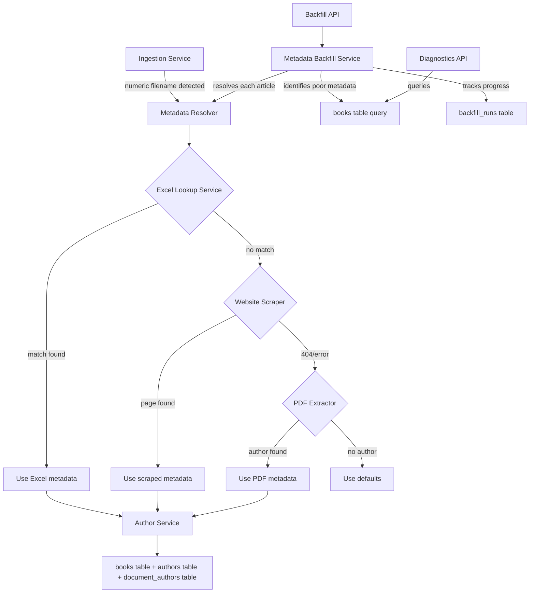

# Design Document: Article Metadata Quality

## Overview

The article metadata quality feature addresses ~290+ articles ingested from the MC Press FTP server that have poor metadata: numeric filenames as titles (e.g., "27814") and "Unknown Author" as the author. The solution introduces a multi-source metadata resolution strategy that checks an Excel spreadsheet, scrapes the MC Press website, and falls back to PDF extraction — both for future ingestion and for backfilling existing records.

### Key Design Decisions

1. **Excel-first resolution**: The "MC Press Books - URL-Title-Author.xlsx" spreadsheet (115 rows of book data) is the primary lookup source. A secondary data source is the existing `export_subset_DMU_v2.xlsx` file (14,000+ article records with IDs, titles, authors, and URLs) which maps article numeric IDs to metadata.
2. **In-memory lookup**: The Excel data is loaded once at service initialization into a dictionary keyed by numeric article ID for O(1) lookups. The spreadsheet is small enough (~115 book rows + ~14K article rows) to fit comfortably in memory.
3. **Website scraping as fallback**: MC Press website scraping uses the article URL from the export spreadsheet (not a constructed URL pattern) since the site uses Joomla-style slug URLs, not numeric ID paths.
4. **Reuse existing services**: Author management reuses `AuthorService.get_or_create_author()` for deduplication and `DocumentAuthorService` for junction table management, avoiding duplicate logic.
5. **Background backfill**: The backfill runs as a background task with a run-tracking table, similar to the existing `ingestion_runs` pattern.

## Architecture

The feature adds three new backend services and integrates them into the existing ingestion pipeline:



### Request Flow

1. **During ingestion**: When `IngestionService.process_and_store()` encounters a numeric filename, it calls `MetadataResolver.resolve()` before storing the document.
2. **During backfill**: The `MetadataBackfillService` queries for articles with poor metadata, then calls `MetadataResolver.resolve()` for each one, updating the database.
3. **Diagnostics**: A read-only query against the books table with aggregation for statistics.

## Components and Interfaces

### 1. ExcelLookupService (`backend/excel_lookup_service.py`)

Loads metadata from the Excel spreadsheet into memory and provides lookup by numeric article ID.

```python
class ExcelLookupService:
    """Loads and provides lookup for article metadata from Excel spreadsheets."""
    
    def __init__(self, spreadsheet_path: str = "MC Press Books - URL-Title-Author.xlsx"):
        """Load spreadsheet data into memory on initialization."""
        self._mapping: Dict[str, ExcelMetadataEntry] = {}
        self._load_spreadsheet(spreadsheet_path)
    
    def lookup_by_id(self, article_id: str) -> Optional[ExcelMetadataEntry]:
        """Look up metadata by numeric article ID. Returns None if not found."""
        ...
    
    def lookup_by_filename(self, filename: str) -> Optional[ExcelMetadataEntry]:
        """Extract numeric ID from filename (e.g., '27814.pdf' → '27814') and look up."""
        ...
    
    def parse_authors(self, author_string: str) -> List[str]:
        """Parse comma/'and'-separated author strings into individual names.
        Reuses the pattern from ExcelImportService.parse_authors()."""
        ...
    
    @staticmethod
    def extract_id_from_url(url: str) -> Optional[str]:
        """Extract numeric article ID from MC Press URL path segments."""
        ...
    
    @staticmethod
    def extract_id_from_filename(filename: str) -> Optional[str]:
        """Extract numeric ID from a filename like '27814.pdf'."""
        ...
    
    def _load_spreadsheet(self, path: str) -> None:
        """Read Excel file using openpyxl, build ID-keyed mapping."""
        ...


@dataclass
class ExcelMetadataEntry:
    title: str
    author: str  # raw author string, may contain multiple authors
    url: Optional[str] = None
    article_id: Optional[str] = None
```

### 2. WebsiteMetadataScraper (`backend/website_metadata_scraper.py`)

Fetches and parses article metadata from the MC Press website.

```python
class WebsiteMetadataScraper:
    """Scrapes article metadata from mcpressonline.com."""
    
    TIMEOUT = 10  # seconds
    USER_AGENT = "MCPressChatbot/1.0"
    
    async def scrape_article(self, article_url: str) -> Optional[ScrapedMetadata]:
        """Fetch article page and extract title + author from HTML.
        Returns None on 404, timeout, or parse failure."""
        ...
    
    def extract_title_from_html(self, html: str) -> Optional[str]:
        """Extract article title from HTML content.
        Looks for <h1> or <h2> with article title class, or <title> tag."""
        ...
    
    def extract_author_from_html(self, html: str) -> Optional[str]:
        """Extract author name from HTML content.
        Looks for 'By Author Name' patterns or author metadata elements."""
        ...


@dataclass
class ScrapedMetadata:
    title: Optional[str] = None
    author: Optional[str] = None
    source_url: Optional[str] = None
```

### 3. MetadataResolver (`backend/metadata_resolver.py`)

Orchestrates multi-source metadata resolution with priority ordering.

```python
class MetadataResolver:
    """Resolves article metadata from multiple sources in priority order."""
    
    def __init__(
        self,
        excel_lookup: ExcelLookupService,
        website_scraper: WebsiteMetadataScraper,
        author_extractor: AuthorExtractor,
    ):
        ...
    
    async def resolve(self, filename: str, pdf_path: Optional[str] = None) -> ResolvedMetadata:
        """Resolve metadata for a numeric-filename article.
        
        Resolution order:
        1. Excel spreadsheet lookup
        2. MC Press website scraping (using URL from export spreadsheet)
        3. PDF content extraction (if pdf_path provided)
        4. Default values (filename as title, 'Unknown Author')
        
        Returns resolved metadata with source attribution.
        """
        ...


@dataclass
class ResolvedMetadata:
    title: str
    authors: List[str]  # parsed individual author names
    source: str  # "excel", "website", "pdf", "default"
    article_url: Optional[str] = None
```

### 4. MetadataBackfillService (`backend/metadata_backfill_service.py`)

Identifies and fixes articles with poor metadata.

```python
class MetadataBackfillService:
    """Identifies and backfills articles with poor metadata."""
    
    def __init__(
        self,
        database_url: str,
        metadata_resolver: MetadataResolver,
        author_service: AuthorService,
        document_author_service: DocumentAuthorService,
    ):
        ...
    
    async def identify_poor_metadata_articles(self) -> List[Dict[str, Any]]:
        """Query books table for articles with numeric titles or unknown authors.
        
        Matches:
        - title consisting only of digits (numeric filename)
        - author = 'Unknown' or 'Unknown Author'
        - document_type = 'article'
        """
        ...
    
    async def run_backfill(self) -> BackfillResult:
        """Execute full backfill process:
        1. Identify articles with poor metadata
        2. Resolve metadata for each article
        3. Update books table with resolved titles
        4. Create/link author records via AuthorService
        5. Create document_authors entries
        6. Produce summary report
        
        Operates idempotently — safe to run multiple times.
        """
        ...
    
    async def get_diagnostics(self, detailed: bool = False) -> DiagnosticsResult:
        """Return metadata quality statistics."""
        ...


@dataclass
class BackfillResult:
    run_id: str
    status: str  # "completed", "failed"
    total_identified: int
    titles_updated: int
    authors_updated: int
    still_poor: int
    errors: List[Dict[str, str]]
    details: List[Dict[str, Any]]  # per-article results with source used


@dataclass
class DiagnosticsResult:
    total_articles: int
    numeric_title_count: int
    unknown_author_count: int
    both_issues_count: int
    sample_articles: List[Dict[str, Any]]  # up to 20 samples
```

### 5. API Routes (`backend/article_metadata_routes.py`)

```python
router = APIRouter()

@router.post("/api/articles/backfill-metadata")
async def trigger_backfill() -> Dict:
    """Start backfill process. Returns run_id and status 'started'.
    Returns 409 if backfill already running."""
    ...

@router.get("/api/articles/backfill-metadata/{run_id}")
async def get_backfill_result(run_id: str) -> Dict:
    """Get backfill run result by run_id."""
    ...

@router.get("/api/articles/poor-metadata")
async def get_poor_metadata_articles() -> Dict:
    """List articles with poor metadata."""
    ...

@router.get("/api/diagnostics/article-metadata")
async def get_metadata_diagnostics(detailed: bool = False) -> Dict:
    """Return metadata quality statistics."""
    ...
```

### Integration with Existing Services

The `MetadataResolver` is injected into `IngestionService.process_and_store()` to enhance metadata during ingestion. The modification is minimal:

```python
# In IngestionService.process_and_store():
metadata = self._build_metadata(filename, author, category)

# NEW: Enhanced metadata resolution for numeric-filename articles
if metadata["document_type"] == "article" and self.metadata_resolver:
    resolved = await self.metadata_resolver.resolve(filename, file_path)
    if resolved.title != filename.rsplit(".pdf", 1)[0]:
        metadata["title"] = resolved.title
    if resolved.authors and resolved.authors[0] != "Unknown Author":
        metadata["author"] = resolved.authors[0]
    metadata["source"] = resolved.source
```

## Data Models

### Existing Tables (no schema changes)

**books table:**
| Column | Type | Description |
|--------|------|-------------|
| id | SERIAL PK | Auto-increment ID |
| filename | TEXT UNIQUE | PDF filename (e.g., "27814.pdf") |
| title | TEXT | Document title |
| author | TEXT | Legacy author field |
| document_type | TEXT | "book" or "article" |
| article_url | TEXT | URL to online article |
| mc_press_url | TEXT | MC Press store URL |
| category | TEXT | Content category |
| total_pages | INTEGER | Page count |

**authors table:**
| Column | Type | Description |
|--------|------|-------------|
| id | SERIAL PK | Auto-increment ID |
| name | TEXT UNIQUE | Author name (deduplication key) |
| site_url | TEXT | Author website URL |

**document_authors table:**
| Column | Type | Description |
|--------|------|-------------|
| id | SERIAL PK | Auto-increment ID |
| book_id | INTEGER FK | References books(id) |
| author_id | INTEGER FK | References authors(id) |
| author_order | INTEGER | Author position (0-based) |

### New Table: backfill_runs

Tracks backfill execution history, following the same pattern as `ingestion_runs`.

```sql
CREATE TABLE IF NOT EXISTS backfill_runs (
    id SERIAL PRIMARY KEY,
    run_id VARCHAR(100) UNIQUE NOT NULL,
    status VARCHAR(20) NOT NULL DEFAULT 'running',
    started_at TIMESTAMP NOT NULL DEFAULT CURRENT_TIMESTAMP,
    completed_at TIMESTAMP,
    total_identified INTEGER DEFAULT 0,
    titles_updated INTEGER DEFAULT 0,
    authors_updated INTEGER DEFAULT 0,
    still_poor INTEGER DEFAULT 0,
    error_details JSONB DEFAULT '[]'::jsonb,
    details JSONB DEFAULT '[]'::jsonb,
    created_at TIMESTAMP DEFAULT CURRENT_TIMESTAMP
);

CREATE INDEX IF NOT EXISTS idx_backfill_runs_status ON backfill_runs(status);
CREATE INDEX IF NOT EXISTS idx_backfill_runs_started ON backfill_runs(started_at DESC);
```

### In-Memory Data Structures

**ExcelLookupService mapping:**
```python
# Keyed by numeric article ID string
_mapping: Dict[str, ExcelMetadataEntry] = {
    "27814": ExcelMetadataEntry(
        title="How Low Code Helps Businesses Modernize their IBM i Apps",
        author="LANSA",
        url="https://www.mcpressonline.com/programming/.../how-low-code-...",
        article_id="27814"
    ),
    ...
}
```

The mapping is built from the `export_subset_DMU_v2.xlsx` file (14,319 article rows) where column A contains the numeric article ID, column B the title, column J the author, and column K the article URL. The "MC Press Books - URL-Title-Author.xlsx" file (115 book rows) supplements this with book metadata keyed by title.

## Correctness Properties

*A property is a characteristic or behavior that should hold true across all valid executions of a system — essentially, a formal statement about what the system should do. Properties serve as the bridge between human-readable specifications and machine-verifiable correctness guarantees.*

### Property 1: Excel Lookup Round-Trip

*For any* entry loaded from the Excel spreadsheet, extracting the numeric article ID and then looking it up via `lookup_by_id()` SHALL return the original title from the spreadsheet.

**Validates: Requirements 1.2, 7.5**

### Property 2: Lookup Miss Returns None

*For any* numeric ID string that does not exist in the Excel spreadsheet mapping, calling `lookup_by_id()` SHALL return None.

**Validates: Requirements 1.3**

### Property 3: Filename-to-ID Extraction

*For any* string of digits `d`, constructing the filename `"{d}.pdf"` and calling `extract_id_from_filename()` SHALL return the original string `d`.

**Validates: Requirements 1.4**

### Property 4: Author String Parsing Round-Trip

*For any* list of author names (each containing no commas or the word "and"), joining them with `", "` separators and then calling `parse_authors()` SHALL return the original list of author names.

**Validates: Requirements 1.5**

### Property 5: HTML Metadata Extraction

*For any* article title and author name, constructing an HTML page with the title in an `<h1>` tag and the author in a "By {author}" pattern, then calling `extract_title_from_html()` and `extract_author_from_html()` SHALL return the original title and author respectively.

**Validates: Requirements 2.2, 2.3**

### Property 6: Poor Metadata Identification

*For any* set of article records, `identify_poor_metadata_articles()` SHALL return exactly those articles where the title consists only of digits OR the author is "Unknown" or "Unknown Author", and SHALL NOT return articles with non-numeric titles and known authors.

**Validates: Requirements 4.1**

### Property 7: Backfill Idempotence

*For any* set of articles with poor metadata, running the backfill process twice SHALL produce the same database state (same titles, same authors, same document_authors entries) and SHALL NOT create duplicate author records.

**Validates: Requirements 4.6**

### Property 8: Diagnostics Count Consistency

*For any* set of articles in the database, the diagnostics counts SHALL satisfy: `both_issues_count <= min(numeric_title_count, unknown_author_count)` and `numeric_title_count + unknown_author_count - both_issues_count <= total_articles`.

**Validates: Requirements 6.2**

### Property 9: URL Numeric ID Extraction

*For any* URL of the form `https://www.mcpressonline.com/{path}/{slug}` where the export spreadsheet maps article ID `n` to that URL, calling `extract_id_from_url()` on the URL with the spreadsheet context SHALL return `n`.

**Validates: Requirements 7.3**

### Property 10: Author Deduplication

*For any* set of articles that share the same author name, after backfill processing, there SHALL be exactly one record in the authors table for that name, and all articles SHALL reference the same author_id in the document_authors table.

**Validates: Requirements 8.1, 8.2, 8.6**

### Property 11: Multi-Author Order Preservation

*For any* article with multiple authors parsed from a comma-separated string, the document_authors entries SHALL preserve the original order (first author gets `author_order=0`, second gets `author_order=1`, etc.).

**Validates: Requirements 8.5**

## Error Handling

### Excel Loading Errors
- **Missing file**: Log warning, continue without Excel lookup. The resolver falls through to website scraping and PDF extraction.
- **Corrupt/unreadable file**: Same as missing file — log and continue.
- **Missing columns**: Log warning with details of which columns are missing.

### Website Scraping Errors
- **HTTP 404**: Log at debug level (expected for some articles), fall through to PDF extraction.
- **Timeout (>10s)**: Log warning, fall through to PDF extraction.
- **Parse failure**: Log warning with URL, fall through to PDF extraction.
- **Network error**: Log warning, fall through to PDF extraction.

### Backfill Errors
- **Single article failure**: Log error with article ID and details, continue processing remaining articles. Record the error in the backfill run's error_details.
- **Database connection failure**: Retry with exponential backoff (3 attempts). If all retries fail, mark the run as "failed" and record the error.
- **Concurrent backfill attempt**: Return 409 Conflict immediately. The `_running` flag prevents concurrent execution.

### Author Management Errors
- **Duplicate author name conflict**: Handled by `INSERT ... ON CONFLICT` in `AuthorService.get_or_create_author()` — returns existing ID.
- **Invalid author name (empty/whitespace)**: Skip author creation, log warning, use "Unknown Author" as fallback.

## Testing Strategy

### Testing Approach

This project has no local test environment — all testing is done via API endpoints against the staging Railway deployment. The testing strategy reflects this constraint.

**Unit-testable logic** (pure functions that can be tested with property-based tests):
- `ExcelLookupService`: Spreadsheet parsing, ID extraction, lookup logic, author parsing
- `WebsiteMetadataScraper`: HTML parsing (title/author extraction from HTML strings)
- `MetadataResolver`: Resolution priority logic (with mocked dependencies)
- Poor metadata identification logic (SQL query correctness)
- Diagnostics count calculations

**Integration tests** (via API endpoints on staging):
- `/api/articles/backfill-metadata` — trigger and monitor backfill
- `/api/articles/poor-metadata` — verify article identification
- `/api/diagnostics/article-metadata` — verify statistics
- End-to-end ingestion with metadata resolution

### Property-Based Testing

Property-based tests use the **Hypothesis** library (already present in the project — see `.hypothesis/` directory).

Each property test runs a minimum of 100 iterations and is tagged with the corresponding design property.

**Configuration:**
```python
from hypothesis import given, settings, strategies as st

@settings(max_examples=100)
```

**Tag format:** `Feature: article-metadata-quality, Property {N}: {title}`

### Unit Tests (Example-Based)

- Resolution priority order (Excel → website → PDF → default)
- Short-circuit behavior (Excel match skips website/PDF)
- 404 fallback from website to PDF extraction
- Backfill summary report structure
- Concurrent backfill rejection (409)
- Error resilience (single article failure doesn't stop backfill)

### Integration Tests (API-Based)

Following the project's API-based testing pattern:
```python
import requests
API_URL = "https://mcpress-chatbot-staging.up.railway.app"

# Test diagnostics endpoint
response = requests.get(f"{API_URL}/api/diagnostics/article-metadata")
assert response.status_code == 200
data = response.json()
assert "total_articles" in data

# Test backfill trigger
response = requests.post(f"{API_URL}/api/articles/backfill-metadata")
assert response.status_code == 200
assert "run_id" in response.json()
```
