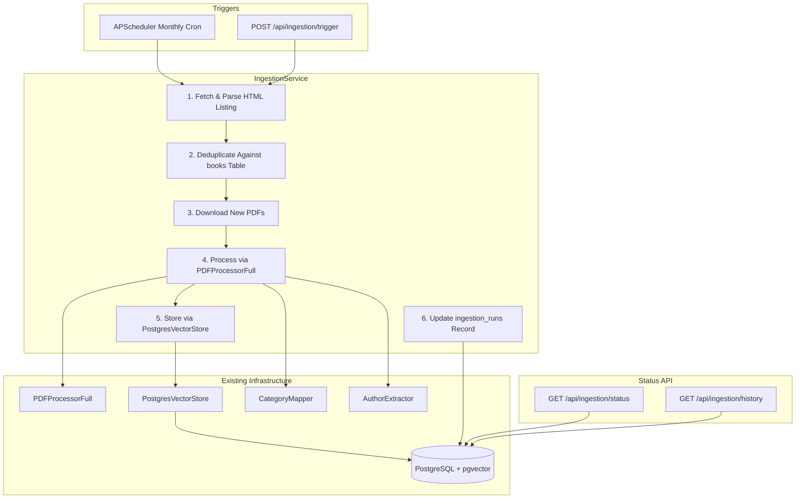
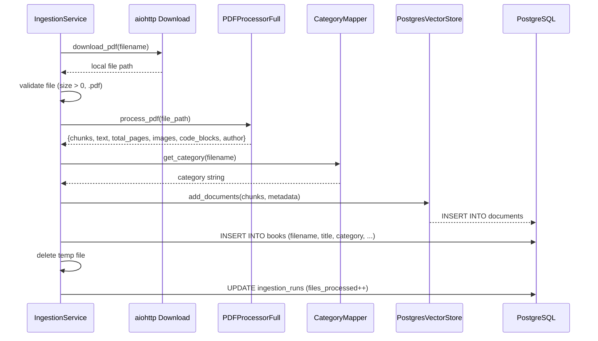

# Design Document: Auto Content Ingestion

## Overview

This feature adds automated ingestion of new PDF content from the MC Press Online repository (`https://prod.mcpressonline.com/images/ngpdfs`). The system periodically scrapes the HTML directory listing, identifies new PDFs not yet in the database, downloads them, and processes them through the existing `PDFProcessorFull` → `PostgresVectorStore` pipeline. A new `IngestionService` orchestrates the workflow, with an `ingestion_runs` table logging each run. Three new API endpoints provide manual triggering, current status, and run history. A monthly scheduler (APScheduler) triggers runs automatically.

The design reuses existing infrastructure heavily: `PDFProcessorFull` for extraction, `PostgresVectorStore.add_documents()` for embedding storage, `CategoryMapper` for categorization, and `AuthorExtractor` for author detection. The new code is limited to: HTML parsing, download orchestration, deduplication logic, run logging, scheduling, and API endpoints.

## Architecture



### New Modules

| File | Purpose |
|------|---------|
| `backend/ingestion_service.py` | Core `IngestionService` class: discovery, dedup, download, orchestration, logging |
| `backend/ingestion_routes.py` | FastAPI router with 3 endpoints: trigger, status, history |
| `backend/ingestion_scheduler.py` | APScheduler setup for monthly cron, startup/shutdown hooks |

### Integration Points

- **`PostgresVectorStore.pool`**: Reused for all DB queries (deduplication, run logging). No new connection pool needed.
- **`PDFProcessorFull.process_pdf()`**: Called per downloaded PDF, returns chunks/images/code_blocks.
- **`PostgresVectorStore.add_documents()`**: Stores chunks with embeddings.
- **`CategoryMapper.get_category()`**: Assigns category from filename.
- **`AuthorExtractor`**: Used indirectly via `PDFProcessorFull` which calls it internally.
- **`main.py` startup**: Registers ingestion routes, initializes scheduler, creates `ingestion_runs` table.

## Components and Interfaces

### IngestionService

```python
class IngestionService:
    def __init__(
        self,
        vector_store: PostgresVectorStore,
        pdf_processor: PDFProcessorFull,
        category_mapper: CategoryMapper,
        source_url: str = "https://prod.mcpressonline.com/images/ngpdfs"
    ):
        ...

    async def run_ingestion(self) -> IngestionRunResult:
        """Execute a full ingestion run. Returns run summary."""

    async def discover_remote_files(self) -> list[str]:
        """Fetch HTML listing and parse out PDF filenames."""

    async def get_existing_filenames(self) -> set[str]:
        """Query books table for all known filenames."""

    def deduplicate(
        self, discovered: list[str], existing: set[str]
    ) -> list[str]:
        """Return filenames in discovered but not in existing."""

    async def download_pdf(
        self, filename: str, dest_dir: str
    ) -> str:
        """Download a single PDF with retry. Returns local path."""

    async def process_and_store(self, file_path: str, filename: str) -> dict:
        """Process PDF and store in vector store + books table. Returns stats."""

    async def get_current_run(self) -> Optional[dict]:
        """Get the currently running or most recent ingestion run."""

    async def get_run_history(
        self, limit: int = 20, offset: int = 0
    ) -> list[dict]:
        """Get paginated ingestion run history."""

    async def ensure_table(self) -> None:
        """Create ingestion_runs table if not exists."""
```

### IngestionRunResult (dataclass)

```python
@dataclass
class IngestionRunResult:
    run_id: str
    status: str           # "completed" | "failed" | "interrupted"
    started_at: datetime
    completed_at: Optional[datetime]
    files_discovered: int
    files_skipped: int    # already loaded
    files_processed: int
    files_failed: int
    errors: list[dict]    # [{filename, error_message}]
```

### API Endpoints (ingestion_routes.py)

| Method | Path | Description | Auth |
|--------|------|-------------|------|
| `POST` | `/api/ingestion/trigger` | Start an ingestion run. Returns 409 if one is already running. | Admin |
| `GET` | `/api/ingestion/status` | Get current/most recent run status. | Admin |
| `GET` | `/api/ingestion/history` | Paginated run history (`?limit=20&offset=0`). | Admin |

### Scheduler (ingestion_scheduler.py)

```python
from apscheduler.schedulers.asyncio import AsyncIOScheduler
from apscheduler.triggers.cron import CronTrigger

def setup_ingestion_scheduler(ingestion_service: IngestionService) -> AsyncIOScheduler:
    """Create and return scheduler with monthly cron job (1st of month, 3:00 AM UTC)."""

async def start_scheduler(scheduler: AsyncIOScheduler) -> None:
    """Start the scheduler. Called from FastAPI startup event."""

async def stop_scheduler(scheduler: AsyncIOScheduler) -> None:
    """Graceful shutdown. Called from FastAPI shutdown event."""
```

The scheduler uses `CronTrigger(day=1, hour=3, minute=0)` to run on the 1st of each month at 3 AM UTC. On startup, it checks the `ingestion_runs` table for the last completed run to avoid double-running if the app restarts mid-month.


## Data Models

### New Table: `ingestion_runs`

```sql
CREATE TABLE IF NOT EXISTS ingestion_runs (
    id SERIAL PRIMARY KEY,
    run_id VARCHAR(100) UNIQUE NOT NULL,
    status VARCHAR(20) NOT NULL DEFAULT 'running',
        -- running | completed | failed | interrupted
    started_at TIMESTAMP NOT NULL DEFAULT CURRENT_TIMESTAMP,
    completed_at TIMESTAMP,
    source_url TEXT NOT NULL,
    files_discovered INTEGER NOT NULL DEFAULT 0,
    files_skipped INTEGER NOT NULL DEFAULT 0,
    files_processed INTEGER NOT NULL DEFAULT 0,
    files_failed INTEGER NOT NULL DEFAULT 0,
    error_details JSONB DEFAULT '[]'::jsonb,
        -- Array of {filename, error_message, stage}
    created_at TIMESTAMP DEFAULT CURRENT_TIMESTAMP
);

CREATE INDEX IF NOT EXISTS idx_ingestion_runs_status
    ON ingestion_runs (status);
CREATE INDEX IF NOT EXISTS idx_ingestion_runs_started_at
    ON ingestion_runs (started_at DESC);
```

### Deduplication Query

Filename-based deduplication queries the `books` table (which has a UNIQUE constraint on `filename`):

```sql
SELECT filename FROM books;
```

This returns all known filenames. The `IngestionService.deduplicate()` method computes the set difference between discovered remote filenames and this set.

### Books Table Integration

When a PDF is successfully processed, the service inserts into the `books` table using the same pattern as the existing upload endpoint in `main.py`:

```sql
INSERT INTO books (filename, title, document_type, category, total_pages, processed_at)
VALUES ($1, $2, 'book', $3, $4, CURRENT_TIMESTAMP)
ON CONFLICT (filename) DO UPDATE SET
    title = EXCLUDED.title,
    category = EXCLUDED.category,
    total_pages = EXCLUDED.total_pages,
    processed_at = EXCLUDED.processed_at
RETURNING id;
```

### HTML Directory Listing Parsing

The source URL returns an Apache-style HTML directory listing. The parser uses Python's `html.parser.HTMLParser` (stdlib) to extract `href` attributes from `<a>` tags, filtering for `.pdf` extensions. No external HTML parsing library is needed.

Example expected HTML structure:
```html
<a href="SomeBook.pdf">SomeBook.pdf</a>
<a href="AnotherBook.pdf">AnotherBook.pdf</a>
```

The parser:
1. Fetches the page via `aiohttp.ClientSession.get()`
2. Parses all `<a href="...">` tags
3. Filters hrefs ending in `.pdf` (case-insensitive)
4. Returns a list of PDF filenames (just the filename, not full URL)
5. Constructs download URLs as `{source_url}/{filename}`

### Download and Temporary Storage

- Downloads use `aiohttp` with a 10-minute timeout per file
- Files are saved to a temp directory (`/tmp/ingestion/` on Railway, configurable)
- Each file is validated: must end in `.pdf` and have size > 0 bytes
- Retry logic: 3 attempts with exponential backoff (5s, 15s, 60s)
- Temp files are deleted after processing (success or failure)

### Processing Pipeline Per File




## Correctness Properties

*A property is a characteristic or behavior that should hold true across all valid executions of a system — essentially, a formal statement about what the system should do. Properties serve as the bridge between human-readable specifications and machine-verifiable correctness guarantees.*

### Property 1: HTML Parser Extracts Exactly PDF Links

*For any* HTML string containing `<a>` tags with various `href` values (some ending in `.pdf`, some not), the parser should return exactly the set of href values that end in `.pdf` (case-insensitive), and no others.

**Validates: Requirements 1.2**

### Property 2: Deduplication Is Set Difference

*For any* list of discovered filenames and any set of existing filenames, the `deduplicate()` function should return exactly the filenames that are in the discovered list but not in the existing set. The result should contain no duplicates and no filenames from the existing set.

**Validates: Requirements 2.2, 7.2**

### Property 3: File Validation Accepts Only Valid PDFs

*For any* filename string and file size integer, the validation function should return `True` if and only if the filename ends with `.pdf` (case-insensitive) and the file size is greater than zero.

**Validates: Requirements 3.4**

### Property 4: Metadata Contains All Required Fields

*For any* filename string ending in `.pdf`, the metadata generation function should produce a dictionary containing all required keys (`filename`, `title`, `category`, `author`, `document_type`) where `title` equals the filename with the `.pdf` extension removed.

**Validates: Requirements 4.3**

### Property 5: Run Record Accounting Invariant

*For any* completed ingestion run record, the sum `files_skipped + files_processed + files_failed` should equal `files_discovered`. Additionally, all count fields should be non-negative integers.

**Validates: Requirements 6.1, 2.3**

### Property 6: Completed Runs Have Timestamps

*For any* ingestion run with status `"completed"` or `"failed"`, the `completed_at` field should be non-null and should be greater than or equal to `started_at`.

**Validates: Requirements 5.2, 7.1**

### Property 7: Independent File Processing

*For any* list of files to process where some subset fails, the number of successfully processed files plus the number of failed files should equal the total number of files attempted. No file's failure should prevent another file from being attempted.

**Validates: Requirements 8.1, 4.4, 3.3**

## Error Handling

### HTTP Errors (Source Discovery)

| Error | Behavior |
|-------|----------|
| Connection timeout / DNS failure | Log error, mark run as `"failed"`, abort |
| HTTP 4xx/5xx | Log status code, mark run as `"failed"`, abort |
| Malformed HTML (no `<a>` tags) | Treat as empty listing, complete with 0 files discovered |

### Download Errors (Per File)

| Error | Behavior |
|-------|----------|
| Network error / timeout | Retry up to 3 times (5s, 15s, 60s backoff) |
| HTTP 404 | Log, skip file (no retry — file doesn't exist) |
| HTTP 5xx | Retry up to 3 times |
| Downloaded file is 0 bytes | Log validation failure, skip file |
| Download timeout (>10 min) | Cancel, log, count as failed |

### Processing Errors (Per File)

| Error | Behavior |
|-------|----------|
| PDF extraction failure | Log error, increment `files_failed`, continue to next file |
| Embedding generation failure | Retry DB operation 3 times, then log and skip |
| Books table insert failure | Retry 3 times, then log and skip (chunks still stored) |
| Processing timeout (>30 min) | Cancel via `asyncio.wait_for()`, log, count as failed |

### System-Level Errors

| Error | Behavior |
|-------|----------|
| Database pool unavailable | Mark run as `"failed"`, log error |
| App restart during run | On next startup, mark any `"running"` runs as `"interrupted"` |
| Concurrent trigger attempt | Return HTTP 409 Conflict |
| Disk full (temp storage) | Catch OSError, mark file as failed, continue |

### Retry Implementation

```python
async def _retry_with_backoff(self, operation, max_retries=3, delays=(5, 15, 60)):
    """Generic retry with exponential backoff."""
    for attempt in range(max_retries):
        try:
            return await operation()
        except Exception as e:
            if attempt == max_retries - 1:
                raise
            await asyncio.sleep(delays[attempt])
```

### Temp File Cleanup

Temp files are cleaned up in a `finally` block to ensure cleanup happens even on failure:

```python
try:
    result = await self.process_and_store(file_path, filename)
finally:
    if os.path.exists(file_path):
        os.remove(file_path)
```

## Testing Strategy

### Property-Based Testing

Property-based tests use the `hypothesis` library (already in `requirements.txt`). Each property test runs a minimum of 100 iterations.

| Property | Test Approach |
|----------|---------------|
| P1: HTML Parser | Generate random HTML with mix of `.pdf` and non-`.pdf` hrefs. Verify extracted set matches expected. |
| P2: Deduplication | Generate random lists of discovered and existing filenames. Verify result is exact set difference. |
| P3: File Validation | Generate random filenames (with/without `.pdf`) and random file sizes (including 0, negative). Verify boolean result. |
| P4: Metadata Fields | Generate random `.pdf` filenames. Verify metadata dict has all required keys and correct title. |
| P5: Run Accounting | Generate random non-negative integers for discovered, skipped, processed, failed where skipped+processed+failed=discovered. Verify invariant holds after constructing run record. |
| P6: Completed Timestamps | Generate random run records with various statuses. Verify completed/failed runs have valid timestamps. |
| P7: Independent Processing | Generate random file lists with random success/failure outcomes. Verify counts are consistent and all files are attempted. |

**PBT Library**: `hypothesis` (already a project dependency)
**Minimum iterations**: 100 per property
**Tag format**: `Feature: auto-content-ingestion, Property {N}: {title}`

### Unit Tests

Unit tests cover specific examples and edge cases:

- **Empty HTML page**: Parser returns empty list
- **HTML with no PDF links**: Parser returns empty list
- **HTML with mixed case extensions** (`.PDF`, `.Pdf`): Parser handles case-insensitively
- **Deduplication with empty discovered list**: Returns empty
- **Deduplication with empty existing set**: Returns all discovered
- **First run (no prior runs)**: All files treated as new
- **Source unreachable**: Run marked as failed with error logged
- **Download retry exhaustion**: File counted as failed, others continue
- **Concurrent trigger**: Returns 409
- **Interrupted run recovery**: Marked as interrupted on startup
- **Timeout enforcement**: Download and processing timeouts respected

### Integration Tests (API-Based, on Railway)

Following the project's testing pattern, integration tests are API-based scripts run against the staging Railway deployment:

```python
# test_ingestion_api.py (run locally against staging)
import requests

API_URL = "https://mcpress-chatbot-staging.up.railway.app"

def test_trigger_ingestion():
    response = requests.post(f"{API_URL}/api/ingestion/trigger")
    assert response.status_code in (200, 409)

def test_get_status():
    response = requests.get(f"{API_URL}/api/ingestion/status")
    assert response.status_code == 200
    data = response.json()
    assert "status" in data

def test_get_history():
    response = requests.get(f"{API_URL}/api/ingestion/history?limit=5")
    assert response.status_code == 200
    data = response.json()
    assert "runs" in data
```
