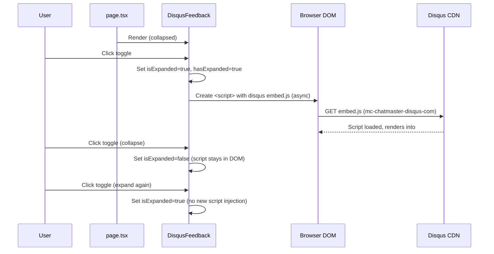
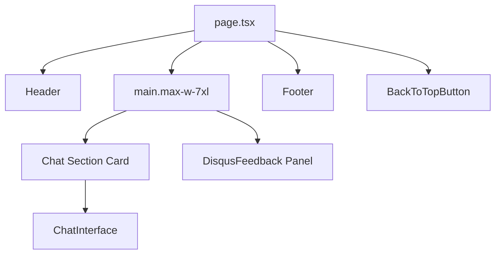

# Design Document: Disqus Feedback Integration

## Overview

This design adds a "Community Feedback" section to the MC ChatMaster main page using Disqus as the commenting platform. The integration is a frontend-only change — no backend modifications are needed.

The component is a collapsible panel (`DisqusFeedback`) placed on `page.tsx` below the `ChatInterface` and above the footer, inside the existing `max-w-7xl` content wrapper. It starts collapsed so the chat experience remains the primary focus. The Disqus embed script is lazy-loaded on first expand to avoid impacting page load performance.

### Key Design Decisions

- **Separate component**: `DisqusFeedback` lives in `frontend/components/DisqusFeedback.tsx` as a self-contained client component. It manages its own expanded/collapsed state and Disqus script lifecycle.
- **Lazy loading via state flag**: A `hasExpanded` ref tracks whether the panel has ever been opened. The Disqus Universal Code is injected into the DOM only on the first expand. Subsequent collapse/expand cycles reuse the already-loaded embed.
- **Single site-wide thread**: The Disqus `page.identifier` and `page.url` are hardcoded constants (not derived from `window.location`), ensuring all visitors share one comment thread regardless of URL or query parameters.
- **No backend changes**: Disqus is a client-side embed. The shortname `mc-chatmaster-disqus-com` and thread config are baked into the component.
- **Error fallback**: A `script.onerror` handler and a timeout detect load failures (ad blockers, network issues) and display a fallback message inside the panel.

## Architecture



### Page Layout



The `DisqusFeedback` component is placed inside the `<main>` element's `space-y-6` container, directly after the chat section `<div>` and before the closing `</main>` tag. This keeps it within the same `max-w-7xl` wrapper and `space-y-6` vertical rhythm.

## Components and Interfaces

### `DisqusFeedback` Component

**File**: `frontend/components/DisqusFeedback.tsx`

```typescript
// Props: none (self-contained)
// State:
//   isExpanded: boolean (default false)
// Refs:
//   hasLoadedDisqus: React.MutableRefObject<boolean> (default false)
//   loadError: boolean (default false)

export default function DisqusFeedback(): JSX.Element
```

#### Behavior

1. **Render**: Always renders the toggle header. The `#disqus_thread` container is rendered but hidden via CSS (`hidden` class or `display: none`) when collapsed.
2. **Toggle**: Clicking the header button flips `isExpanded`. On the first expand (`hasLoadedDisqus.current === false`), calls `loadDisqus()`.
3. **`loadDisqus()`**: Sets `window.disqus_config` with fixed `page.identifier` and `page.url`, creates a `<script>` element pointing to `https://mc-chatmaster-disqus-com.disqus.com/embed.js`, sets `async: true` and `data-timestamp`, appends to `document.body`. Sets `hasLoadedDisqus.current = true`. Attaches `onerror` handler to set `loadError = true`.
4. **Fallback**: If `loadError` is true, shows a message: "Comments could not be loaded. Please check your connection or ad blocker settings."

#### Disqus Configuration Constants

```typescript
const DISQUS_SHORTNAME = 'mc-chatmaster-disqus-com'
const DISQUS_PAGE_IDENTIFIER = 'mc-chatmaster-main'
const DISQUS_PAGE_URL = 'https://mc-chatmaster.netlify.app'
```

### Integration in `page.tsx`

The `DisqusFeedback` component is imported and placed after the chat section div, inside the `space-y-6` container:

```tsx
import DisqusFeedback from '@/components/DisqusFeedback'

// Inside the <main> element, after the chat section <div>:
<DisqusFeedback />
```

No props are passed. The component is fully self-contained.

## Data Models

No new data models, database tables, or API endpoints are required. This is a purely frontend integration.

### Disqus Configuration Object

The `window.disqus_config` function is set before script injection:

```typescript
window.disqus_config = function () {
  this.page.url = 'https://mc-chatmaster.netlify.app'
  this.page.identifier = 'mc-chatmaster-main'
}
```

These values are constants — they do not change based on the current URL, ensuring a single site-wide thread.


## Correctness Properties

*A property is a characteristic or behavior that should hold true across all valid executions of a system — essentially, a formal statement about what the system should do. Properties serve as the bridge between human-readable specifications and machine-verifiable correctness guarantees.*

### Property 1: Toggle state consistency

*For any* sequence of N clicks on the Collapse_Toggle (where N ≥ 1), the `isExpanded` state after the Nth click shall equal `N % 2 === 1` (odd clicks = expanded, even clicks = collapsed), and the `aria-expanded` attribute on the toggle shall always equal the string representation of the current `isExpanded` state.

**Validates: Requirements 1.4, 1.5, 5.3**

### Property 2: Disqus config invariance

*For any* value of `window.location.pathname` and `window.location.search`, the Disqus configuration shall always produce `page.identifier = 'mc-chatmaster-main'` and `page.url = 'https://mc-chatmaster.netlify.app'`.

**Validates: Requirements 2.2**

### Property 3: Script injection idempotence

*For any* sequence of expand/collapse toggles after the panel has been expanded at least once, the number of Disqus embed `<script>` elements in the DOM shall always equal exactly 1.

**Validates: Requirements 4.2, 4.3**

## Error Handling

| Scenario | Behavior |
|---|---|
| Disqus script fails to load (network error, ad blocker) | `onerror` handler sets `loadError` state to true. Panel displays fallback message: "Comments could not be loaded. Please check your connection or ad blocker settings." The toggle still works — user can collapse and re-expand. |
| Disqus script loads but thread fails to render | The `#disqus_thread` container remains empty. A timeout (e.g., 10 seconds after script injection) can detect this and show the fallback message. |
| User rapidly toggles the panel | The `hasLoadedDisqus` ref prevents multiple script injections. React state batching handles rapid `isExpanded` flips gracefully. |
| JavaScript disabled | The component renders the collapsed header as static HTML. Without JS, the toggle won't function, but the page remains usable — the chat interface is the primary feature. |

## Testing Strategy

### Property-Based Testing

Property-based tests use `fast-check` (to be added as a dev dependency) with Jest. Each property test runs a minimum of 100 iterations.

Since this is a frontend component, property tests operate on the component's logic functions rather than the full DOM. The toggle logic and Disqus config functions are extracted as testable pure functions.

Each property test is tagged with a comment referencing its design property:
```typescript
// Feature: disqus-feedback-integration, Property 1: Toggle state consistency
```

**Property tests to implement:**
- Property 1: Generate random arrays of boolean toggle actions (length 1–50), apply them sequentially to the toggle state starting from `false`, verify the final state equals `actions.length % 2 === 1` and that after each action the aria-expanded value matches.
- Property 2: Generate random URL path strings and query parameter strings, set them on a mock `window.location`, call the Disqus config function, verify identifier and URL are always the hardcoded constants.
- Property 3: Generate random sequences of expand/collapse actions (length 2–30, first action always expand), count how many times `loadDisqus` would be called, verify it is always exactly 1.

### Unit Tests

Unit tests cover specific examples and edge cases:
- Component renders in collapsed state by default (Req 1.3)
- Toggle header displays "Community Feedback" text (Req 1.2)
- Chevron icon rotates on expand/collapse (Req 1.2)
- `#disqus_thread` container exists with correct `aria-label` (Req 2.3, 5.4)
- No Disqus script in DOM on initial render (Req 4.1)
- Script element has `async` attribute after first expand (Req 4.4)
- Fallback message appears when script `onerror` fires (Req 2.4)
- Toggle is a `<button>` element, focusable via tab (Req 5.1)
- Enter and Space keys toggle the panel (Req 5.2)
- Panel uses same card styling classes as chat section (Req 3.1)
- Panel uses brand color variables for heading (Req 3.4)

### Test Configuration

```typescript
import fc from 'fast-check'

// Property test settings
const FC_CONFIG = { numRuns: 100 }

test('Property 1: Toggle state consistency', () => {
  // Feature: disqus-feedback-integration, Property 1: Toggle state consistency
  fc.assert(
    fc.property(
      fc.array(fc.constant('click'), { minLength: 1, maxLength: 50 }),
      (clicks) => { /* ... */ }
    ),
    FC_CONFIG
  )
})
```
