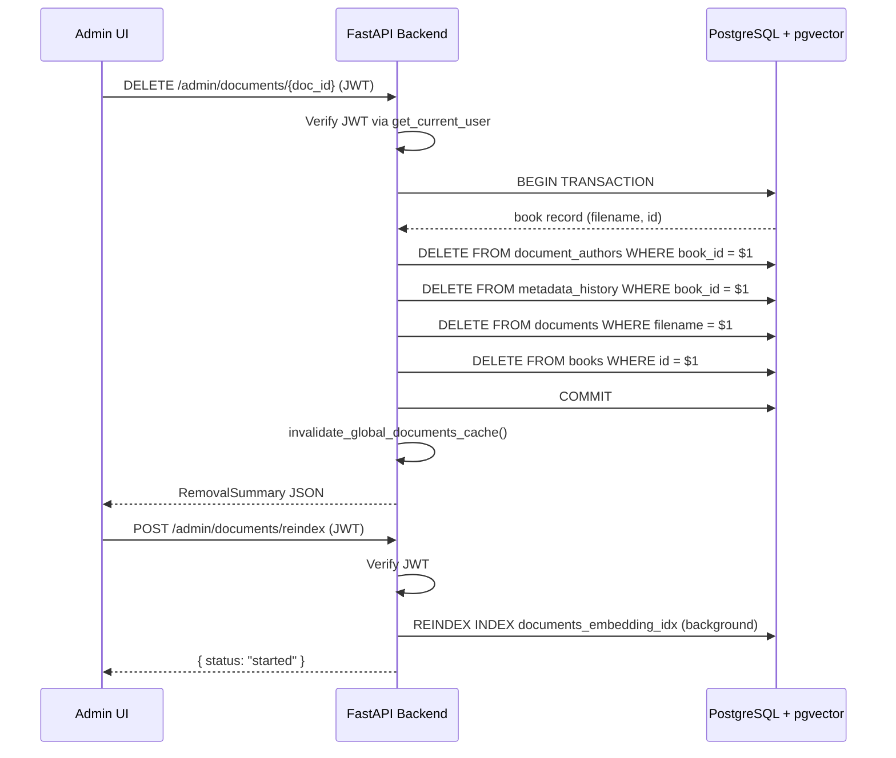
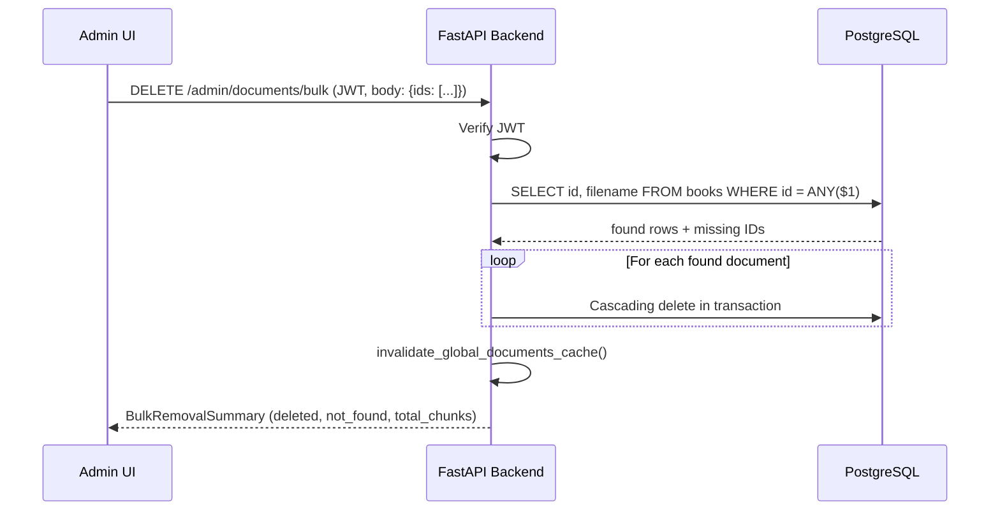

# Design Document: Document Removal

## Overview

This design consolidates the existing scattered document deletion logic into a single, admin-authenticated, cascading removal system. Currently, three separate delete endpoints exist:

1. `DELETE /documents/{filename}` in `main.py` — unauthenticated, only deletes chunks
2. `DELETE /admin/documents/{doc_id}` in `admin_documents_fixed.py` — unauthenticated, deletes books + chunks but not `document_authors` or `metadata_history`
3. `DELETE /admin/documents/bulk` in `admin_documents_fixed.py` — unauthenticated, same gaps

The new design replaces these with two admin-authenticated endpoints that perform full cascading deletion (books, chunks, document_authors, metadata_history) and adds vector index rebuild capability. The frontend gets enhanced with bulk selection, chunk count visibility, and proper confirmation dialogs.

### Key Design Decisions

- **Consolidate into `/admin/documents` router**: All delete operations live in `admin_documents_fixed.py` behind `get_current_user` auth dependency. The old unauthenticated `DELETE /documents/{filename}` in `main.py` is removed.
- **Use database transactions**: All cascading deletes happen inside a single `conn.transaction()` block so partial failures leave data consistent.
- **Retain orphaned authors**: Per requirement 2.3, authors with zero remaining documents are kept. This avoids data loss if the author is re-associated later.
- **Reindex is optional and non-blocking**: PostgreSQL `REINDEX` on IVFFlat is a maintenance operation. It runs in a background task so search remains available during the rebuild.

## Architecture



### Bulk Flow



## Components and Interfaces

### Backend: Modified `admin_documents_fixed.py`

The existing delete endpoints are replaced with authenticated, cascading versions.

#### `DELETE /admin/documents/{doc_id}`

- **Auth**: `Depends(get_current_user)` — returns 401 if no valid JWT
- **Path param**: `doc_id: int`
- **Response 200**:
  ```json
  {
    "deleted": true,
    "document_id": 42,
    "filename": "rpg-guide.pdf",
    "title": "RPG Programming Guide",
    "chunks_deleted": 1523,
    "author_associations_deleted": 2,
    "metadata_history_deleted": 5
  }
  ```
- **Response 404**: `{ "detail": "Document not found" }`
- **Response 401**: `{ "detail": "Invalid or expired token" }`
- **Response 500**: `{ "detail": "Database error: ..." }`

#### `DELETE /admin/documents/bulk`

- **Auth**: `Depends(get_current_user)`
- **Body**: `{ "ids": [1, 2, 3] }`
- **Validation**: Returns 400 if `ids` is empty
- **Response 200**:
  ```json
  {
    "deleted_count": 2,
    "not_found_ids": [3],
    "deleted_documents": [
      { "id": 1, "filename": "book1.pdf", "chunks_deleted": 500 },
      { "id": 2, "filename": "book2.pdf", "chunks_deleted": 300 }
    ],
    "total_chunks_deleted": 800,
    "total_author_associations_deleted": 3,
    "total_metadata_history_deleted": 7
  }
  ```

#### `POST /admin/documents/reindex`

- **Auth**: `Depends(get_current_user)`
- **Response 200**: `{ "status": "started", "message": "Vector index rebuild initiated" }`
- **Response 409**: `{ "detail": "Rebuild already in progress" }`
- **Response 500**: `{ "detail": "Rebuild failed: ..." }`

A module-level flag `_reindex_in_progress` prevents concurrent rebuilds. The actual `REINDEX INDEX documents_embedding_idx` runs via `asyncio.create_task` so the endpoint returns immediately.

#### `GET /admin/documents/reindex/status`

- **Auth**: `Depends(get_current_user)`
- **Response 200**: `{ "in_progress": false, "last_completed_at": "...", "last_duration_seconds": 45.2 }` or `{ "in_progress": true }`

### Backend: Removed from `main.py`

The unauthenticated `DELETE /documents/{filename}` endpoint is removed. The frontend already calls `DELETE /admin/documents/{doc_id}` via `apiClient` which attaches the admin JWT automatically.

### Frontend: `frontend/app/admin/documents/page.tsx`

#### New State

```typescript
const [selectedIds, setSelectedIds] = useState<Set<number>>([]);
const [bulkDeleteLoading, setBulkDeleteLoading] = useState(false);
const [showBulkDeleteDialog, setShowBulkDeleteDialog] = useState(false);
const [reindexLoading, setReindexLoading] = useState(false);
const [reindexStatus, setReindexStatus] = useState<string | null>(null);
```

#### Checkbox Column

A checkbox column is added to the document table. A "select all on page" checkbox in the header toggles all visible documents. Individual row checkboxes toggle membership in `selectedIds`.

#### Bulk Delete Button

Appears above the table when `selectedIds.size > 0`. Shows count: "Delete 3 selected". Clicking opens `showBulkDeleteDialog`.

#### Enhanced Confirmation Dialogs

**Single delete dialog** — already exists but enhanced to show:
- Document title
- Document type (book/article badge)
- Chunk count (already available in `selectedDoc.chunk_count`)

**Bulk delete dialog** — new, shows:
- List of selected document titles (scrollable if many)
- Total chunk count across all selected
- Warning text about irreversibility

#### Rebuild Vector Index Button

A button in the page header area: "Rebuild Vector Index". Opens a confirmation dialog explaining the operation. While in progress, shows a spinner and disables the button. On completion, shows elapsed time.

#### Chunk Count Display

Already present in the edit panel metadata section (`selectedDoc.chunk_count`). The `list_documents` query in `admin_documents_fixed.py` already returns chunk counts per document. No backend change needed for this — the data is already flowing. We add chunk count as a visible column in the table for at-a-glance visibility.

## Data Models

### Database Tables Involved

```sql
-- Primary document metadata (existing)
books (
    id SERIAL PRIMARY KEY,
    filename TEXT UNIQUE NOT NULL,
    title TEXT,
    author TEXT,
    category TEXT,
    document_type TEXT DEFAULT 'book',
    mc_press_url TEXT,
    article_url TEXT,
    total_pages INTEGER,
    created_at TIMESTAMP DEFAULT CURRENT_TIMESTAMP
)

-- Document chunks with embeddings (existing)
documents (
    id SERIAL PRIMARY KEY,
    filename VARCHAR(500) NOT NULL,
    content TEXT NOT NULL,
    page_number INTEGER,
    chunk_index INTEGER,
    embedding vector(384),
    metadata JSONB,
    created_at TIMESTAMP DEFAULT CURRENT_TIMESTAMP
)

-- Author associations (existing)
document_authors (
    book_id INTEGER REFERENCES books(id) ON DELETE CASCADE,
    author_id INTEGER REFERENCES authors(id),
    author_order INTEGER DEFAULT 0
)

-- Metadata change history (existing)
metadata_history (
    id SERIAL PRIMARY KEY,
    book_id INTEGER REFERENCES books(id) ON DELETE CASCADE,
    field_name TEXT NOT NULL,
    old_value TEXT,
    new_value TEXT,
    changed_by TEXT NOT NULL,
    changed_at TIMESTAMP DEFAULT CURRENT_TIMESTAMP
)
```

Note: `document_authors` and `metadata_history` both have `ON DELETE CASCADE` referencing `books(id)`. This means deleting from `books` will automatically cascade to these tables. However, the design explicitly deletes from these tables first within the transaction for two reasons:
1. To count the rows deleted for the removal summary response
2. To not rely solely on implicit cascade behavior — explicit is safer and more auditable

### Deletion Order (within transaction)

1. `DELETE FROM document_authors WHERE book_id = $1` — count affected rows
2. `DELETE FROM metadata_history WHERE book_id = $1` — count affected rows
3. `DELETE FROM documents WHERE filename = $1` — count affected rows (chunks)
4. `DELETE FROM books WHERE id = $1` — the book record itself

### Request/Response Models

```python
# Pydantic models for the bulk delete endpoint
class BulkDeleteRequest(BaseModel):
    ids: List[int]

class DocumentDeletionDetail(BaseModel):
    id: int
    filename: str
    chunks_deleted: int

class SingleRemovalSummary(BaseModel):
    deleted: bool
    document_id: int
    filename: str
    title: str
    chunks_deleted: int
    author_associations_deleted: int
    metadata_history_deleted: int

class BulkRemovalSummary(BaseModel):
    deleted_count: int
    not_found_ids: List[int]
    deleted_documents: List[DocumentDeletionDetail]
    total_chunks_deleted: int
    total_author_associations_deleted: int
    total_metadata_history_deleted: int
```


## Correctness Properties

*A property is a characteristic or behavior that should hold true across all valid executions of a system — essentially, a formal statement about what the system should do. Properties serve as the bridge between human-readable specifications and machine-verifiable correctness guarantees.*

### Property 1: Unauthenticated requests are rejected

*For any* DELETE request to `/admin/documents/{doc_id}` or `/admin/documents/bulk` that does not include a valid JWT token, the API shall return a 401 status code and the document data shall remain unchanged.

**Validates: Requirements 1.1**

### Property 2: Non-existent document returns 404

*For any* document ID that does not exist in the `books` table, a DELETE request to `/admin/documents/{doc_id}` shall return a 404 status code.

**Validates: Requirements 1.4**

### Property 3: Single document cascading delete completeness

*For any* document that exists in the database, after a successful authenticated DELETE request, zero rows shall remain in `books` for that document ID, zero rows shall remain in `documents` for that filename, zero rows shall remain in `document_authors` for that book_id, and zero rows shall remain in `metadata_history` for that book_id.

**Validates: Requirements 1.2, 1.3, 2.1, 2.2, 8.1, 8.2, 8.3**

### Property 4: Orphaned author retention

*For any* document deletion where an associated author has no other document associations, the author record shall still exist in the `authors` table after the deletion completes.

**Validates: Requirements 2.3**

### Property 5: Cache invalidation after deletion

*For any* successful document deletion (single or bulk), the global documents cache shall be invalidated, and a subsequent call to the document listing endpoint shall not include the deleted document(s).

**Validates: Requirements 2.4**

### Property 6: Bulk delete cascading completeness

*For any* list of valid document IDs submitted to the bulk delete endpoint, after a successful response, zero rows shall remain in `books`, `documents`, `document_authors`, and `metadata_history` for each of those documents.

**Validates: Requirements 3.1**

### Property 7: Bulk delete mixed ID partitioning and summary accuracy

*For any* bulk delete request containing a mix of valid and invalid document IDs, the response `not_found_ids` shall contain exactly the IDs that did not exist in `books`, the `deleted_count` shall equal the number of valid IDs, and `total_chunks_deleted` shall equal the sum of chunks that existed for each deleted document's filename.

**Validates: Requirements 3.2, 3.3**

### Property 8: Chunk count present in listing response

*For any* document returned by the document listing endpoint, the response object shall include a `chunk_count` field whose value equals the actual count of rows in the `documents` table matching that document's filename.

**Validates: Requirements 6.3**

### Property 9: Confirmation dialog content accuracy

*For any* document selected for deletion in the Admin UI, the confirmation dialog shall display the document's title, document type, and chunk count. For bulk deletion, the dialog shall list all selected document titles and display the sum of their chunk counts.

**Validates: Requirements 4.1, 5.2, 5.3**

## Error Handling

### Backend Error Handling

| Scenario | Response | Behavior |
|---|---|---|
| No JWT / invalid JWT | 401 Unauthorized | Request rejected before any DB operation |
| Document ID not found | 404 Not Found | `{ "detail": "Document not found" }` |
| Empty bulk ID list | 400 Bad Request | `{ "detail": "No document IDs provided" }` |
| Database error during delete | 500 Internal Server Error | Transaction rolls back, data unchanged, error logged |
| Reindex already in progress | 409 Conflict | `{ "detail": "Rebuild already in progress" }` |
| Reindex fails | 500 Internal Server Error | Error logged, status endpoint reports failure |

### Transaction Safety

All delete operations use `async with conn.transaction()`. If any step in the cascading delete fails, the entire transaction rolls back. This ensures requirement 1.5 — data remains consistent even on partial failure.

### Frontend Error Handling

- API errors are caught in the `handleDelete` and `handleBulkDelete` functions
- Error messages from the API response body (`response.data.detail`) are displayed in a red alert banner
- Network errors show a generic "Failed to delete document(s)" message
- The confirmation dialog remains open on error so the admin can retry or cancel
- Loading states prevent double-submission during delete operations

## Testing Strategy

### Property-Based Testing

Property-based tests use the `hypothesis` library (already present in the project — see `.hypothesis/` directory). Each property test runs a minimum of 100 iterations with generated inputs.

Since this project has no local testing environment, property-based tests are written as pytest tests that run on Railway via the staging deployment. Tests interact with the API via HTTP requests against the staging URL.

Each property test is tagged with a comment referencing its design property:
```python
# Feature: document-removal, Property 3: Single document cascading delete completeness
```

**Property tests to implement:**
- Property 1: Generate random invalid/missing tokens, verify 401 on all delete endpoints
- Property 2: Generate random non-existent IDs (large integers), verify 404
- Property 3: Create a test document with chunks/authors/history, delete it, verify all tables are clean
- Property 4: Create a document with a unique author, delete the document, verify author persists
- Property 5: Delete a document, then call listing endpoint, verify deleted doc is absent
- Property 6: Create multiple test documents, bulk delete them, verify all tables are clean
- Property 7: Mix real and fake IDs in bulk delete, verify correct partitioning in response
- Property 8: For documents in listing response, verify chunk_count matches actual DB count

Property 9 (UI dialog content) is tested via frontend unit tests rather than API-level property tests.

### Unit Tests

Unit tests cover specific examples and edge cases:
- Empty bulk delete list returns 400
- Database transaction rollback on simulated failure (requirement 1.5)
- Reindex endpoint returns 409 when already in progress
- Reindex status endpoint returns correct state
- Single delete of a document with zero chunks (edge case)
- Bulk delete where all IDs are invalid (edge case)
- Confirmation dialog renders correct content for books vs articles
- Bulk delete button shows correct count
- Cancel dialog takes no action

### Frontend Tests

Frontend component tests (if testing infrastructure is added) would cover:
- Checkbox selection/deselection behavior
- Bulk delete button visibility based on selection count
- Confirmation dialog content rendering
- Reindex button disabled state during rebuild
- Error message display on API failure

### Test Configuration

```python
# Property test settings
from hypothesis import settings, given
from hypothesis import strategies as st

@settings(max_examples=100)
@given(doc_id=st.integers(min_value=999999, max_value=9999999))
def test_nonexistent_doc_returns_404(doc_id):
    # Feature: document-removal, Property 2: Non-existent document returns 404
    ...
```
