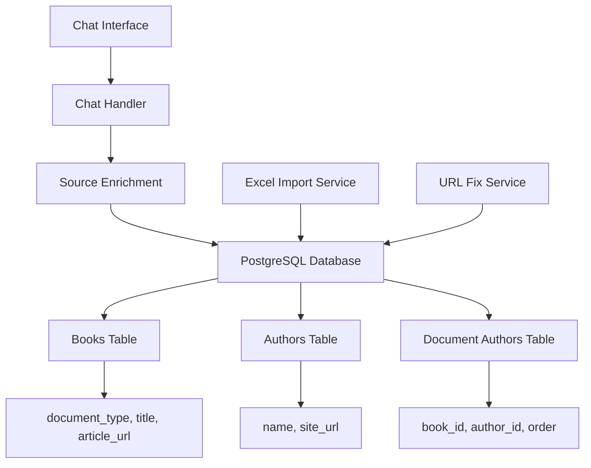

# Design Document

## Overview

This design addresses the final UI and data consistency issues in the MC Press chatbot system. The core problem is that while the database contains correct metadata, the chat interface is not properly displaying it due to issues in the source enrichment process, URL formatting problems in the import pipeline, and frontend component behavior inconsistencies.

## Architecture

### System Components



### Data Flow

1. **Import Pipeline**: Excel → Import Service → Database Tables
2. **Chat Pipeline**: User Query → Chat Handler → Source Enrichment → Database → Frontend Display
3. **URL Fix Pipeline**: URL Fix Service → Database → Updated URLs

## Components and Interfaces

### Source Enrichment Service

**Location**: `backend/chat_handler.py` - `_enrich_source_metadata()` method

**Current Issues**:
- Returns correct data but chat interface shows ID numbers instead of titles
- This suggests the enrichment data is not being properly used by the frontend

**Required Changes**:
- Verify enrichment query is returning correct title data
- Ensure enrichment response format matches frontend expectations
- Add logging to trace data flow from database to frontend

### Excel Import Service

**Location**: `backend/excel_import_service.py` - `import_article_metadata()` method

**Current Issues**:
- Reads URLs directly from Excel without validation/correction
- May not be properly updating document_type to 'article'
- Transaction handling may not be committing changes

**Required Changes**:
- Add URL format validation and correction during import
- Ensure document_type is set to 'article' for all imported articles
- Improve transaction handling and error reporting
- Add URL normalization: `ww.mcpressonline.com` → `www.mcpressonline.com`

### Frontend Component

**Location**: `frontend/components/CompactSources.tsx`

**Current Issues**:
- Author button dropdown not working (hover vs click behavior)
- Author names are hyperlinks when they shouldn't be
- May not be using enriched title data properly

**Required Changes**:
- Fix hover-based dropdown for Author button
- Remove direct hyperlinks from author names
- Ensure title data from enrichment is displayed instead of filename

## Data Models

### Books Table Schema
```sql
CREATE TABLE books (
    id SERIAL PRIMARY KEY,
    filename VARCHAR(500) UNIQUE NOT NULL,
    title VARCHAR(500),                    -- Should contain article titles from Excel Column B
    document_type VARCHAR(50),             -- Should be 'article' for articles, 'book' for books
    article_url VARCHAR(500),              -- Should use www.mcpressonline.com format
    mc_press_url VARCHAR(500),             -- For books only
    author VARCHAR(255),                   -- Legacy field
    category VARCHAR(100)
);
```

### Expected Data State
- **Articles**: `document_type='article'`, `title` from Excel, `article_url` with correct www format
- **Books**: `document_type='book'`, `title` from metadata, `mc_press_url` populated

## Correctness Properties

*A property is a characteristic or behavior that should hold true across all valid executions of a system-essentially, a formal statement about what the system should do. Properties serve as the bridge between human-readable specifications and machine-verifiable correctness guarantees.*

### Property 1: Title Display Consistency
*For any* search result in the chat interface, the displayed title should match the title field from the books table, not the filename
**Validates: Requirements 1.1, 1.2, 1.3**

### Property 2: Document Type Button Mapping
*For any* document with `document_type='article'`, the chat interface should display a green "Read" button; for `document_type='book'`, a blue "Buy" button
**Validates: Requirements 2.1, 2.2**

### Property 3: URL Format Normalization
*For any* article URL imported from Excel, the URL should use the "www.mcpressonline.com" format, not "ww.mcpressonline.com"
**Validates: Requirements 3.1, 3.2**

### Property 4: Author Button Dropdown Behavior
*For any* source with authors having website URLs, hovering over the Author button should display a dropdown with clickable author links
**Validates: Requirements 4.1, 4.2, 4.3**

### Property 5: Import Transaction Consistency
*For any* successful import operation, all reported database changes should be committed and visible in subsequent queries
**Validates: Requirements 6.1, 6.2**

### Property 6: Author Name Resolution
*For any* article with author data in the Excel file, the chat interface should display the real author name from Column J, not "Unknown Author"
**Validates: Requirements 5.1, 5.2**

## Error Handling

### Import Service Error Handling
- **Database Connection Failures**: Retry with exponential backoff, report actual errors
- **Excel File Format Issues**: Validate structure before processing, provide specific error messages
- **URL Format Validation**: Log invalid URLs, attempt correction, fall back gracefully
- **Transaction Failures**: Rollback partial changes, report specific failure reasons

### Frontend Error Handling
- **Missing Enrichment Data**: Fall back to filename display, log missing data for debugging
- **Invalid URLs**: Disable buttons, show appropriate tooltips
- **Empty Author Lists**: Hide Author button, maintain layout consistency

### URL Fix Service Error Handling
- **No URLs to Fix**: Return success with zero count, avoid unnecessary operations
- **Partial Fix Failures**: Report which URLs failed, continue with successful fixes
- **Database Lock Issues**: Retry with delays, report lock contention

## Testing Strategy

### Unit Tests
- Test URL normalization logic with various input formats
- Test enrichment data mapping for different document types
- Test frontend component rendering with various data states
- Test import service transaction handling with simulated failures

### Property-Based Tests
- Generate random article data and verify title display consistency
- Generate random URL formats and verify normalization
- Generate random author data and verify dropdown behavior
- Test import operations with various Excel file structures

### Integration Tests
- End-to-end test: Import Excel → Database → Chat Interface → Correct Display
- Test URL fix service with real database data
- Test chat enrichment with various document types
- Test frontend component with real API responses

### Manual Testing
- Verify chat interface shows article titles instead of ID numbers
- Verify "Read" buttons work with corrected URLs
- Verify Author button dropdown functionality
- Verify import operations actually update database
- Verify consistent behavior across different browsers