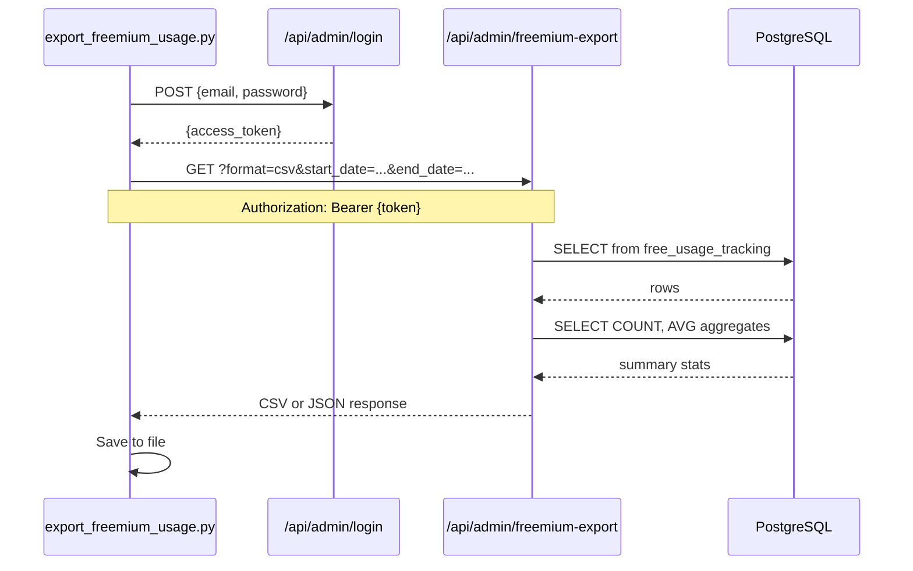
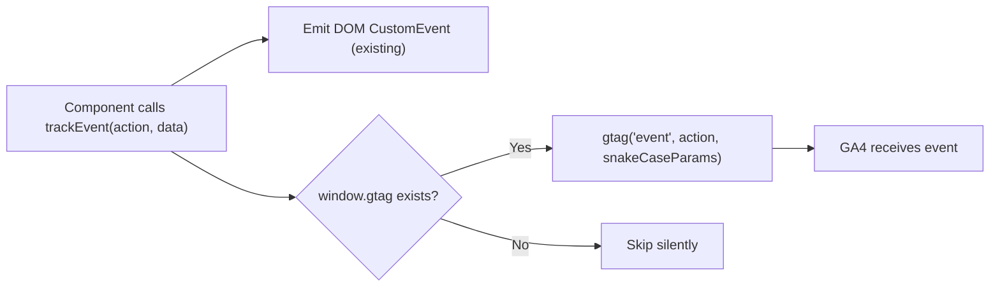

# Design Document: Freemium Usage Export

## Overview

This feature adds three capabilities to the MC ChatMaster platform:

1. **Backend CSV/JSON export endpoint** (`GET /api/admin/freemium-export`) — a new FastAPI route module that queries the existing `free_usage_tracking` PostgreSQL table and returns per-user usage data plus funnel summary statistics. Protected by the existing admin JWT auth (`get_current_user` dependency from `auth_routes.py`).

2. **Google Analytics bridge in `trackEvent()`** — a small modification to `frontend/utils/analytics.ts` that forwards every analytics event to `window.gtag()` (already loaded in `layout.tsx` with measurement ID `G-EMLGMF3E5K`). Includes camelCase-to-snake_case parameter conversion and a TypeScript type declaration for `gtag` on `window`.

3. **Local export script** (`export_freemium_usage.py`) — a standalone Python script at the project root that authenticates via `/api/admin/login`, calls the export endpoint, and saves the result to a file. Follows the project's established API-based script pattern (no backend imports, uses `requests`).

### Key Design Decisions

- **Separate route module, not inline in `main.py`.** The endpoint lives in `backend/freemium_export_routes.py` with its own `APIRouter`, registered in `main.py` via the standard try/except import pattern. This keeps `main.py` from growing further and follows the pattern used by `export_routes.py`, `article_metadata_routes.py`, etc.
- **Direct database query, not through `UsageGate`.** The `UsageGate` class is designed for per-request usage checks, not bulk data export. The export route creates its own `asyncpg` pool connection to run the aggregate query. This avoids coupling the export to the gate's internal API.
- **`FREE_QUESTION_LIMIT` read from env at request time.** The summary thresholds (soft warning, strong warning, reached limit) are computed using the same env var the gate uses. Reading it per-request means the export always reflects the current configuration.
- **CSV summary appended as comment rows.** When exporting CSV, the summary statistics are appended below the user data as `# Summary` comment rows. This keeps the CSV parseable — standard CSV readers ignore `#`-prefixed rows, while humans can read the summary at the bottom.
- **`gtag` integration is unconditional for all events.** Rather than filtering to only freemium events, the `trackEvent()` function forwards all events to GA. This is simpler and more useful — any future analytics events automatically flow to GA4.
- **TypeScript `gtag` declaration is inline.** A `declare global` block in `analytics.ts` is simpler than a separate `.d.ts` file and keeps the type near its usage.

### What Does NOT Change

- `free_usage_tracking` table schema (no migrations)
- `UsageGate` class or freemium gate logic
- Existing admin auth system (`auth.py`, `auth_routes.py`)
- Existing `trackEvent()` DOM `CustomEvent` emission behavior
- Google Analytics gtag loading in `layout.tsx`

## Architecture

### Export Endpoint Flow



### Analytics Bridge Flow



### Module Structure

```
backend/
  freemium_export_routes.py   # New: APIRouter with GET /api/admin/freemium-export
  auth_routes.py              # Existing: get_current_user dependency reused
  usage_gate.py               # Existing: not modified, env var pattern referenced
  main.py                     # Modified: import and register freemium_export_routes

frontend/
  utils/analytics.ts          # Modified: add gtag bridge + type declaration

export_freemium_usage.py      # New: standalone script at project root
```

## Components and Interfaces

### Backend: `freemium_export_routes.py` — New Module

A new FastAPI router module that provides the admin-authenticated export endpoint.

```python
# backend/freemium_export_routes.py

router = APIRouter(prefix="/api/admin", tags=["admin"])

@router.get("/freemium-export")
async def export_freemium_usage(
    format: str = Query("csv", regex="^(csv|json)$"),
    start_date: Optional[str] = Query(None),
    end_date: Optional[str] = Query(None),
    current_user: Dict[str, Any] = Depends(get_current_user),
) -> Response:
    ...
```

**Query parameters:**

| Parameter | Type | Default | Description |
|-----------|------|---------|-------------|
| `format` | string | `"csv"` | Output format: `csv` or `json` |
| `start_date` | string (optional) | `None` | ISO 8601 date (`YYYY-MM-DD`), inclusive start |
| `end_date` | string (optional) | `None` | ISO 8601 date (`YYYY-MM-DD`), inclusive end |

**Authentication:** Uses `Depends(get_current_user)` from `auth_routes.py` — the same dependency used by all existing admin endpoints. Returns HTTP 401 if the JWT is missing, expired, or invalid.

**Response formats:**

- **CSV** (`format=csv`): Returns `text/csv` with `Content-Disposition: attachment; filename=freemium-usage-export-{YYYY-MM-DD}.csv`. Header row: `email,questions_used,first_seen,last_active`. User rows ordered by `questions_used DESC, last_question_at DESC`. Summary appended after a blank row as `#`-prefixed comment rows.
- **JSON** (`format=json`): Returns `application/json` with structure:

```json
{
  "users": [
    {
      "email": "user@example.com",
      "questions_used": 7,
      "first_seen": "2025-01-15T10:30:00",
      "last_active": "2025-06-20T14:22:00"
    }
  ],
  "summary": {
    "total_free_users": 142,
    "reached_soft_warning": 45,
    "reached_strong_warning": 30,
    "reached_limit": 22,
    "average_questions_used": 4.3,
    "questions_limit": 8
  }
}
```

**Internal logic:**

1. Parse and validate `start_date` / `end_date` (return HTTP 400 on invalid format).
2. Read `FREE_QUESTION_LIMIT` from `os.getenv("FREE_QUESTION_LIMIT", "8")`, parse to int (default 8 on failure — same pattern as `UsageGate._read_limit()`).
3. Build SQL query with optional `WHERE created_at >= $start AND created_at <= $end` clauses.
4. Execute user data query: `SELECT user_email, questions_used, created_at, last_question_at FROM free_usage_tracking` with ordering and optional date filters.
5. Execute summary aggregates: `COUNT(*)`, `AVG(questions_used)`, and conditional counts for each warning threshold.
6. Format timestamps as ISO 8601 strings.
7. Return CSV or JSON response.

**Database access:** The module acquires a connection from an `asyncpg` pool initialized at module level (same `DATABASE_URL` env var). The pool is created lazily on first request or during startup via a setter function called from `main.py`, following the pattern used by other route modules.

### Backend: `main.py` — Registration

Add the standard try/except import block and register the router:

```python
# Import freemium export routes
try:
    try:
        from freemium_export_routes import router as freemium_export_router, set_database_url
    except ImportError:
        from backend.freemium_export_routes import router as freemium_export_router, set_database_url
    FREEMIUM_EXPORT_AVAILABLE = True
    print("✅ Freemium export module loaded")
except Exception as e:
    print(f"⚠️ Freemium export module not available: {e}")
    FREEMIUM_EXPORT_AVAILABLE = False
    freemium_export_router = None
```

In the `startup_event`, after the database URL is confirmed available:

```python
if FREEMIUM_EXPORT_AVAILABLE:
    try:
        database_url = os.getenv("DATABASE_URL")
        if database_url:
            set_database_url(database_url)
            app.include_router(freemium_export_router)
            print("✅ Freemium export endpoint enabled at /api/admin/freemium-export")
        else:
            print("⚠️ DATABASE_URL not set - freemium export disabled")
    except Exception as e:
        print(f"⚠️ Could not enable freemium export: {e}")
```

### Frontend: Modified `analytics.ts` — GA Bridge

The existing `trackEvent()` function is extended to also call `window.gtag()`. A TypeScript type declaration is added for `gtag` on the `window` object.

```typescript
// frontend/utils/analytics.ts

declare global {
  interface Window {
    gtag?: (
      command: string,
      action: string,
      params?: Record<string, string | number | boolean>
    ) => void
  }
}

function toSnakeCase(str: string): string {
  return str.replace(/([a-z])([A-Z])/g, '$1_$2').toLowerCase()
}

function convertKeysToSnakeCase(
  data: Record<string, string | number | boolean>
): Record<string, string | number | boolean> {
  const result: Record<string, string | number | boolean> = {}
  for (const [key, value] of Object.entries(data)) {
    result[toSnakeCase(key)] = value
  }
  return result
}

export function trackEvent(
  action: string,
  data?: Record<string, string | number | boolean>
): void {
  try {
    // Existing: emit DOM CustomEvent
    const event = new CustomEvent('mc_analytics', {
      detail: { action, ...data, timestamp: Date.now() }
    })
    window.dispatchEvent(event)

    if (process.env.NODE_ENV === 'development') {
      console.log('[Analytics]', action, data)
    }
  } catch {
    // Analytics failures must never break the app
  }

  // New: forward to Google Analytics gtag
  try {
    if (typeof window.gtag === 'function') {
      const gaParams = data ? convertKeysToSnakeCase(data) : undefined
      window.gtag('event', action, gaParams)
    }
  } catch {
    // GA failures must never break the app
  }
}
```

**Key behaviors:**
- The DOM `CustomEvent` is emitted first, in its own try/catch. If `gtag` fails, the DOM event is unaffected.
- `gtag` availability is checked with `typeof window.gtag === 'function'` — safe in SSR, test environments, and ad-blocker scenarios.
- Parameter keys are converted from camelCase to snake_case for GA4 compatibility (e.g., `questionsUsed` → `questions_used`, `isPQL` → `is_pql`).
- No new npm dependencies required.

### Export Script: `export_freemium_usage.py`

A standalone Python script at the project root. Uses only `requests` (standard in the project's root-level scripts) and `argparse`.

```python
#!/usr/bin/env python3
"""
Export freemium usage data from MC ChatMaster.

Usage:
    python3 export_freemium_usage.py
    python3 export_freemium_usage.py --format json
    python3 export_freemium_usage.py --start-date 2025-01-01 --end-date 2025-06-30
    python3 export_freemium_usage.py --output /path/to/report.csv
"""

import argparse, os, sys, requests
from datetime import date
```

**Authentication flow:**
1. Read `ADMIN_EMAIL` and `ADMIN_PASSWORD` from environment variables.
2. Read `API_URL` from environment (default: `https://mcpress-chatbot-production.up.railway.app`).
3. POST to `{API_URL}/api/admin/login` with `{"email": ..., "password": ...}`.
4. Extract `access_token` from response.
5. On auth failure (non-200 or missing token), print error and `sys.exit(1)`.

**Export flow:**
1. Build query params from CLI args (`format`, `start_date`, `end_date`).
2. GET `{API_URL}/api/admin/freemium-export` with `Authorization: Bearer {token}` header.
3. Save response body to output file.
4. Print summary line: `"Exported {N} users to {filepath}"` (parse count from response).

**CLI arguments:**

| Argument | Default | Description |
|----------|---------|-------------|
| `--format` | `csv` | Export format: `csv` or `json` |
| `--start-date` | None | Filter start date (YYYY-MM-DD) |
| `--end-date` | None | Filter end date (YYYY-MM-DD) |
| `--output` | `freemium-usage-export-{today}.{format}` | Output file path |

## Data Models

### Database: `free_usage_tracking` (Existing — No Changes)

```sql
CREATE TABLE free_usage_tracking (
    id SERIAL PRIMARY KEY,
    user_email VARCHAR(255) UNIQUE NOT NULL,
    questions_used INTEGER NOT NULL DEFAULT 0,
    created_at TIMESTAMP NOT NULL DEFAULT CURRENT_TIMESTAMP,
    last_question_at TIMESTAMP NOT NULL DEFAULT CURRENT_TIMESTAMP
);
```

### Export User Row (Python → CSV/JSON)

| Export Column | DB Column | Format |
|---------------|-----------|--------|
| `email` | `user_email` | string |
| `questions_used` | `questions_used` | integer |
| `first_seen` | `created_at` | ISO 8601 timestamp |
| `last_active` | `last_question_at` | ISO 8601 timestamp |

### Summary Object (JSON format)

```python
class FreemiumSummary:
    total_free_users: int          # COUNT(*)
    reached_soft_warning: int      # COUNT WHERE questions_used >= limit - 2
    reached_strong_warning: int    # COUNT WHERE questions_used >= limit - 1
    reached_limit: int             # COUNT WHERE questions_used >= limit
    average_questions_used: float  # AVG(questions_used), rounded to 1 decimal
    questions_limit: int           # Current FREE_QUESTION_LIMIT value
```

### SQL Queries

**User data query:**
```sql
SELECT user_email, questions_used, created_at, last_question_at
FROM free_usage_tracking
WHERE ($1::timestamp IS NULL OR created_at >= $1)
  AND ($2::timestamp IS NULL OR created_at <= $2)
ORDER BY questions_used DESC, last_question_at DESC
```

**Summary aggregates query:**
```sql
SELECT
    COUNT(*) AS total_free_users,
    COALESCE(ROUND(AVG(questions_used)::numeric, 1), 0) AS average_questions_used,
    COUNT(*) FILTER (WHERE questions_used >= $1) AS reached_soft_warning,
    COUNT(*) FILTER (WHERE questions_used >= $2) AS reached_strong_warning,
    COUNT(*) FILTER (WHERE questions_used >= $3) AS reached_limit
FROM free_usage_tracking
WHERE ($4::timestamp IS NULL OR created_at >= $4)
  AND ($5::timestamp IS NULL OR created_at <= $5)
```

Where `$1 = limit - 2`, `$2 = limit - 1`, `$3 = limit`.

### Environment Variables

| Variable | Used By | Description |
|----------|---------|-------------|
| `DATABASE_URL` | `freemium_export_routes.py` | PostgreSQL connection string (existing) |
| `FREE_QUESTION_LIMIT` | `freemium_export_routes.py` | Warning threshold computation (existing, default 8) |
| `ADMIN_EMAIL` | `export_freemium_usage.py` | Admin credentials for script auth |
| `ADMIN_PASSWORD` | `export_freemium_usage.py` | Admin credentials for script auth |
| `API_URL` | `export_freemium_usage.py` | Backend URL (default: production) |

### GA4 Event Parameter Mapping

| Event Action | camelCase Input | snake_case GA Parameter |
|-------------|-----------------|------------------------|
| `warning_stage_change` | `questionsUsed` | `questions_used` |
| `warning_stage_change` | `stage` | `stage` |
| `upgrade_click` | `isPQL` | `is_pql` |
| `upgrade_click` | `stage` | `stage` |
| `pql_qualified` | `sessionQuestionCount` | `session_question_count` |
| `newsletter_dismissed` | `questionsUsed` | `questions_used` |
| `newsletter_signup` | `questionsUsed` | `questions_used` |


## Correctness Properties

*A property is a characteristic or behavior that should hold true across all valid executions of a system — essentially, a formal statement about what the system should do. Properties serve as the bridge between human-readable specifications and machine-verifiable correctness guarantees.*

### Property 1: Export ordering is correct

*For any* list of user records with varying `questions_used` and `last_question_at` values, the export output SHALL be sorted by `questions_used` descending first, then by `last_question_at` descending as a tiebreaker. That is, for any two adjacent rows `a` (before) and `b` (after), either `a.questions_used > b.questions_used`, or `a.questions_used == b.questions_used` and `a.last_question_at >= b.last_question_at`.

**Validates: Requirements 1.6**

### Property 2: ISO 8601 timestamp round-trip

*For any* valid `datetime` value from the database, formatting it as an ISO 8601 string and parsing it back SHALL produce a value equivalent to the original (truncated to the same precision). This ensures the `first_seen` and `last_active` columns faithfully represent the underlying `created_at` and `last_question_at` data.

**Validates: Requirements 1.7**

### Property 3: Summary threshold counts are consistent with user data

*For any* set of user records and *any* positive integer `questions_limit`, the summary fields SHALL satisfy:
- `total_free_users` equals the total number of user records
- `reached_soft_warning` equals the count of users where `questions_used >= questions_limit - 2`
- `reached_strong_warning` equals the count of users where `questions_used >= questions_limit - 1`
- `reached_limit` equals the count of users where `questions_used >= questions_limit`
- The invariant `reached_limit <= reached_strong_warning <= reached_soft_warning <= total_free_users` always holds

**Validates: Requirements 2.2, 2.3, 2.6**

### Property 4: Summary average computation

*For any* non-empty set of user records, `average_questions_used` SHALL equal `round(sum(questions_used) / count, 1)`. For an empty set, the average SHALL be `0`.

**Validates: Requirements 2.4**

### Property 5: Date range filtering correctness

*For any* set of user records with varying `created_at` timestamps and *any* valid date range `[start_date, end_date]`, every user in the filtered result SHALL have `created_at >= start_date` and `created_at <= end_of(end_date)`, and every user in the original set that satisfies both conditions SHALL appear in the filtered result. When no date range is provided, all users SHALL be returned.

**Validates: Requirements 3.2, 3.3, 3.4, 3.5**

### Property 6: camelCase to snake_case conversion

*For any* string in camelCase format (e.g., `questionsUsed`, `isPQL`, `sessionQuestionCount`), the `toSnakeCase` function SHALL produce a string where every uppercase letter is preceded by an underscore and lowercased, and the result contains no uppercase letters. Additionally, applying `toSnakeCase` to an already-snake_case string SHALL return the same string (idempotence for snake_case inputs).

**Validates: Requirements 6.6**

## Error Handling

### Backend: Export Endpoint

| Scenario | HTTP Status | Response |
|----------|-------------|----------|
| Missing or invalid JWT token | 401 | `{"detail": "Invalid or expired token"}` (from `get_current_user`) |
| Invalid `format` parameter (not csv/json) | 400 | `{"detail": "Format must be 'csv' or 'json'"}` |
| Invalid `start_date` format | 400 | `{"detail": "Invalid start_date format. Expected YYYY-MM-DD."}` |
| Invalid `end_date` format | 400 | `{"detail": "Invalid end_date format. Expected YYYY-MM-DD."}` |
| `start_date` after `end_date` | 400 | `{"detail": "start_date must be before or equal to end_date."}` |
| `DATABASE_URL` not configured | 503 | Endpoint not registered (disabled at startup) |
| Database connection failure | 500 | `{"detail": "Export failed: {error}"}` |
| No users in date range | 200 | Empty CSV (header only) or JSON with empty `users` array and zeroed summary |
| `FREE_QUESTION_LIMIT` not set or invalid | — | Defaults to 8 (same pattern as `UsageGate._read_limit()`) |

### Frontend: Analytics Bridge

| Scenario | Handling |
|----------|----------|
| `window.gtag` is undefined (ad blocker, SSR, test env) | Skip gtag call silently, DOM event still emitted |
| `window.gtag` throws an error | Caught by try/catch, DOM event already emitted (separate try/catch blocks) |
| `data` parameter is undefined | Pass `undefined` to gtag (GA4 handles this gracefully) |
| `data` contains keys that are already snake_case | `toSnakeCase` is idempotent for snake_case — no double-conversion |

### Export Script

| Scenario | Handling |
|----------|----------|
| `ADMIN_EMAIL` or `ADMIN_PASSWORD` not set | Print error message, `sys.exit(1)` |
| Authentication fails (wrong credentials) | Print "Authentication failed: {status} {detail}", `sys.exit(1)` |
| Export endpoint returns non-200 | Print "Export failed: {status} {detail}", `sys.exit(1)` |
| Network error (connection refused, timeout) | Print "Connection error: {error}", `sys.exit(1)` |
| Output directory doesn't exist | Let Python's `open()` raise `FileNotFoundError` with natural error message |

## Testing Strategy

### Property-Based Tests

Property-based testing is appropriate for this feature because several components involve pure functions with clear input/output behavior: the sorting logic, timestamp formatting, summary computation, date filtering, and camelCase-to-snake_case conversion. These are all functions where behavior varies meaningfully with input and 100+ iterations will catch edge cases that example tests miss.

**Backend (Python — Hypothesis):**

| Property | Test File | What It Tests |
|----------|-----------|---------------|
| Property 1: Export ordering | `backend/test_freemium_export.py` | Sorting logic on generated user records |
| Property 2: ISO 8601 round-trip | `backend/test_freemium_export.py` | Timestamp formatting/parsing |
| Property 3: Threshold counts | `backend/test_freemium_export.py` | Summary computation with varying limits |
| Property 4: Average computation | `backend/test_freemium_export.py` | Average calculation and rounding |
| Property 5: Date range filtering | `backend/test_freemium_export.py` | Filter logic with generated dates |

**Frontend (TypeScript — fast-check):**

| Property | Test File | What It Tests |
|----------|-----------|---------------|
| Property 6: camelCase to snake_case | `frontend/__tests__/analytics.property.test.ts` | `toSnakeCase` and `convertKeysToSnakeCase` functions |

Each property test runs a minimum of 100 iterations and is tagged with:
**Feature: freemium-usage-export, Property {number}: {property_text}**

### Unit Tests (Example-Based)

| Test | What It Verifies | Requirement |
|------|-----------------|-------------|
| Export endpoint returns 401 without auth | Auth enforcement | 1.2 |
| CSV response has correct Content-Type and Content-Disposition | Response headers | 1.3 |
| JSON response has correct Content-Type | Response headers | 1.4 |
| CSV header row matches `email,questions_used,first_seen,last_active` | Column names | 1.5 |
| JSON response contains `users` array and `summary` object | Response structure | 2.1 |
| CSV summary rows appear after blank row with `#` prefix | CSV format | 2.5 |
| Request with valid date params succeeds | Date param acceptance | 3.1 |
| Request without date params returns all users | No-filter behavior | 3.5 |
| Invalid date format returns 400 | Input validation | 3.6 |
| `trackEvent` emits DOM CustomEvent | Existing behavior preserved | 5.1 |
| `trackEvent` calls `window.gtag` when available | GA bridge | 5.1 |
| `trackEvent` does not throw when `gtag` is undefined | Defensive check | 5.2, 5.6 |
| `trackEvent` emits DOM event even when `gtag` throws | Error isolation | 5.5 |
| GA params for `warning_stage_change` include `stage`, `questions_used` | Param mapping | 6.1 |
| GA params for `upgrade_click` include `stage`, `is_pql` | Param mapping | 6.2 |
| GA params for `pql_qualified` include `session_question_count` | Param mapping | 6.3 |

### Integration Tests (Manual — on Railway Staging)

Following the project's established pattern, integration tests are performed manually on staging after deployment:

1. **Export script end-to-end:** Run `python3 export_freemium_usage.py` against staging with valid admin credentials. Verify CSV file is created with correct data.
2. **JSON export:** Run with `--format json`, verify JSON structure includes `users` and `summary`.
3. **Date filtering:** Run with `--start-date` and `--end-date`, verify only matching users appear.
4. **Auth failure:** Run with wrong password, verify error message and non-zero exit.
5. **GA events in GA4:** Deploy frontend to staging, trigger freemium events, verify events appear in GA4 Realtime report.

### Test Libraries

| Layer | Library | Notes |
|-------|---------|-------|
| Backend property tests | [Hypothesis](https://hypothesis.readthedocs.io/) | Already used in project (`.hypothesis/` dir exists) |
| Frontend property tests | [fast-check](https://github.com/dubzzz/fast-check) | Standard PBT library for TypeScript |
| Frontend unit tests | Vitest or Jest | Whichever is already configured |
| Backend unit tests | pytest | Standard Python test runner |
