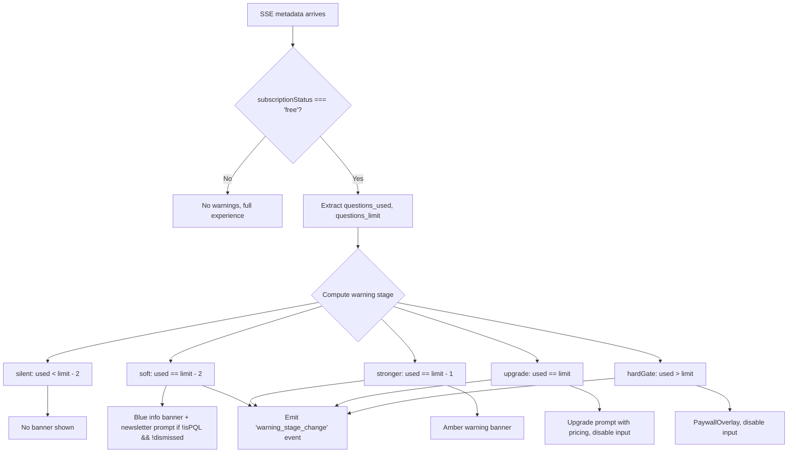
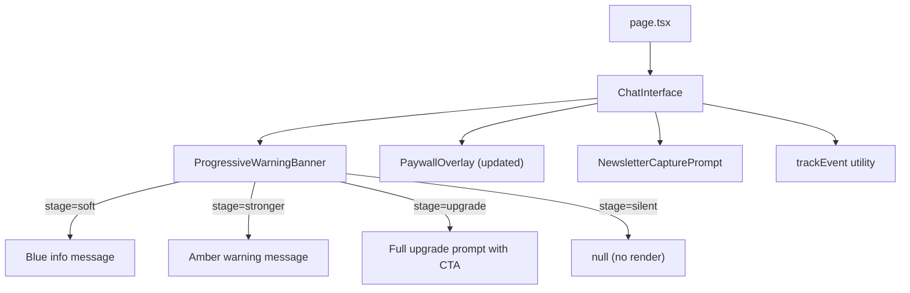
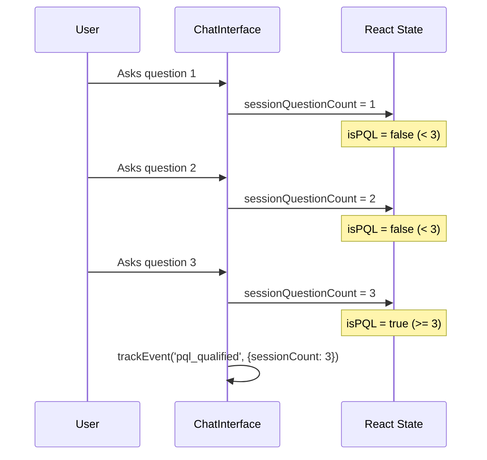

# Design Document: Freemium Usage Gate v2 — Progressive Warnings & Conversion Optimization

## Overview

This design builds on the fully working freemium usage gate (v1) to improve free-to-paid conversion. The changes are:

1. **Backend**: Change the `FREE_QUESTION_LIMIT` default from 5 to 8 (one line in `usage_gate.py`).
2. **Frontend — Progressive Warning System**: Replace the always-visible `RemainingQuestionsBanner` with a new `ProgressiveWarningBanner` that shows stage-specific messaging only when the user is close to the limit. Warning stages are computed from `questions_used` and `questions_limit` (never hardcoded to 8).
3. **Frontend — Updated PaywallOverlay**: New copy with $19.95/month pricing, "Start Unlimited Access — $19.95/month" CTA, "Cancel anytime." text, and PQL-variant copy.
4. **Frontend — PQL Detection**: In-memory session counter in `ChatInterface`. After 3+ questions in a session, set `isPQL` flag. Affects upgrade prompt and paywall copy.
5. **Frontend — Newsletter Capture Prompt**: Dismissible component shown at question 6 (soft warning stage) when PQL is not yet set. Pre-fills email from session. Session-scoped dismissal.
6. **Frontend — Analytics Event Emission**: Simple callback/custom event pattern at each warning stage transition and CTA clicks.
7. **Frontend — Footer text**: Hide "Unlimited Queries" for free-tier users during silent phase (show it only for subscribed users).

### Key Design Decisions

- **No new backend endpoints.** The existing SSE metadata already provides `questions_used`, `questions_limit`, and `questions_remaining`. All progressive warning logic is frontend-driven.
- **Warning thresholds derived from `questions_limit`.** Silent = `questions_used < (questions_limit - 2)`, soft = `== (questions_limit - 2)`, stronger = `== (questions_limit - 1)`, upgrade prompt = `== questions_limit`, hard gate = `> questions_limit`. This adapts automatically if the env var changes.
- **PQL is session-scoped, in-memory only.** No persistence, no backend changes. A simple counter in React state that increments on each successful question in the current page session.
- **Newsletter capture is frontend-only for now.** The prompt collects an email and emits an analytics event, but does not call a backend endpoint (no newsletter API exists yet). The actual subscription integration is deferred.
- **Analytics uses a simple callback pattern.** A `trackEvent(action, data)` utility function that currently logs to console. Google Analytics integration is a separate future task — the callback is the hook point.

### What Does NOT Change

- Login flow (working from v1)
- Subscription verification via Appstle (working from v1)
- Database schema (`free_usage_tracking` table)
- SSE metadata format
- `/chat` endpoint logic (check_usage, record_question, 402 response)
- Subscribed user experience (no banners, no limits)

## Architecture

### Warning Stage Computation Flow



### Component Hierarchy



### PQL Detection Flow



## Components and Interfaces

### Backend: `usage_gate.py` — Single Default Change

The only backend change is updating the default in `_read_limit()`:

```python
def _read_limit(self) -> int:
    """Read FREE_QUESTION_LIMIT from env. Default 8. Log warning on bad value."""
    raw = os.getenv("FREE_QUESTION_LIMIT")
    if raw is None:
        return 8  # Changed from 5
    try:
        return int(raw)
    except (ValueError, TypeError):
        logger.warning(
            f"FREE_QUESTION_LIMIT has non-integer value '{raw}', defaulting to 8"
        )
        return 8  # Changed from 5
```

No other backend changes are needed.

### Frontend: `getWarningStage()` — Pure Function

A new utility function that computes the warning stage from usage data. This is the core logic that all UI components depend on.

```typescript
// utils/warningStage.ts

export type WarningStage = 'silent' | 'soft' | 'stronger' | 'upgrade' | 'hardGate'

export function getWarningStage(questionsUsed: number, questionsLimit: number): WarningStage {
  if (questionsUsed > questionsLimit) return 'hardGate'
  if (questionsUsed === questionsLimit) return 'upgrade'
  if (questionsUsed === questionsLimit - 1) return 'stronger'
  if (questionsUsed === questionsLimit - 2) return 'soft'
  return 'silent'
}
```

This function is pure, deterministic, and the primary target for property-based testing.

### Frontend: `ProgressiveWarningBanner` — New Component

Replaces `RemainingQuestionsBanner`. Renders different UI based on the warning stage.

```typescript
// components/ProgressiveWarningBanner.tsx

interface ProgressiveWarningBannerProps {
  questionsUsed: number
  questionsLimit: number
  isPQL: boolean
  signupUrl: string
  onUpgradeClick: () => void
}
```

**Rendering by stage:**

| Stage | Visual | Copy |
|-------|--------|------|
| `silent` | Nothing (returns `null`) | — |
| `soft` | Blue/neutral info banner | "You've used {used} of your {limit} free MC ChatMaster questions. You still have {remaining} left to explore the MC Press knowledge base." |
| `stronger` | Amber/warm warning banner | "You have 1 free question remaining. Upgrade anytime for unlimited source-backed IBM i answers." |
| `upgrade` | Full upgrade prompt card | Standard: "You've reached your {limit} free questions. Continue with unlimited access to MC ChatMaster for $19.95/month. Get instant, source-linked answers from 113+ MC Press books and 6,300+ technical articles." PQL variant: "Looks like you're working through a real IBM i issue. Unlock unlimited access and keep going without interruption." + standard pricing/CTA |
| `hardGate` | Not rendered by this component — `PaywallOverlay` handles it | — |

The `upgrade` stage includes:
- Primary CTA button: "Start Unlimited Access — $19.95/month" (opens `signupUrl` in new tab)
- "Cancel anytime." text near pricing
- "Already subscribed? Sign In" link
- Does NOT block previous chat messages (it sits below messages, above input)

### Frontend: Updated `PaywallOverlay` — New Copy

The existing `PaywallOverlay` component is updated with new copy and PQL support:

```typescript
// components/PaywallOverlay.tsx

interface PaywallOverlayProps {
  signupUrl: string
  onSignIn: () => void
  isPQL?: boolean
}
```

**Standard copy:** "You've reached your free questions. Continue with unlimited access to MC ChatMaster for $19.95/month. Get instant, source-linked answers from 113+ MC Press books and 6,300+ technical articles."

**PQL copy:** "Looks like you're working through a real IBM i issue. Unlock unlimited access and keep going without interruption."

Both variants include:
- CTA: "Start Unlimited Access — $19.95/month"
- "Cancel anytime."
- "Already subscribed? Sign In" link

### Frontend: `NewsletterCapturePrompt` — New Component

A dismissible prompt shown at the soft warning stage (question 6) when PQL is not yet set.

```typescript
// components/NewsletterCapturePrompt.tsx

interface NewsletterCapturePromptProps {
  userEmail: string
  onDismiss: () => void
  onSignup: (email: string) => void
}
```

**Behavior:**
- Pre-fills the email input with the user's authenticated email
- "Join the MC Press Newsletter" heading with brief value prop
- Submit button and dismiss (X) button
- On dismiss: calls `onDismiss()`, which sets session-scoped `newsletterDismissed` state in `ChatInterface`
- On submit: calls `onSignup(email)`, emits analytics event, sets `newsletterSignedUp` state
- Not shown if `newsletterDismissed` or `newsletterSignedUp` is true
- Not shown if `isPQL` is true (PQL users get upgrade messaging instead)

**Note:** The submit action emits an analytics event but does not call a backend endpoint. Actual newsletter integration is deferred.

### Frontend: `trackEvent()` — Analytics Utility

```typescript
// utils/analytics.ts

export interface AnalyticsEvent {
  action: string
  data?: Record<string, string | number | boolean>
}

export function trackEvent(action: string, data?: Record<string, string | number | boolean>): void {
  // Emit a custom DOM event for future analytics integration
  const event = new CustomEvent('mc_analytics', {
    detail: { action, ...data, timestamp: Date.now() }
  })
  window.dispatchEvent(event)
  
  // Console log for development visibility
  if (process.env.NODE_ENV === 'development') {
    console.log('[Analytics]', action, data)
  }
}
```

**Events emitted:**

| Action | When | Data |
|--------|------|------|
| `warning_stage_change` | Stage transitions to soft, stronger, upgrade, or hardGate | `{ stage, questionsUsed, questionsLimit }` |
| `upgrade_click` | User clicks "Start Unlimited Access" CTA | `{ stage, isPQL }` |
| `newsletter_dismissed` | User dismisses newsletter prompt | `{ questionsUsed }` |
| `newsletter_signup` | User submits newsletter prompt | `{ questionsUsed }` |
| `pql_qualified` | Session question count reaches 3 | `{ sessionQuestionCount }` |

### Frontend: Modified `ChatInterface.tsx`

Changes to the main chat component:

1. **New state variables:**
   - `sessionQuestionCount: number` (starts at 0, increments on each successful question, in-memory only)
   - `isPQL: boolean` (derived: `sessionQuestionCount >= 3`)
   - `newsletterDismissed: boolean` (session-scoped)
   - `newsletterSignedUp: boolean` (session-scoped)
   - `previousWarningStage: WarningStage` (for detecting stage transitions to emit events)

2. **On successful SSE metadata received:**
   - Increment `sessionQuestionCount`
   - Compute `warningStage` via `getWarningStage(questionsUsed, questionsLimit)`
   - If stage changed from previous, call `trackEvent('warning_stage_change', ...)`
   - If `sessionQuestionCount >= 3` and not already PQL, set `isPQL = true` and emit `pql_qualified` event

3. **Replace `RemainingQuestionsBanner` rendering** with `ProgressiveWarningBanner` (only when `subscriptionStatus === 'free'` and usage data available and stage is not `silent`)

4. **Show `NewsletterCapturePrompt`** when stage is `soft` and `!isPQL` and `!newsletterDismissed` and `!newsletterSignedUp`

5. **Disable input** when stage is `upgrade` or `hardGate`

6. **Footer text:** Conditionally render "Unlimited Queries" only when `subscriptionStatus !== 'free'` or when stage is not `silent` (per Req 2.2, hide it during silent phase for free users). Actually, per the requirement, free-tier users should NOT see "Unlimited Queries" at all — it's misleading. So the footer text changes to omit "Unlimited Queries" when `subscriptionStatus === 'free'`.

7. **Pass `isPQL` to `PaywallOverlay`** for PQL-variant copy.

### Frontend: Modified `page.tsx`

- Pass `userEmail` to `ChatInterface` as a new prop (needed for newsletter pre-fill)
- No other changes needed — `subscriptionStatus` is already passed

## Data Models

### No Database Changes

The `free_usage_tracking` table schema is unchanged. The only data change is the default value of `FREE_QUESTION_LIMIT` moving from 5 to 8.

### Warning Stage Type

```typescript
type WarningStage = 'silent' | 'soft' | 'stronger' | 'upgrade' | 'hardGate'
```

### SSE Metadata (Unchanged)

```json
{
  "type": "metadata",
  "usage": {
    "questions_used": 6,
    "questions_limit": 8,
    "questions_remaining": 2
  }
}
```

### Environment Variables

| Variable | Change | Default | Description |
|---|---|---|---|
| `FREE_QUESTION_LIMIT` | Default changed from 5 to 8 | `8` | Max free questions per registered free-tier user |
| `SUBSCRIPTION_SIGNUP_URL` | No change | — | URL for upgrade CTA buttons |


## Correctness Properties

*A property is a characteristic or behavior that should hold true across all valid executions of a system — essentially, a formal statement about what the system should do. Properties serve as the bridge between human-readable specifications and machine-verifiable correctness guarantees.*

### Property 1: Valid integer passthrough for `_read_limit()`

*For any* valid positive integer `n`, when `FREE_QUESTION_LIMIT` is set to the string representation of `n`, `_read_limit()` shall return `n`.

**Validates: Requirements 1.2**

### Property 2: Non-integer default for `_read_limit()`

*For any* string that cannot be parsed as an integer (including floats, words, empty strings, and special characters), when `FREE_QUESTION_LIMIT` is set to that string, `_read_limit()` shall return 8.

**Validates: Requirements 1.3**

### Property 3: Warning stage computation correctness

*For any* pair of non-negative integers `(questionsUsed, questionsLimit)` where `questionsLimit >= 3`, `getWarningStage(questionsUsed, questionsLimit)` shall return:
- `'silent'` when `questionsUsed < questionsLimit - 2`
- `'soft'` when `questionsUsed === questionsLimit - 2`
- `'stronger'` when `questionsUsed === questionsLimit - 1`
- `'upgrade'` when `questionsUsed === questionsLimit`
- `'hardGate'` when `questionsUsed > questionsLimit`

This property also validates that no threshold is hardcoded to 8 — by testing with varying `questionsLimit` values, we confirm the function adapts to any limit.

**Validates: Requirements 2.1, 3.1, 4.1, 5.2, 12.2, 12.3, 12.4**

### Property 4: PQL threshold detection

*For any* non-negative integer `sessionQuestionCount`, the PQL signal shall be `true` if and only if `sessionQuestionCount >= 3`.

**Validates: Requirements 9.1, 9.2**

## Error Handling

### Backend

| Scenario | Handling |
|----------|----------|
| `FREE_QUESTION_LIMIT` set to non-integer | Log warning, default to 8 (existing pattern, just new default) |
| `FREE_QUESTION_LIMIT` set to 0 | Treat as valid — all free-tier requests denied (existing behavior) |
| `FREE_QUESTION_LIMIT` set to negative | Treat as valid integer — all free-tier requests denied (questions_used will always be >= negative limit, so `check_usage` returns `allowed=false` immediately) |
| Database connection failure during `check_usage` | Existing error handling in v1 — returns 500 to client |

### Frontend

| Scenario | Handling |
|----------|----------|
| SSE metadata missing `usage` object | No warning banner shown (subscribed user path) |
| `questions_limit` is 0 or negative in metadata | `getWarningStage` returns `'hardGate'` (used > limit), PaywallOverlay shown |
| `questions_limit` is 1 or 2 | `getWarningStage` still works — soft/stronger stages may not be reachable, but upgrade and hardGate still trigger correctly. With limit=1: question 1 → upgrade. With limit=2: question 1 → soft, question 2 → upgrade. |
| Newsletter prompt email pre-fill fails | Fall back to empty input field — user can type their email |
| `SUBSCRIPTION_SIGNUP_URL` not configured | CTA button opens blank tab (existing v1 behavior) |
| `trackEvent` throws | Wrapped in try/catch — analytics failures must never break the chat experience |

## Testing Strategy

### Property-Based Tests (TypeScript — fast-check)

Property-based tests use [fast-check](https://github.com/dubzzz/fast-check) to verify universal properties across many generated inputs. Each test runs a minimum of 100 iterations.

**Target: `getWarningStage()` utility function and `isPQL` logic.**

| Property | Test File | Iterations |
|----------|-----------|------------|
| Property 1: Valid integer passthrough | `backend/test_usage_gate_v2.py` (Hypothesis) | 100+ |
| Property 2: Non-integer default | `backend/test_usage_gate_v2.py` (Hypothesis) | 100+ |
| Property 3: Warning stage correctness | `frontend/__tests__/warningStage.property.test.ts` (fast-check) | 100+ |
| Property 4: PQL threshold | `frontend/__tests__/warningStage.property.test.ts` (fast-check) | 100+ |

Each property test is tagged with: **Feature: freemium-usage-gate-v2, Property {number}: {property_text}**

### Unit Tests (Example-Based)

| Test | What it verifies | Requirement |
|------|-----------------|-------------|
| `_read_limit()` returns 8 when env var unset | Default value change | 1.1 |
| `_read_limit()` returns 8 when env var is "0" | Zero limit edge case | 1.4 |
| `ProgressiveWarningBanner` renders nothing at silent stage | No banner for early questions | 2.1 |
| `ProgressiveWarningBanner` renders blue banner at soft stage | Correct styling | 3.2 |
| `ProgressiveWarningBanner` renders amber banner at stronger stage | Correct styling | 4.2 |
| `ProgressiveWarningBanner` renders upgrade prompt with "$19.95/month" | Pricing display | 7.1 |
| `ProgressiveWarningBanner` renders PQL copy when `isPQL=true` | PQL variant | 9.3 |
| `ProgressiveWarningBanner` renders standard copy when `isPQL=false` | Standard variant | 9.5 |
| `PaywallOverlay` renders "$19.95/month" and "Cancel anytime." | Updated copy | 7.2, 7.5 |
| `PaywallOverlay` renders PQL copy when `isPQL=true` | PQL variant | 9.4 |
| Stronger warning mentions "Upgrade" but not "$19.95" | No premature price anchoring | 7.3 |
| CTA button text is "Start Unlimited Access — $19.95/month" | Consistent CTA | 7.4 |
| `NewsletterCapturePrompt` pre-fills email | Email pre-fill | 10.3 |
| `NewsletterCapturePrompt` not shown when dismissed | Session dismissal | 10.4 |
| `NewsletterCapturePrompt` not shown when isPQL is true | PQL takes priority | 10.1 |
| Footer hides "Unlimited Queries" for free-tier users | Footer text update | 2.2 |
| `trackEvent` emits CustomEvent with correct payload | Analytics wiring | 11.1–11.5 |

### Integration Tests (Manual — on Railway Staging)

Since this project has no local test environment, integration tests are performed manually on staging after deployment:

1. **New user flow (8 questions):** Create a new free-tier account, ask 8 questions, verify:
   - Questions 1–5: no banner, no "Unlimited Queries" in footer
   - Question 6: blue info banner appears with correct copy
   - Question 7: amber warning banner with "Upgrade" text (no price)
   - Question 8: full answer streamed, then upgrade prompt with $19.95/month pricing
   - Question 9: HTTP 402, PaywallOverlay shown

2. **PQL detection:** Ask 3+ questions in one session, verify PQL copy appears at upgrade/paywall stages.

3. **Newsletter prompt:** At question 6 (without PQL), verify newsletter prompt appears, can be dismissed, does not reappear.

4. **Subscribed user bypass:** Log in with active subscription, verify no banners, no limits, "Unlimited Queries" in footer.

5. **Custom limit:** Set `FREE_QUESTION_LIMIT=3` on staging, verify warning stages shift accordingly (soft at 1, stronger at 2, upgrade at 3).

### Test Libraries

| Layer | Library | Notes |
|-------|---------|-------|
| Backend property tests | [Hypothesis](https://hypothesis.readthedocs.io/) | Already used in project (`.hypothesis/` dir exists) |
| Frontend property tests | [fast-check](https://github.com/dubzzz/fast-check) | Standard PBT library for TypeScript |
| Frontend unit tests | Jest or Vitest | Whichever is already configured in the project |
| Frontend component tests | React Testing Library | For rendering and interaction tests |
