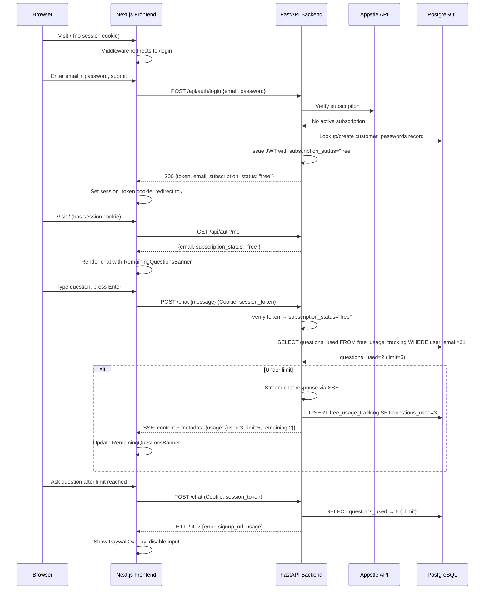
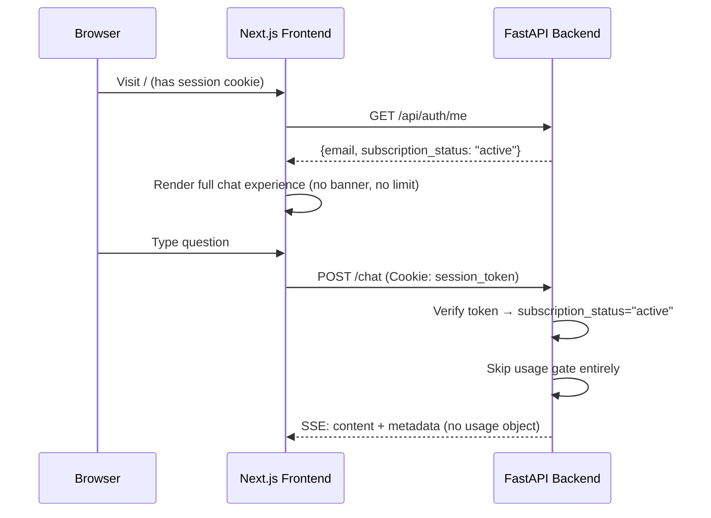

# Design Document: Freemium Usage Gate (Registration-Required)

## Overview

This feature transforms MC ChatMaster from a subscription-only application into a freemium product where all users must register (create an account) before using the chat. Registered users without an active Appstle subscription get a configurable number of free questions. Once exhausted, they must subscribe to continue. Users with an active Appstle subscription get unlimited access.

This is a revision of the original anonymous-fingerprint-based design. The key change: no anonymous access. All users must log in, and usage is tracked by email address.

### What Changes from the Current System

1. **Login flow**: Currently, the login endpoint (`SubscriptionAuthService.login()`) denies users at step 4 if they don't have an active Appstle subscription. The new flow allows these users to log in with `subscription_status="free"`.
2. **Usage gate**: Tracks questions per `user_email` (not per browser fingerprint). The `UsageGate` class is modified to accept email instead of fingerprint.
3. **Frontend**: Restores the login-required middleware (reverts the anonymous access change). After login, free-tier users see a remaining questions banner and eventually a paywall.
4. **Cleanup**: Removes all anonymous fingerprint code (localStorage `anonymousUserId`, `X-Anonymous-Id` header, `getOrCreateAnonymousId` utility).

### Key Design Decisions

- **Server-side enforcement**: Question counts live in PostgreSQL keyed by email. No client-side tracking.
- **Subscription status in JWT**: The session token's `subscription_status` claim distinguishes `"active"` (unlimited) from `"free"` (limited). The frontend reads this to decide which UI to show.
- **Appstle remains the source of truth for paid status**: The login flow still calls Appstle. If subscription is active → `"active"` token. If not → `"free"` token. The usage gate only applies to `"free"` tokens.
- **Increment after stream starts**: The question counter increments only after the first SSE chunk is successfully yielded.
- **Existing table reuse**: The `free_usage_tracking` table is modified to use `user_email` instead of `fingerprint` as the unique key.

## Architecture

### Free-Tier User Flow



### Subscribed User Flow (unchanged)



## Components and Interfaces

### Backend: Modified `SubscriptionAuthService.login()` in `subscription_auth.py`

The critical change: step 4 no longer denies users without an active subscription. Instead, it issues a `"free"` token.

```python
# Current behavior (step 4):
if not (appstle_resp.is_valid and normalized == "active"):
    # DENY — return 403

# New behavior (step 4):
if appstle_resp.is_valid and normalized == "active":
    subscription_status = "active"
else:
    subscription_status = "free"
# Continue to password check (steps 5-7) regardless
# Issue token with the determined subscription_status (step 8)
```

The password check (steps 5-7) remains unchanged. New users still create a `customer_passwords` record. The only difference is that non-subscribers get a `"free"` token instead of a 403 denial.

### Backend: Modified `UsageGate` in `usage_gate.py`

Change from fingerprint-based to email-based tracking:

```python
class UsageGate:
    async def check_usage(self, user_email: str) -> UsageResult:
        """Check if user_email is under the free question limit."""

    async def record_question(self, user_email: str) -> UsageInfo:
        """Increment question count for user_email via UPSERT."""
```

### Backend: Modified `/chat` Endpoint in `main.py`

The chat endpoint changes:

1. Always verify `session_token` cookie. If no valid token → return 401 (not 402).
2. Read `subscription_status` from JWT claims.
3. If `"active"` → skip usage gate, unlimited access.
4. If `"free"` → call `usage_gate.check_usage(email)`. If denied → return 402 with signup URL.
5. If allowed → stream response, call `record_question(email)` after first content chunk.
6. Include `usage` in metadata SSE event for free-tier users only.
7. Remove all `X-Anonymous-Id` header handling.

```python
@app.post("/chat")
async def chat(request: Request, message: ChatMessage):
    # 1. Verify session token (required)
    session_token = request.cookies.get("session_token")
    if not session_token:
        return JSONResponse(status_code=401, content={"error": "Authentication required"})

    claims = subscription_auth_service.verify_token(session_token, allow_grace=False)
    if not claims:
        return JSONResponse(status_code=401, content={"error": "Invalid or expired token"})

    email = claims.get("sub", "")
    subscription_status = claims.get("subscription_status", "free")

    # 2. Usage gate for free-tier users
    usage_info = None
    if subscription_status != "active" and usage_gate:
        result = await usage_gate.check_usage(email)
        if not result.allowed:
            return JSONResponse(status_code=402, content={
                "error": "Free questions exhausted",
                "signup_url": result.signup_url,
                "usage": result.usage.model_dump()
            })
        usage_info = result.usage

    # 3. Stream response (existing logic)
    # After first content chunk, call usage_gate.record_question(email) for free-tier
    # Include usage in metadata event for free-tier
```

### Backend: Modified `free_usage_tracking` Table

```sql
CREATE TABLE IF NOT EXISTS free_usage_tracking (
    id SERIAL PRIMARY KEY,
    user_email VARCHAR(255) UNIQUE NOT NULL,
    questions_used INTEGER NOT NULL DEFAULT 0,
    created_at TIMESTAMP NOT NULL DEFAULT CURRENT_TIMESTAMP,
    last_question_at TIMESTAMP NOT NULL DEFAULT CURRENT_TIMESTAMP
);

CREATE INDEX IF NOT EXISTS idx_free_usage_tracking_email
    ON free_usage_tracking (user_email);
```

Note: If the table already exists with `fingerprint` column from the previous implementation, a migration will rename it or recreate the table.

### Frontend: Restore Login-Required Middleware

Revert `frontend/middleware.ts` to remove the `pathname === '/'` bypass. The root path requires authentication again.

### Frontend: Remove Anonymous Fingerprint Code

- Delete `frontend/utils/anonymousId.ts`
- Remove fingerprint state and `X-Anonymous-Id` header from `page.tsx` and `ChatInterface.tsx`

### Frontend: Modified `page.tsx`

- Restore redirect to `/login` for unauthenticated users
- Read `subscription_status` from `/api/auth/me` response
- Pass `subscriptionStatus` to `ChatInterface` as a prop
- Show `RemainingQuestionsBanner` for `"free"` users

### Frontend: Modified `ChatInterface.tsx`

- New prop: `subscriptionStatus?: string` (replaces `isAuthenticated` and `fingerprint`)
- `sendMessage()`: No anonymous headers. Parse `usage` from metadata SSE event when `subscriptionStatus === "free"`.
- Handle 402 response → show `PaywallOverlay`
- `RemainingQuestionsBanner` shown when `subscriptionStatus === "free"` and usage data is available

### Frontend: Modified `PaywallOverlay.tsx`

Update the message to be kind and thoughtful:
- "We hope you've enjoyed exploring MC ChatMaster! To continue asking questions, subscribe to get unlimited access."
- "Subscribe Now" button → opens `SUBSCRIPTION_SIGNUP_URL` in new tab
- "Already subscribed? Sign in" link → navigates to `/login`

### Frontend: Modified Login Page

The login page (`/login`) currently shows "No subscription found" errors from the 403 response. With the new flow, login succeeds for non-subscribers, so this error path is removed for the normal login case. The login page may need minor adjustments to handle the `"free"` subscription status gracefully (e.g., redirect to `/` on success regardless of subscription status).

## Data Models

### Modified Table: `free_usage_tracking`

```sql
-- Drop old fingerprint-based data and recreate with email-based tracking
DROP TABLE IF EXISTS free_usage_tracking;

CREATE TABLE IF NOT EXISTS free_usage_tracking (
    id SERIAL PRIMARY KEY,
    user_email VARCHAR(255) UNIQUE NOT NULL,
    questions_used INTEGER NOT NULL DEFAULT 0,
    created_at TIMESTAMP NOT NULL DEFAULT CURRENT_TIMESTAMP,
    last_question_at TIMESTAMP NOT NULL DEFAULT CURRENT_TIMESTAMP
);

CREATE INDEX IF NOT EXISTS idx_free_usage_tracking_email
    ON free_usage_tracking (user_email);
```

### Upsert Query (used by `record_question`)

```sql
INSERT INTO free_usage_tracking (user_email, questions_used, last_question_at)
VALUES ($1, 1, CURRENT_TIMESTAMP)
ON CONFLICT (user_email)
DO UPDATE SET
    questions_used = free_usage_tracking.questions_used + 1,
    last_question_at = CURRENT_TIMESTAMP
RETURNING questions_used;
```

### Check Query (used by `check_usage`)

```sql
SELECT questions_used FROM free_usage_tracking WHERE user_email = $1;
```

### Environment Variables

| Variable | Required | Default | Description |
|---|---|---|---|
| `FREE_QUESTION_LIMIT` | No | `5` | Max free questions per registered free-tier user |
| `SUBSCRIPTION_SIGNUP_URL` | Yes (existing) | — | URL for the "Subscribe Now" button |
| `DATABASE_URL` | Yes (existing) | — | PostgreSQL connection string |

### Modified SSE Metadata Event (free-tier users only)

```json
{
  "type": "metadata",
  "confidence": 0.85,
  "source_count": 3,
  "model_used": "gpt-4o-mini",
  "usage": {
    "questions_used": 3,
    "questions_limit": 5,
    "questions_remaining": 2
  }
}
```

For subscribed users, the `usage` key is omitted entirely.

### HTTP 402 Response Body

```json
{
  "error": "Free questions exhausted",
  "signup_url": "https://...",
  "usage": {
    "questions_used": 5,
    "questions_limit": 5,
    "questions_remaining": 0
  }
}
```
