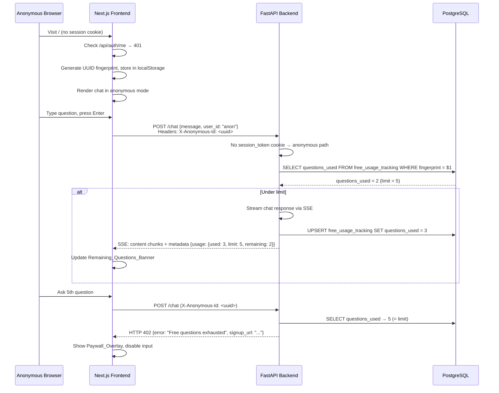
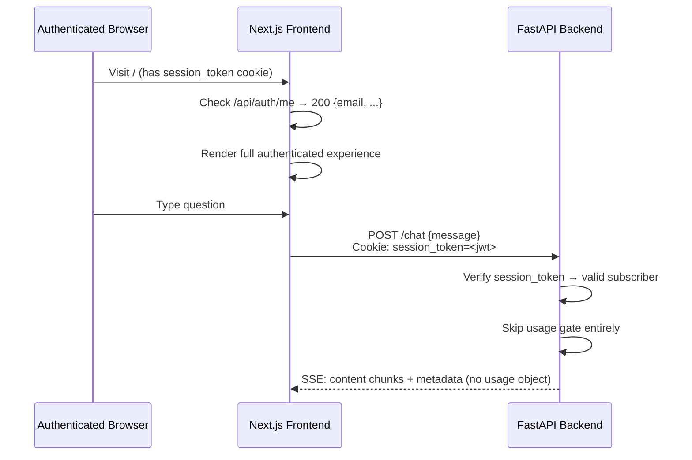

# Design Document: Freemium Usage Gate

## Overview

This feature transforms MC ChatMaster from a login-required application into a freemium product. Anonymous visitors can ask a configurable number of free questions before being prompted to subscribe. The goal is to let potential customers experience the product's value before committing.

Currently, the `page.tsx` home page redirects unauthenticated users to `/login`. The `/chat` endpoint accepts any request with a `user_id` field but has no concept of anonymous usage limits. This design introduces:

1. A `Usage_Gate` middleware layer in the backend that intercepts anonymous chat requests, tracks question counts in PostgreSQL, and enforces the configurable limit.
2. Frontend changes to allow anonymous access to the chat page, display remaining question counts, and show a paywall overlay when the limit is reached.
3. A new `free_usage_tracking` database table for server-side question counting.

### Key Design Decisions

- **Server-side enforcement**: Question counts live in PostgreSQL, not localStorage. Clearing browser storage does not reset the counter. The fingerprint is a UUID generated client-side and sent via `X-Anonymous-Id` header — it's a convenience identifier, not a security boundary.
- **Modify `/chat` endpoint directly**: Rather than creating a separate middleware, the usage gate logic is added to the existing `chat()` function in `main.py`. This keeps the SSE streaming flow intact and avoids complexity with FastAPI middleware and streaming responses.
- **Cookie-based auth detection**: The existing subscription auth uses an `httponly` cookie (`session_token`). The chat endpoint checks for this cookie first. If valid, the request is treated as authenticated and bypasses the usage gate entirely.
- **Increment after stream starts**: The question counter increments only after the first SSE chunk is successfully yielded. Failed requests (OpenAI errors, etc.) don't consume a free question.
- **SSE metadata event carries usage info**: The existing `metadata` SSE event type is extended with a `usage` object for anonymous users. Authenticated users don't receive this object.
- **Frontend routing change**: `page.tsx` no longer redirects to `/login`. Instead, it checks auth status and renders either the full authenticated experience or the anonymous freemium experience.

## Architecture



### Authenticated User Flow (unchanged)



## Components and Interfaces

### Backend: New Module `backend/usage_gate.py`

Encapsulates all freemium usage gate logic. Imported by `main.py`.

```python
class UsageGate:
    def __init__(self, database_url: str):
        self.database_url = database_url
        self.free_question_limit = self._read_limit()
        self.pool = None

    def _read_limit(self) -> int:
        """Read FREE_QUESTION_LIMIT from env. Default 5. Log warning on bad value."""

    async def init(self):
        """Create connection pool and ensure free_usage_tracking table exists."""

    async def check_and_increment(self, fingerprint: str) -> UsageResult:
        """
        Check if fingerprint is under limit.
        Returns UsageResult with allowed/denied status and current counts.
        Does NOT increment yet — call record_question() after successful stream.
        """

    async def record_question(self, fingerprint: str) -> UsageInfo:
        """
        Increment question count via UPSERT. Called after stream starts.
        Returns updated usage info for the SSE metadata event.
        """
```

#### `UsageResult` and `UsageInfo` models

```python
from pydantic import BaseModel
from typing import Optional

class UsageInfo(BaseModel):
    questions_used: int
    questions_limit: int
    questions_remaining: int

class UsageResult(BaseModel):
    allowed: bool
    usage: UsageInfo
    signup_url: Optional[str] = None  # Populated when denied
```

### Backend: Modified `/chat` Endpoint in `main.py`

The existing `chat()` function is modified to:

1. Check for `session_token` cookie → if valid, skip usage gate (authenticated path).
2. If no valid cookie, read `X-Anonymous-Id` header → if missing, generate a new UUID.
3. Call `usage_gate.check_and_increment(fingerprint)`.
4. If denied (limit reached), return HTTP 402 JSON response (not SSE).
5. If allowed, proceed with existing SSE streaming.
6. After first successful content chunk, call `usage_gate.record_question(fingerprint)`.
7. Include `usage` object in the `metadata` SSE event.
8. Include `X-Anonymous-Id` header in the response.

```python
@app.post("/chat")
async def chat(
    request: Request,
    message: ChatMessage,
    credentials: HTTPAuthorizationCredentials = Depends(HTTPBearer(auto_error=False))
):
    # 1. Check cookie-based subscription auth
    is_authenticated = False
    session_token = request.cookies.get("session_token")
    if session_token:
        try:
            claims = subscription_auth_service.verify_token(session_token, allow_grace=False)
            if claims:
                is_authenticated = True
                user_id = claims.get("sub", message.user_id or "guest")
        except Exception:
            pass

    # 2. Anonymous path — usage gate
    fingerprint = None
    usage_info = None
    if not is_authenticated:
        fingerprint = request.headers.get("X-Anonymous-Id") or str(uuid.uuid4())
        result = await usage_gate.check_and_increment(fingerprint)
        if not result.allowed:
            return JSONResponse(
                status_code=402,
                content={
                    "error": "Free questions exhausted",
                    "signup_url": result.signup_url,
                    "usage": result.usage.model_dump()
                },
                headers={"X-Anonymous-Id": fingerprint}
            )
        user_id = f"anon:{fingerprint}"

    # 3. Stream response
    async def generate():
        question_recorded = False
        async for chunk in chat_handler.stream_response(message.message, message.conversation_id, user_id):
            # Record question after first successful content chunk
            if not is_authenticated and not question_recorded and chunk.get("type") == "content":
                usage_info = await usage_gate.record_question(fingerprint)
                question_recorded = True

            # Inject usage into metadata event for anonymous users
            if not is_authenticated and chunk.get("type") == "metadata" and usage_info:
                chunk["usage"] = usage_info.model_dump()

            yield f"data: {json.dumps(chunk)}\n\n"

    headers = {}
    if fingerprint:
        headers["X-Anonymous-Id"] = fingerprint

    return StreamingResponse(
        generate(),
        media_type="text/event-stream",
        headers=headers
    )
```

### Backend: Startup Integration

In `main.py` startup event:

```python
# Initialize usage gate
usage_gate = None
database_url = os.getenv("DATABASE_URL")
if database_url:
    from usage_gate import UsageGate
    usage_gate = UsageGate(database_url)
    # In startup_event:
    await usage_gate.init()
```

### Frontend: Modified `page.tsx` (Home Page)

The home page no longer redirects unauthenticated users to `/login`. Instead:

1. Call `/api/auth/me` on mount.
2. If 200 → set `isAuthenticated = true`, render full experience (History, Logout, email display).
3. If 401 → set `isAuthenticated = false`, render anonymous experience (Sign In link, Remaining_Questions_Banner).
4. Generate/retrieve fingerprint from localStorage under key `anonymousUserId`.
5. Pass `isAuthenticated` and `fingerprint` to `ChatInterface`.

### Frontend: Modified `ChatInterface.tsx`

New props:

```typescript
interface ChatInterfaceProps {
  hasDocuments?: boolean
  isAuthenticated?: boolean
  fingerprint?: string | null
}
```

Changes to `sendMessage()`:

1. If not authenticated, include `X-Anonymous-Id` header in the fetch request.
2. Parse `usage` from the `metadata` SSE event → update `remainingQuestions` state.
3. Handle HTTP 402 response → set `showPaywall = true`.
4. When `showPaywall` is true, disable input and show `PaywallOverlay`.

### Frontend: New Component `PaywallOverlay.tsx`

```typescript
interface PaywallOverlayProps {
  signupUrl: string
  onSignIn: () => void
}
```

Renders:
- Message: "You've used all your free questions. Subscribe to continue chatting."
- "Subscribe Now" button → opens `signupUrl` in new tab.
- "Sign In" link → navigates to `/login`.
- Does not block previous chat messages (overlay sits above the input area, not over the message list).

### Frontend: New Component `RemainingQuestionsBanner.tsx`

```typescript
interface RemainingQuestionsBannerProps {
  questionsUsed: number
  questionsLimit: number
}
```

Renders:
- Normal state: "3 of 5 free questions remaining" in a subtle info banner.
- Warning state (1 remaining): "Last free question!" in a warning-styled banner.
- Hidden when `isAuthenticated` is true.

### Frontend: Fingerprint Utility

Add to `frontend/utils/guestAuth.ts` or create `frontend/utils/anonymousId.ts`:

```typescript
const ANON_ID_KEY = 'anonymousUserId'

export function getOrCreateAnonymousId(): string {
  if (typeof window === 'undefined') return ''
  let id = localStorage.getItem(ANON_ID_KEY)
  if (!id) {
    id = crypto.randomUUID()
    localStorage.setItem(ANON_ID_KEY, id)
  }
  return id
}
```

## Data Models

### New Table: `free_usage_tracking`

```sql
CREATE TABLE IF NOT EXISTS free_usage_tracking (
    id SERIAL PRIMARY KEY,
    fingerprint VARCHAR(255) UNIQUE NOT NULL,
    questions_used INTEGER NOT NULL DEFAULT 0,
    created_at TIMESTAMP NOT NULL DEFAULT CURRENT_TIMESTAMP,
    last_question_at TIMESTAMP NOT NULL DEFAULT CURRENT_TIMESTAMP
);

CREATE INDEX IF NOT EXISTS idx_free_usage_tracking_fingerprint
    ON free_usage_tracking (fingerprint);
```

### Upsert Query (used by `record_question`)

```sql
INSERT INTO free_usage_tracking (fingerprint, questions_used, last_question_at)
VALUES ($1, 1, CURRENT_TIMESTAMP)
ON CONFLICT (fingerprint)
DO UPDATE SET
    questions_used = free_usage_tracking.questions_used + 1,
    last_question_at = CURRENT_TIMESTAMP
RETURNING questions_used;
```

### Check Query (used by `check_and_increment`)

```sql
SELECT questions_used FROM free_usage_tracking WHERE fingerprint = $1;
```

Returns `NULL` if fingerprint not seen before (treated as 0 questions used).

### Environment Variables

| Variable | Required | Default | Description |
|---|---|---|---|
| `FREE_QUESTION_LIMIT` | No | `5` | Max free questions per anonymous fingerprint |
| `SUBSCRIPTION_SIGNUP_URL` | Yes (existing) | — | URL for the "Subscribe Now" button |
| `DATABASE_URL` | Yes (existing) | — | PostgreSQL connection string |

### Modified SSE Metadata Event (anonymous users only)

```json
{
  "type": "metadata",
  "confidence": 0.85,
  "source_count": 3,
  "model_used": "gpt-4o-mini",
  "usage": {
    "questions_used": 3,
    "questions_limit": 5,
    "questions_remaining": 2
  }
}
```

For authenticated users, the `usage` key is omitted entirely.

### HTTP 402 Response Body

```json
{
  "error": "Free questions exhausted",
  "signup_url": "https://mc-store.com/products/mc-chatmaster",
  "usage": {
    "questions_used": 5,
    "questions_limit": 5,
    "questions_remaining": 0
  }
}
```

