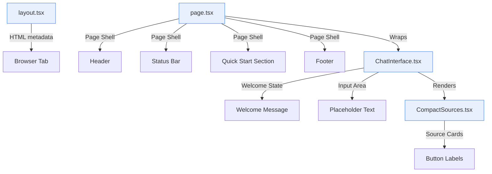
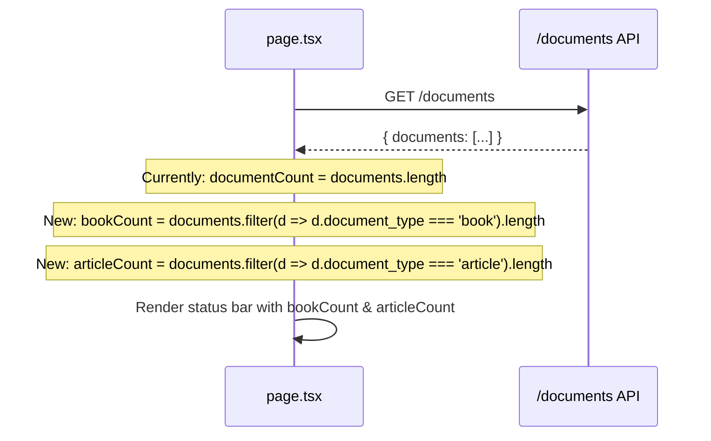

# Design Document: MC ChatMaster Branding Refresh

## Overview

This design covers a comprehensive branding refresh of the MC Press Chatbot frontend to establish the "MC ChatMaster" product identity. The changes are purely frontend, spanning 4 files across the Next.js 14 application. No backend API changes are required — the existing `/documents` API already returns `document_type` on each document, which is sufficient for computing book vs. article counts client-side.

The scope is intentionally narrow: text/label updates, two color changes on quick start buttons, and a new secondary footer line. No new components, routes, or API endpoints are introduced.

### Key Design Decisions

1. **Client-side count computation**: Rather than adding a new backend endpoint for book/article counts, we compute them from the existing `/documents` response by filtering on `document_type`. This avoids backend deployment and keeps the change frontend-only.

2. **Tailwind utility classes for purple buttons**: The project doesn't define a `--mc-purple` CSS variable. For the RPG-related purple buttons, we'll use Tailwind's built-in `bg-purple-600` / `hover:bg-purple-700` classes, consistent with how purple is already used in `CompactSources.tsx` for author buttons.

3. **Orange buttons via existing CSS variable**: Action-oriented buttons will use the existing `var(--mc-orange)` / `var(--mc-orange-dark)` CSS custom properties already defined in `design-tokens.css`.

## Architecture

The branding refresh touches the presentation layer only. No architectural changes are needed.



### Files Modified

| File | Changes |
|------|---------|
| `frontend/app/layout.tsx` | Update `title` and `description` in metadata export |
| `frontend/app/page.tsx` | Update heading, status bar, quick start, footer |
| `frontend/components/ChatInterface.tsx` | Update welcome state text, input placeholder |
| `frontend/components/CompactSources.tsx` | Update section header and button labels |

### Data Flow for Book/Article Counts

The existing `checkDocuments` function in `page.tsx` fetches `/documents` and receives an array of document objects, each with a `document_type` field (`"book"` or `"article"`). Currently it only counts total documents. The change adds two derived counts:



## Components and Interfaces

### 1. layout.tsx — Metadata Update

**Current:**
```typescript
export const metadata: Metadata = {
  title: 'MC Press Chatbot - AI-Powered Document Assistant',
  description: 'Ask questions about MC Press technical books and documentation',
}
```

**New:**
```typescript
export const metadata: Metadata = {
  title: 'MC ChatMaster | Instant AI-Powered IBM i Expertise',
  description: 'Your 24/7 AI-powered guide to mastering RPG, DB2, System Administration, and IBM i best practices from MC Press technical books and articles',
}
```

### 2. page.tsx — State Changes

Add two new state variables alongside the existing `documentCount`:

```typescript
const [bookCount, setBookCount] = useState(0)
const [articleCount, setArticleCount] = useState(0)
```

In the `checkDocuments` effect, after extracting the documents array:

```typescript
const books = documents.filter((d: any) => d.document_type === 'book')
const articles = documents.filter((d: any) => d.document_type === 'article')
setBookCount(books.length)
setArticleCount(articles.length)
```

### 3. page.tsx — Text/Label Changes

| Element | Current Text | New Text |
|---------|-------------|----------|
| Section heading | "AI Assistant" | "MC ChatMaster Assistant" |
| Status primary | "✨ System Ready!" | "✨ MC ChatMaster Ready!" |
| Status secondary | "{documentCount} documents loaded and indexed • AI assistant active" | "{bookCount} Books & {articleCount} Articles Loaded • Instant Expertise Active" |
| Quick start title | "Quick Start - Try these questions:" | "Instant Insights: Try These RPG & IBM i Questions" |
| Button 1 label | `"How do I configure DB2 on IBM i?"` | "Master DB2 Config on IBM i" |
| Button 2 label | `"RPG programming best practices"` | "Optimize Your RPG Skills" |
| Footer primary | "MC Press Chatbot - Powered by AI" | "MC ChatMaster: Instant AI-Powered IBM i Expertise" |
| Footer secondary | *(none)* | "POWERED BY AI IBM i EXPERTISE" |

### 4. page.tsx — Button Color Changes

| Button | Current Color | New Color | Rationale |
|--------|--------------|-----------|-----------|
| Button 1 (DB2) | `var(--mc-blue)` | `var(--mc-orange)` / `var(--mc-orange-dark)` | Action-oriented |
| Button 2 (RPG) | `var(--mc-green)` | `bg-purple-600` / `hover:bg-purple-700` (Tailwind) | RPG-related |
| Button 3 (System Admin) | `var(--mc-gray)` | Unchanged | Not specified in requirements |
| Button 4 (JSON) | `var(--mc-orange)` | Unchanged | Not specified in requirements |

### 5. ChatInterface.tsx — Text Changes

| Element | Current Text | New Text |
|---------|-------------|----------|
| Welcome heading | "Ready to help! ✨" | "MC ChatMaster Ready for Your Query! ✨" |
| Welcome subtext | "Ask me anything about your MC Press books" | "Your 24/7 Guide to Mastering RPG, DB2, System Administration, and IBM i Best Practices – Fresh Insights Added as MC Press Publishes" |
| Input placeholder (has docs) | "Ask me about your MC Press books..." | "Ask MC ChatMaster Anything" |
| Input placeholder (no docs) | "Upload documents first to start chatting..." | Unchanged |

### 6. CompactSources.tsx — Label Changes

| Element | Current Label | New Label |
|---------|--------------|-----------|
| Section header | "References" | "Sources" |
| Single-author button | "Author" | "View Author Profile" |
| Multi-author dropdown | "Authors" | "View Author Profiles" |
| Article link button | "Read" | "Access Source" |
| Book purchase button | "Buy" | Unchanged |

## Data Models

No data model changes are required. The existing document response structure already includes `document_type`:

```typescript
interface Document {
  id: number
  filename: string
  title: string
  author: string
  category: string
  document_type: string  // "book" | "article" — already present
  mc_press_url: string
  article_url: string
  total_pages: number
  processed_at: string
  authors: Author[]
}
```

The only new client-side state is two derived integer counts (`bookCount`, `articleCount`) computed from the existing response.


## Correctness Properties

*A property is a characteristic or behavior that should hold true across all valid executions of a system — essentially, a formal statement about what the system should do. Properties serve as the bridge between human-readable specifications and machine-verifiable correctness guarantees.*

Most acceptance criteria in this feature are specific text/label replacements that are best validated as example-based tests (exact string matching in rendered output). Only the book/article count computation involves logic that generalizes across inputs.

### Property 1: Book and article counts are correctly derived from document_type

*For any* array of document objects where each has a `document_type` field with value `"book"`, `"article"`, or any other string, the computed `bookCount` should equal the number of documents where `document_type === "book"` and the computed `articleCount` should equal the number of documents where `document_type === "article"`. Documents with other or missing `document_type` values should not be counted in either total.

**Validates: Requirements 2.2**

## Error Handling

This feature is a presentation-layer text/label refresh with minimal logic. Error handling considerations:

1. **Missing `document_type` field**: If a document object lacks `document_type` or has an unexpected value (e.g., `null`, `undefined`, `"other"`), it should not be counted as either a book or an article. The filter logic (`d.document_type === 'book'`) naturally handles this — non-matching values are excluded.

2. **Empty document list**: If the `/documents` API returns an empty array, both `bookCount` and `articleCount` will be `0`. The status bar should display "0 Books & 0 Articles Loaded • Instant Expertise Active". This is acceptable behavior.

3. **API failure**: The existing error handling in `checkDocuments` already sets `hasDocuments = false` on failure, which hides the status bar entirely. No change needed.

4. **Long button labels**: The new labels ("View Author Profile", "View Author Profiles", "Access Source") are longer than the originals. The existing `flex-shrink-0` class on buttons prevents truncation. On very narrow screens, the button row may wrap — this is acceptable given the existing responsive design.

## Testing Strategy

### Property-Based Testing

**Library**: `fast-check` (JavaScript/TypeScript property-based testing library, compatible with the existing Next.js/Jest test setup)

**Configuration**: Minimum 100 iterations per property test.

**Property Test**:

- **Feature: mc-chatmaster-branding, Property 1: Book and article counts are correctly derived from document_type**
  - Generate random arrays of document objects with `document_type` values drawn from `["book", "article", "other", undefined, null]`
  - Compute `bookCount` and `articleCount` using the same filter logic as the component
  - Assert `bookCount === documents.filter(d => d.document_type === 'book').length`
  - Assert `articleCount === documents.filter(d => d.document_type === 'article').length`
  - Assert `bookCount + articleCount <= documents.length`

### Unit/Example Tests

Example-based tests should cover the text/label replacements across all 4 files. These are best organized by component:

1. **layout.tsx metadata**: Verify `title` and `description` values match the new branding strings.

2. **page.tsx rendering** (with mocked API):
   - Heading text is "MC ChatMaster Assistant"
   - Status bar shows "MC ChatMaster Ready!" and the dynamic count string
   - Quick start title is "Instant Insights: Try These RPG & IBM i Questions"
   - Button 1 label is "Master DB2 Config on IBM i" and still triggers prompt "How do I configure DB2 on IBM i?"
   - Button 2 label is "Optimize Your RPG Skills" and still triggers prompt "RPG programming best practices"
   - Button 1 has orange background color, Button 2 has purple background color
   - Footer primary text is "MC ChatMaster: Instant AI-Powered IBM i Expertise"
   - Footer secondary text "POWERED BY AI IBM i EXPERTISE" exists with appropriate styling classes

3. **ChatInterface.tsx rendering**:
   - Welcome heading is "MC ChatMaster Ready for Your Query! ✨" when `hasDocuments=true` and no messages
   - Welcome subtext matches the new branding string
   - Input placeholder is "Ask MC ChatMaster Anything" when `hasDocuments=true`
   - Input placeholder is "Upload documents first to start chatting..." when `hasDocuments=false`

4. **CompactSources.tsx rendering**:
   - Section header is "Sources"
   - Single-author button shows "View Author Profile"
   - Multi-author dropdown button shows "View Author Profiles"
   - Article link button shows "Access Source"
   - Book purchase button still shows "Buy"
   - Author buttons retain purple background, article buttons retain green background
