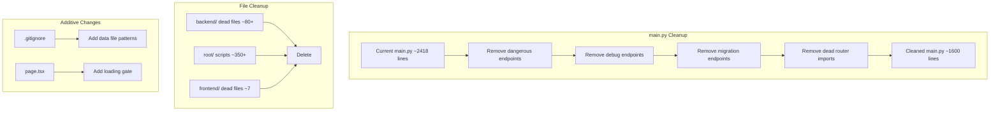

# Design Document: Pre-Tester Cleanup

## Overview

This spec covers a comprehensive cleanup of the MC Press Chatbot codebase before sharing with first testers. The work spans three categories:

1. **Security hardening** — Remove dangerous, debug, and migration endpoints from `backend/main.py` that could destroy data or leak internals
2. **Dead code removal** — Delete hundreds of unused files across backend, frontend, and root directories
3. **Polish** — Update `.gitignore` to prevent future clutter, fix a post-login page flash, and remove an empty spec directory

The cleanup is purely subtractive (deleting code/files) except for two additive changes: the `.gitignore` update and the post-login loading gate in `frontend/app/page.tsx`.

## Architecture

No architectural changes. The deployed system remains:

- **Backend**: FastAPI on Railway (`backend/main.py` entry point)
- **Frontend**: Next.js 14 on Netlify (`frontend/`)
- **Database**: Supabase PostgreSQL with pgvector (untouched)

The cleanup reduces the surface area of `backend/main.py` by removing ~30 endpoint registrations (inline functions + router imports) and deletes ~400+ files across the repository.



### Execution Order

The work must be done in a specific order to avoid breaking the deployment:

1. **Endpoint removal in `main.py`** (Requirements 1-3) — Must be done carefully as a single coherent edit, since router imports and registrations are interleaved throughout the file
2. **Dead backend file deletion** (Requirements 4-5) — Safe to do after endpoint removal since removed routers reference these files
3. **Root-level file deletion** (Requirement 6) — Independent of backend changes
4. **Frontend cleanup** (Requirement 7) — Independent
5. **`.gitignore` update** (Requirement 8) — Should be done before file deletion so deleted files don't get re-committed
6. **Post-login flash fix** (Requirement 9) — Independent frontend change
7. **Empty spec directory removal** (Requirement 10) — Trivial, do last

## Components and Interfaces

### Component 1: Endpoint Removal in `backend/main.py`

Three categories of endpoints to remove:

**Dangerous Endpoints (Requirement 1)** — Inline functions:
- `reset_database()` at `POST /reset` (~line 1788)
- `trigger_bulk_upload()` at `POST /bulk-upload` (~line 1904)
- `create_backup()` at `POST /backup/create` (~line 1851)
- `list_backups()` at `GET /backup/list` (~line 1864)
- `restore_backup()` at `POST /backup/restore` (~line 1883)

Also remove the `backup_manager` import since it's only used by backup endpoints, and the `run_upload_batch()` helper + `upload_status` global + `subprocess`/`sys` imports used by bulk upload.

**Debug Endpoints (Requirement 2)** — Mix of inline and router-based:
- Inline: `diagnostic_db_test()` at `GET /diag/db-test` (~line 1959), `test_books_table()` at `GET /test-books-table` (~line 1983), `upload_debug()` at `GET /upload-debug` (~line 1695), `upload_dashboard()` at `GET /upload-dashboard` (~line 1642)
- Router: `debug_books_schema` router (import + `app.include_router` block), `debug_enrichment_endpoint` router (import + registration), `debug_appstle_endpoint` router (import + registration)

**Migration Endpoints (Requirement 3)** — Mix of inline and router-based:
- Inline: `run_story4_migration()` (~line 2018), `run_story12_migration()` (~line 2027), `OLD_run_story4_migration_DO_NOT_USE()` (~line 2086), `run_migration_simple()` (~line 2194)
- Routers to remove (import + registration blocks):
  - `migration_story_004_endpoint` (story4_migration_router)
  - `conversation_migration_endpoint` (story11_migration_router)
  - `migration_003_endpoint` (migration_003_router)
  - `test_003_endpoint` (test_003_router)
  - `author_service_test_endpoint` (author_service_test_router)
  - `document_author_service_test_endpoint` (document_author_service_test_router)
  - `data_migration_003_endpoint` (data_migration_003_router)
  - `article_migration_endpoint` (article_migration_router)
  - `fix_article_urls_endpoint` (fix_urls_router)
  - `placeholder_books_endpoint` — if registered (check)
  - `test_document_author_endpoint` (test_task_6_router)

**Additional routers to evaluate for removal** (one-off admin tools, not needed for testers):
- `fix_authors_endpoint` — one-time correction tool
- `csv_comparison_endpoint` — one-time data comparison
- `bulk_author_correction_endpoint` — one-time correction
- `bulk_url_correction_endpoint` — one-time correction
- `author_diagnostics_endpoint` — diagnostic tool
- `association_checker_endpoint` — diagnostic tool
- `duplicate_author_endpoint` — diagnostic tool

These are all one-off admin/diagnostic tools that were used during development. They should be removed for tester safety, but the corresponding backend files will be deleted in Requirement 5 anyway, so the router registrations will simply fail silently (try/except pattern). However, for cleanliness, the import+registration blocks should be removed from `main.py`.

### Component 2: Dead Backend File Deletion (Requirement 4)

Files to delete from `backend/`:

| Category | Files to Delete | Active File (Keep) |
|---|---|---|
| main variants | `main_deploy.py`, `main_minimal.py`, `main_query_only.py`, `main_query_only_fixed.py` | `main.py` |
| admin_documents variants | `admin_documents.py`, `admin_documents_minimal.py`, `admin_documents_robust.py`, `admin_documents_simple.py` | `admin_documents_fixed.py` |
| pdf_processor variants | `pdf_processor.py`, `pdf_processor_minimal.py`, `pdf_processor_simple.py`, `pdf_processor_text_only.py`, `pdf_processor_full.py.backup` | `pdf_processor_full.py` |
| vector_store variants | `vector_store.py`, `vector_store_chroma.py`, `vector_store_simple.py` | `vector_store_postgres.py` |

**Important**: `main.py` has fallback imports for `vector_store.py` and `vector_store_chroma.py` in the `USE_POSTGRESQL` conditional block. Since `USE_POSTGRESQL=true` in production, these fallbacks are dead code. After deleting these files, the fallback import blocks in `main.py` should also be removed to prevent confusing error messages on startup.

### Component 3: Backend One-Off Script Deletion (Requirement 5)

~47 test files, ~12 markdown docs, ~19 migration scripts, plus miscellaneous one-off scripts in `backend/`. Full list derived from the directory listing. Key categories:

- `test_*.py` files (not part of a test suite)
- `run_migration_*.py`, `run_*.py` runner scripts
- `data_migration_*.py`, `pre_migration_*.py` migration helpers
- `*.md` documentation files (duplicated in `docs/`)
- One-off endpoint files for removed routers (e.g., `migration_003_endpoint.py`, `debug_enrichment_endpoint.py`, etc.)
- Diagnostic/debug scripts (`database_diagnostic.py`, `debug_patterns.py`, etc.)
- One-off data scripts (`compare_books.py`, `quick_compare.py`, `populate_books_from_documents.py`, etc.)

### Component 4: Root-Level File Deletion (Requirement 6)

~257 Python scripts and ~97 markdown files at root level. All are one-off scripts not imported by the application. Delete all matching:
- `check_*.py`, `test_*.py`, `debug_*.py`, `fix_*.py`, `execute_*.py`, `upload_*.py`
- `find_*.py`, `run_*.py`, `compare_*.py`, `verify_*.py`, `analyze_*.py`, `investigate_*.py`
- `migrate_*.py`, `import_*.py`, `setup_*.py`, `wait_*.py`, `force_*.py`, `get_*.py`
- `*.md` (except `README.md`)
- `*.json`, `*.csv`, `*.sql`, `*.txt`, `*.pages`, `*.numbers`, `*.xlsm`, `*.sh`, `*.html`

Keep: `README.md`, `requirements.txt`, `runtime.txt`, `Procfile`, `netlify.toml`, `docker-compose.yml`, `package.json`, `package-lock.json`, `.gitignore`, `.env.example`, `.env.railway`, `.railwayignore`

### Component 5: Frontend Dead File Deletion (Requirement 7)

Files to delete:
- `frontend/app/page_original.tsx`
- `frontend/test-api.html`
- `frontend/test-components.md`
- `frontend/test-document-list.md`
- `frontend/test-search-formatting.md`
- `frontend/components/DocumentTypeSelector.example.tsx`
- `frontend/components/MultiAuthorInput.example.tsx`
- `frontend/vercel.json`
- Root-level orphans: `frontend_admin_documents_fixed.tsx`, `frontend_author_button_enhancement.tsx`

### Component 6: `.gitignore` Update (Requirement 8)

Add patterns to `.gitignore`:

```gitignore
# Data files (root level)
/*.json
!package.json
!package-lock.json
/*.csv
/*.sql
/*.txt
!requirements.txt
!runtime.txt

# Apple formats
*.numbers
*.pages

# Excel macro files
*.xlsm

# Testing artifacts
.hypothesis/
```

The `/*.json` and `/*.txt` patterns use the leading `/` to scope them to the root directory only, then `!` negation patterns preserve the essential files. This avoids accidentally ignoring `frontend/package.json` or files in subdirectories.

### Component 7: Post-Login Flash Fix (Requirement 9)

**Problem**: `frontend/app/page.tsx` is a `'use client'` component that renders the full page layout (header, chat container, footer) immediately on mount. Two `useEffect` hooks fire async fetches (`fetchUserInfo` and `checkDocuments`), but the layout is already visible. After a login redirect, the user sees a brief flash of the unloaded page before the loading indicator appears.

**Solution**: Add an `isInitializing` state that starts as `true` and gates the entire render. The component returns a full-screen branded loading spinner until both initial fetches have settled (or a short timeout elapses). Once ready, `isInitializing` is set to `false` and the normal layout renders.

```typescript
const [isInitializing, setIsInitializing] = useState(true)

// In the checkDocuments useEffect, after the fetch completes:
setIsInitializing(false)

// At the top of the return:
if (isInitializing) {
  return (
    <div className="min-h-screen flex items-center justify-center bg-gray-50">
      <div className="text-center">
        
        <div className="w-8 h-8 border-4 rounded-full animate-spin mx-auto"
          style={{ borderColor: 'var(--mc-blue-lighter)', borderTopColor: 'var(--mc-blue)' }} />
      </div>
    </div>
  )
}
```

The `checkDocuments` effect already sets `isCheckingDocuments = false` in its `finally` block, so we tie `isInitializing` to that same lifecycle. The `fetchUserInfo` call is non-blocking (failures are silently ignored), so we don't gate on it.

### Component 8: Empty Spec Directory Removal (Requirement 10)

Delete `.kiro/specs/shopify-subscription-auth/` directory (confirmed empty).

## Data Models

No data model changes. The database schema is untouched. All changes are to application code and static files.


## Correctness Properties

*A property is a characteristic or behavior that should hold true across all valid executions of a system — essentially, a formal statement about what the system should do. Properties serve as the bridge between human-readable specifications and machine-verifiable correctness guarantees.*

The prework analysis identified that most acceptance criteria in this spec fall into two patterns:

1. **Endpoint removal** (Requirements 1-3): All 16 specific endpoint criteria are subsumed by a single property — "for any removed endpoint path, the server returns 404."
2. **File deletion** (Requirements 4-7): All file-existence criteria are filesystem checks that can be expressed as properties over directory contents.
3. **Gitignore patterns** (Requirement 8): All 7 criteria can be combined into a single property over the set of required patterns.

Requirements 9.1, 9.3 (visual flash/transition smoothness) are not programmatically testable. Requirement 9.2 (loading indicator presence) is testable as an example.

After reflection, redundant per-endpoint and per-file properties were consolidated into 5 properties.

### Property 1: Removed endpoints return 404

*For any* endpoint path in the set of removed endpoints (dangerous, debug, and migration), sending an HTTP request to that path should return a 404 status code.

**Validates: Requirements 1.1, 1.2, 1.3, 1.4, 2.1, 2.2, 2.3, 2.4, 2.5, 2.6, 2.7, 2.8, 3.1, 3.2, 3.3, 3.4**

### Property 2: Backend directory contains only active files

*For any* file in the `backend/` directory, it should not match any banned pattern: no `main_*.py` variants, no `admin_documents*.py` variants (except `admin_documents_fixed.py`), no `pdf_processor*.py` variants (except `pdf_processor_full.py`), no `vector_store*.py` variants (except `vector_store_postgres.py`), no ad-hoc `test_*.py` scripts, no standalone `*.md` files, and no completed migration runner scripts (`run_migration_*.py`, `data_migration_*.py`, `pre_migration_*.py`).

**Validates: Requirements 4.1, 4.2, 4.3, 4.4, 5.1, 5.3, 5.4**

### Property 3: Root directory contains no ad-hoc scripts

*For any* Python file at the repository root, it should not match any banned pattern: `check_*.py`, `test_*.py`, `debug_*.py`, `fix_*.py`, `execute_*.py`, `upload_*.py`, `find_*.py`, `run_*.py`, `compare_*.py`, `verify_*.py`, `analyze_*.py`, `investigate_*.py`, `migrate_*.py`, `import_*.py`, `setup_*.py`, `wait_*.py`, `force_*.py`, `get_*.py`. Additionally, no `*.md` files should exist at root except `README.md`.

**Validates: Requirements 6.1, 6.2, 6.3, 6.4, 6.5, 6.7**

### Property 4: Root directory contains no data files

*For any* file at the repository root with extension `.json`, `.csv`, `.sql`, `.txt`, `.pages`, `.numbers`, `.xlsm`, `.sh`, or `.html`, it should not exist — with the exception of `package.json`, `package-lock.json`, `requirements.txt`, and `runtime.txt`.

**Validates: Requirements 6.6**

### Property 5: Gitignore contains required patterns with correct negations

*For any* data file type in the set {`*.json`, `*.csv`, `*.sql`, `*.txt`, `*.numbers`, `*.pages`, `*.xlsm`, `.hypothesis/`}, the `.gitignore` file should contain a matching ignore pattern. Additionally, for `*.json` the negation patterns `!package.json` and `!package-lock.json` must be present, and for `*.txt` the negation patterns `!requirements.txt` and `!runtime.txt` must be present.

**Validates: Requirements 8.1, 8.2, 8.3, 8.4, 8.5, 8.6, 8.7**

## Error Handling

### Endpoint Removal Safety

- All router imports in `main.py` use try/except blocks. After removing router files, the import will simply fail and the except block will print a warning. This is the existing pattern and is safe.
- However, for cleanliness, the import+registration blocks for removed routers should be deleted entirely from `main.py` rather than relying on silent failure.

### File Deletion Safety

- Before deleting any file, verify it is not imported by active application code. The requirements document already identifies which files are safe to delete.
- The `vector_store.py` and `vector_store_chroma.py` fallback imports in `main.py` must be removed when those files are deleted, otherwise the startup logs will show confusing error messages (even though the app still works due to try/except).

### `.gitignore` Negation Patterns

- The `/*.json` pattern with `!package.json` negation must be tested to ensure `frontend/package.json` is not affected. Using the `/` prefix scopes the pattern to root only.
- Similarly, `/*.txt` with `!requirements.txt` must not affect any `.txt` files in subdirectories.

### Post-Login Flash Fix

- The loading gate must not create an infinite loading state. The `isInitializing` flag must be set to `false` in the `finally` block of the `checkDocuments` effect, ensuring it resolves even if the fetch fails.
- If the fetch errors out, the page should still render (with the error state), not hang on the loading screen.

## Testing Strategy

### Dual Testing Approach

This spec uses both unit/example tests and property-based tests:

- **Property tests**: Verify universal properties across generated inputs (Properties 1-5)
- **Unit/example tests**: Verify specific file deletions, the loading gate behavior, and application health

### Property-Based Testing Configuration

- **Library**: [fast-check](https://github.com/dubzzz/fast-check) for TypeScript/frontend tests, [hypothesis](https://hypothesis.readthedocs.io/) for Python/backend tests
- **Minimum iterations**: 100 per property test
- **Tag format**: `Feature: pre-tester-cleanup, Property {number}: {property_text}`

### Property Test Plan

| Property | Test Approach |
|---|---|
| Property 1: Removed endpoints return 404 | Generate from the list of all removed endpoint paths (16 paths). For each, send an HTTP request and assert 404. Use hypothesis `@given(sampled_from(REMOVED_ENDPOINTS))` to pick a random endpoint each iteration. |
| Property 2: Backend directory active files only | List all files in `backend/`, generate from that list, and assert none match banned patterns. Use hypothesis with `sampled_from(os.listdir('backend/'))`. |
| Property 3: Root directory no ad-hoc scripts | List all `.py` files at root, generate from that list, and assert none match banned prefixes. |
| Property 4: Root directory no data files | List all files at root, filter by banned extensions, assert the filtered list is empty (excluding allowed files). |
| Property 5: Gitignore patterns | Parse `.gitignore` content, for each required pattern verify it exists, for each negation verify it exists. |

### Unit/Example Test Plan

| Test | What it verifies |
|---|---|
| Health endpoint returns 200 | Application boots without import errors after all deletions (Requirements 4.5, 5.5, 6.8) |
| Specific frontend files deleted | `page_original.tsx`, test artifacts, example components, `vercel.json` don't exist (Requirements 7.1-7.5) |
| Empty spec directory removed | `.kiro/specs/shopify-subscription-auth/` doesn't exist (Requirement 10.1) |
| Loading gate renders before data | Render `Home` component, assert loading indicator is present before fetch resolves (Requirement 9.2) |
| Frontend build succeeds | `next build` completes without errors after file deletions (Requirement 7.6) |

### Test Execution

Per the project's testing rules, all backend tests must be executed on Railway after deployment. Frontend tests can be run via the Netlify build process. Property tests that check the deployed API (Property 1) must be run as API-based scripts against the Railway URL.

Each property test must include a comment referencing its design property:
```python
# Feature: pre-tester-cleanup, Property 1: Removed endpoints return 404
```

Each property-based test must implement exactly ONE property from this design document. Minimum 100 iterations per test.
