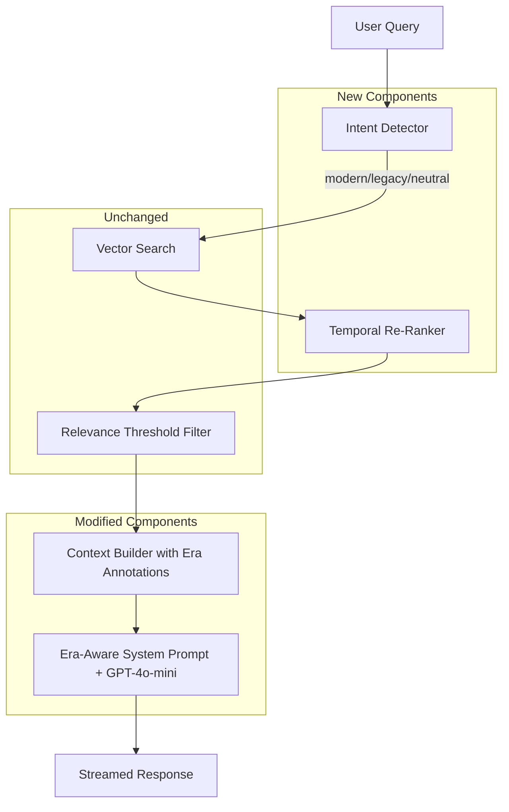

# Design Document: Temporal RAG Anti-Hallucination

## Overview

This feature adds temporal awareness to the MC Press Chatbot's RAG pipeline to eliminate "era hallucinations" — where the system returns RPG code from the wrong era (e.g., 1994 fixed-format RPG III when the user asks about modern free-form RPG).

The solution has four layers:

1. **Era-Aware System Prompt** — Few-shot examples and instructions that teach GPT-4o-mini to distinguish RPG eras and default to modern syntax.
2. **Query Intent Detection** — A fast keyword-based classifier that tags each query as `modern`, `legacy`, or `neutral` before retrieval.
3. **Temporal Metadata** — New `publication_year` and `rpg_era` columns on the `books` table, populated via migration + bulk enrichment.
4. **Temporal Re-Ranking** — A scoring adjustment in `_filter_relevant_documents` that boosts era-matching documents before the relevance threshold filter.

Non-RPG content (CL, DB2, security, etc.) is tagged `general` and passes through re-ranking untouched — only RPG-era-specific documents get boosted or penalized.

## Architecture



### Data Flow

1. User submits a query via `/chat` endpoint.
2. `ChatHandler.stream_response` calls `IntentDetector.detect_era(query)` → returns `"modern"`, `"legacy"`, or `"neutral"`.
3. Vector search runs as before via `vector_store.search()` returning top-N results with cosine distance.
4. `_filter_relevant_documents` now calls `TemporalReRanker.apply_boost(docs, era_intent)` which adjusts distance scores based on `rpg_era` metadata from the `books` table.
5. Documents are re-sorted by adjusted distance, then filtered by the existing dynamic threshold.
6. `_build_context` annotates each source with `[Source: file.pdf, Page 42, Era: fully-free, Year: 2021]`.
7. The era-aware system prompt instructs GPT-4o-mini to prefer modern RPG and flag era mismatches.

### Key Design Decisions

- **Keyword-based intent detection over LLM classification**: The intent detector uses pure keyword matching (no LLM call) to stay under 5ms. RPG era signals are well-defined and finite — keyword matching is sufficient and deterministic.
- **Distance adjustment over score multiplication**: We subtract a fixed configurable amount (default 0.10) from the cosine distance of era-matching documents rather than multiplying. This keeps the boost predictable and bounded regardless of the original distance.
- **Metadata on `books` table, not `documents` table**: Era and year are document-level properties, not chunk-level. Storing them on `books` avoids duplicating metadata across 227K+ chunks. The re-ranker joins via filename at query time.
- **`general` as default era**: Non-RPG content (DB2, CL, security, PHP, Node.js) gets `general` and is never boosted or penalized — it ranks purely on semantic relevance.
- **Heuristic-based bulk enrichment**: Publication year → era mapping uses simple year ranges. This is imperfect (a 2015 book could still teach fixed-format) but provides a strong baseline. Manual overrides via the metadata update endpoint handle exceptions.

## Components and Interfaces

### 1. IntentDetector (new module in `chat_handler.py`)

```python
class IntentDetector:
    """Classifies user queries by RPG era intent using keyword matching."""

    MODERN_SIGNALS: set[str]  # {"free-form", "fully free", "dcl-s", "dcl-proc", ...}
    LEGACY_SIGNALS: set[str]  # {"c-spec", "h-spec", "fixed-format", "rpg iii", ...}

    def detect_era(self, query: str) -> str:
        """
        Returns 'modern', 'legacy', or 'neutral'.
        Must complete in <5ms for queries up to 500 chars.
        Uses case-insensitive keyword matching against MODERN_SIGNALS and LEGACY_SIGNALS.
        If both modern and legacy signals are found, returns 'neutral' (ambiguous).
        """
```

### 2. TemporalReRanker (new logic in `_filter_relevant_documents`)

```python
def apply_temporal_boost(
    documents: list[dict],
    era_intent: str,
    boost_amount: float = 0.10
) -> list[dict]:
    """
    Adjusts document distance scores based on era match.

    - For 'modern' intent: reduces distance for docs with rpg_era in {'free-form', 'fully-free'}
    - For 'legacy' intent: reduces distance for docs with rpg_era in {'fixed-format', 'rpg-iv'}
    - For 'neutral' intent: no adjustment
    - Documents with rpg_era=None or 'general': no adjustment

    Returns documents with 'adjusted_distance' field added.
    Logs original distance, boost, and adjusted distance per document.
    """
```

### 3. Modified `_build_context` (in `chat_handler.py`)

The existing `_build_context` method is extended to include era and year annotations in the source info bracket. The era metadata is looked up from the `books` table via the existing `_enrich_source_metadata` method (which already queries the `books` table per filename).

### 4. Modified System Prompt (in `stream_response`)

The system prompt gains:
- A new section distinguishing fixed-format RPG (C-specs, H-specs, D-specs) from modern free-form RPG (`dcl-s`, `dcl-proc`, `dcl-ds`).
- Two few-shot examples showing the same operation in fixed-format vs. free-form.
- An instruction to default to modern free-form RPG when the user doesn't specify an era.
- An instruction to flag era mismatches with a brief note.

### 5. Migration Script (`backend/run_migration_006.py` + `backend/migrations/006_temporal_metadata.sql`)

Follows the established pattern (see `run_migration_004.py`):
- SQL file adds `publication_year INTEGER` and `rpg_era VARCHAR(20) DEFAULT 'general'` to `books` table using `ADD COLUMN IF NOT EXISTS`.
- Creates index on `rpg_era`.
- Exposed as `POST /run-migration-006`.

### 6. Bulk Enrichment Endpoint

A new `POST /api/temporal/enrich` endpoint that:
- Reads all books from the `books` table.
- Applies year → era mapping rules (≤2000 → `fixed-format`, 2001-2013 → `rpg-iv`, 2014-2019 → `free-form`, 2020+ → `fully-free`).
- Skips books with `rpg_era` already set to a non-`general` value.
- Returns a summary of updates per era category.

### 7. Config Updates (`backend/config.py`)

```python
TEMPORAL_CONFIG = {
    "era_boost_amount": float(os.getenv("ERA_BOOST_AMOUNT", "0.10")),
}
```

## Data Models

### Books Table (modified)

Two new columns added to the existing `books` table:

| Column | Type | Default | Nullable | Description |
|--------|------|---------|----------|-------------|
| `publication_year` | `INTEGER` | `NULL` | Yes | Year the document was published |
| `rpg_era` | `VARCHAR(20)` | `'general'` | No | RPG era classification |

Valid `rpg_era` values: `fixed-format`, `rpg-iv`, `free-form`, `fully-free`, `general`.

### Era Mapping Rules

| Publication Year | RPG Era | Description |
|-----------------|---------|-------------|
| ≤ 2000 | `fixed-format` | RPG III / RPG-400, column-based specs |
| 2001–2013 | `rpg-iv` | RPG IV with mixed format, ILE introduction |
| 2014–2019 | `free-form` | Free-form RPG IV (`/free` blocks) |
| 2020+ | `fully-free` | Fully-free RPG (no `/free` needed, VS Code era) |
| NULL / unknown | `general` | Non-RPG or unknown era |

### Intent Detection Signal Sets

**Modern signals**: `free-form`, `fully free`, `fully-free`, `dcl-s`, `dcl-proc`, `dcl-ds`, `dcl-pi`, `dcl-pr`, `/free`, `**free`, `vs code`, `rdi`, `sql embedded`, `ibm i 7.3`, `ibm i 7.4`, `ibm i 7.5`, `modern rpg`, `free format rpg`

**Legacy signals**: `c-spec`, `h-spec`, `d-spec`, `f-spec`, `o-spec`, `fixed-format`, `fixed format`, `rpg iii`, `rpg/400`, `rpg-400`, `s/36`, `s/38`, `rpgle fixed`, `column-based`, `column based`, `specifications`, `c spec`, `h spec`, `d spec`, `f spec`, `o spec`

### Re-Ranking Boost Logic

```
For each document:
  if era_intent == 'neutral' OR doc.rpg_era in (None, 'general'):
    adjusted_distance = original_distance
  elif era_intent == 'modern' AND doc.rpg_era in ('free-form', 'fully-free'):
    adjusted_distance = original_distance - boost_amount
  elif era_intent == 'legacy' AND doc.rpg_era in ('fixed-format', 'rpg-iv'):
    adjusted_distance = original_distance - boost_amount
  else:
    adjusted_distance = original_distance

  adjusted_distance = max(0, adjusted_distance)  # clamp to non-negative
```


## Correctness Properties

*A property is a characteristic or behavior that should hold true across all valid executions of a system — essentially, a formal statement about what the system should do. Properties serve as the bridge between human-readable specifications and machine-verifiable correctness guarantees.*

### Property 1: Modern signals produce modern classification

*For any* query string that contains at least one keyword from the MODERN_SIGNALS set (e.g., "free-form", "dcl-s", "dcl-proc") and no keywords from the LEGACY_SIGNALS set, `IntentDetector.detect_era(query)` should return `"modern"`.

**Validates: Requirements 2.1**

### Property 2: Legacy signals produce legacy classification

*For any* query string that contains at least one keyword from the LEGACY_SIGNALS set (e.g., "c-spec", "fixed-format", "rpg iii") and no keywords from the MODERN_SIGNALS set, `IntentDetector.detect_era(query)` should return `"legacy"`.

**Validates: Requirements 2.2**

### Property 3: Absence of signals produces neutral classification

*For any* query string that contains no keywords from either the MODERN_SIGNALS or LEGACY_SIGNALS sets, `IntentDetector.detect_era(query)` should return `"neutral"`.

**Validates: Requirements 2.3**

### Property 4: Era-matching documents receive distance reduction

*For any* list of documents with `rpg_era` metadata and a non-neutral era intent, applying the temporal boost should reduce the distance of era-matching documents by exactly the configured `boost_amount` (clamped to ≥ 0), while leaving non-matching documents unchanged. Specifically:
- When intent is `"modern"`, documents with `rpg_era` in `{"free-form", "fully-free"}` get `distance - boost_amount`.
- When intent is `"legacy"`, documents with `rpg_era` in `{"fixed-format", "rpg-iv"}` get `distance - boost_amount`.
- All other documents retain their original distance.

**Validates: Requirements 4.1, 4.2**

### Property 5: Neutral intent or general era means no distance change

*For any* list of documents, if the era intent is `"neutral"`, all documents should retain their original distance scores unchanged. Additionally, *for any* document with `rpg_era` equal to `None` or `"general"`, the document should retain its original distance regardless of the era intent.

**Validates: Requirements 4.3, 4.5**

### Property 6: Era annotation reflects metadata availability

*For any* document with `rpg_era` set to a non-null, non-general value, the context string produced by `_build_context` should contain an `Era:` annotation with that value. *For any* document with `publication_year` set, the context string should contain a `Year:` annotation with that value. Conversely, *for any* document where `rpg_era` is `None` or `"general"`, the context string should not contain an `Era:` annotation, and *for any* document where `publication_year` is `None`, the context string should not contain a `Year:` annotation.

**Validates: Requirements 5.1, 5.2, 5.3**

### Property 7: Year-to-era mapping follows defined rules

*For any* integer year, the enrichment mapping function should return: `"fixed-format"` when year ≤ 2000, `"rpg-iv"` when 2001 ≤ year ≤ 2013, `"free-form"` when 2014 ≤ year ≤ 2019, and `"fully-free"` when year ≥ 2020. For `None` year, it should return `"general"`.

**Validates: Requirements 7.1, 7.2**

### Property 8: Enrichment preserves manually-set eras

*For any* book record where `rpg_era` is already set to a value other than `"general"`, running the bulk enrichment process should not change that book's `rpg_era` value, regardless of its `publication_year`.

**Validates: Requirements 7.5**

## Error Handling

### Intent Detection Errors
- If the query is `None` or empty string, `detect_era` returns `"neutral"` (safe default).
- If the query contains both modern and legacy signals (ambiguous), `detect_era` returns `"neutral"` to avoid incorrect boosting.

### Re-Ranking Errors
- If a document's `rpg_era` metadata is missing from the `books` table lookup, it is treated as `"general"` (no boost applied).
- If the `boost_amount` config is negative or zero, no boost is applied (defensive clamping).
- Adjusted distance is clamped to `max(0, adjusted_distance)` to prevent negative distances.

### Migration Errors
- Migration uses `ADD COLUMN IF NOT EXISTS` — safe to run multiple times.
- If the `books` table doesn't exist, the migration fails with a clear error (this would indicate a broken database state).
- The migration endpoint returns structured JSON with status, affected columns, and any errors.

### Enrichment Errors
- If the database connection fails during enrichment, the endpoint returns a 500 error with details.
- Books with no `publication_year` get `"general"` — they are not skipped, they are explicitly handled.
- The enrichment is wrapped in a transaction — if any update fails, all changes are rolled back.

### Context Building Errors
- If `_enrich_source_metadata` fails for a document (e.g., book not found in `books` table), the era annotation is simply omitted — the context still includes the document content.
- Missing metadata fields are omitted rather than showing "Unknown" placeholders.

## Testing Strategy

### Property-Based Testing

Use the `hypothesis` library (already present in the project — `.hypothesis/` directory exists) for property-based tests. Each property test runs a minimum of 100 iterations.

Each property-based test must be tagged with a comment referencing the design property:
```python
# Feature: temporal-rag-anti-hallucination, Property 1: Modern signals produce modern classification
```

**Property tests to implement:**

1. **IntentDetector classification** (Properties 1, 2, 3): Generate random query strings with injected signal keywords and verify correct classification. Use `hypothesis.strategies` to generate base strings and randomly insert signal keywords.

2. **Temporal boost correctness** (Properties 4, 5): Generate random lists of documents with random `rpg_era` values and random distances, apply the boost function with each intent type, and verify the distance adjustments match the specification.

3. **Context annotation** (Property 6): Generate random document metadata dicts with optional `rpg_era` and `publication_year` fields, call `_build_context`, and verify the output string contains/omits era and year annotations correctly.

4. **Year-to-era mapping** (Property 7): Generate random integers for years and verify the mapping function returns the correct era string per the defined ranges.

5. **Enrichment preservation** (Property 8): Generate random book records with pre-set non-general `rpg_era` values, run the enrichment logic, and verify the era values are unchanged.

### Unit Tests

Unit tests cover specific examples, edge cases, and integration points:

- **System prompt content**: Verify the prompt contains RPG era distinctions, at least two few-shot examples, default-to-modern instruction, and era-mismatch flagging instruction.
- **Migration idempotency**: Run migration SQL twice, verify no errors and columns exist.
- **Migration data preservation**: Verify row counts before and after migration are equal.
- **Enrichment API response format**: Verify the response contains per-era update counts.
- **Edge cases for intent detection**: Empty string, None, query with both modern and legacy signals, query with signals as substrings of other words.
- **Edge cases for re-ranking**: Empty document list, documents with no metadata, boost_amount of 0, document with distance already at 0.
- **Config defaults**: Verify `TEMPORAL_CONFIG["era_boost_amount"]` defaults to 0.10.

### Test Configuration

- **Library**: `hypothesis` (Python property-based testing)
- **Min iterations**: 100 per property test (`@settings(max_examples=100)`)
- **Test location**: `backend/test_temporal_rag.py`
- **Execution**: Deploy to Railway staging, run via API-based test endpoint or Railway shell
- **No local testing**: All tests run on Railway per project constraints
