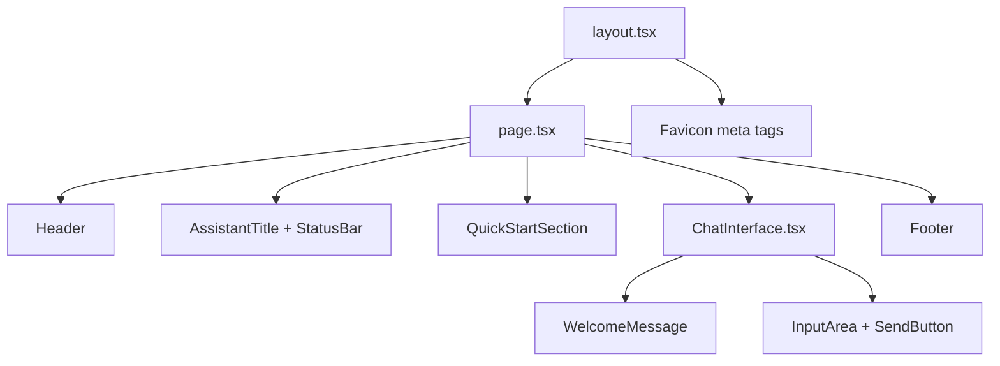

# Design Document: UI Enhancements Round Two

## Overview

This design covers a comprehensive set of branding and UI refinements for the MC ChatMaster frontend. The changes span the header logo, assistant title, status bar, quick-start section, welcome message, input field/send button, footer, responsive layout, favicon, and overall brand consistency. All work is confined to the Next.js 14 frontend (`frontend/`) and touches primarily `frontend/app/page.tsx`, `frontend/components/ChatInterface.tsx`, `frontend/app/layout.tsx`, `frontend/app/globals.css`, and `frontend/app/styles/design-tokens.css`.

The goal is to tighten MC Press brand alignment (orange/red #EF9537/#990000, purple, green #A1A88B), replace hardcoded document counts with dynamic API-fetched values, improve mobile usability, and add visual polish (background ovals, animations, favicon).

## Architecture

The changes are purely frontend. No new backend endpoints are required — the existing `GET /documents` endpoint already returns documents with `document_type` fields that the frontend uses to compute `bookCount` and `articleCount`. The current `page.tsx` already fetches these counts dynamically; the design ensures they flow into all UI locations that display them.

### Component Hierarchy (affected)



### Design Decisions

1. **No new components for header/footer** — The header and footer are currently inline JSX in `page.tsx`. Given their moderate complexity, they will remain inline but be refactored into clearly commented sections. Extracting them into separate components is optional and out of scope for this feature.

2. **Background ovals via CSS pseudo-elements** — Faint scattered light blue ovals will be rendered using CSS `::before`/`::after` pseudo-elements with `border-radius: 50%` and low opacity, positioned absolutely. This avoids extra DOM nodes and keeps the markup clean.

3. **Favicon via `layout.tsx` metadata** — Next.js 14 supports favicon configuration through the `metadata` export in `layout.tsx`. We'll place favicon files in `frontend/public/` and reference them in the metadata object.

4. **Tooltip via CSS `title` attribute + custom CSS tooltip** — The status bar tooltip will use a lightweight CSS-only approach with `::after` pseudo-element on hover, avoiding a tooltip library dependency.

5. **Pulse animation respects `prefers-reduced-motion`** — The existing `globals.css` already has a `@media (prefers-reduced-motion: reduce)` block. New animations will be added to this block.

## Components and Interfaces

### 1. Header (in `page.tsx`)

Current: Displays logo image, user email, History button, Logout button.

Updated:
- Replace `` logo with a styled text wordmark: `MC |` (black + orange/red bar), `CHAT` (bold red #990000), `MASTER` (black).
- Add tagline "Instant AI-Powered IBM i Expertise" next to logo on desktop, stacked on mobile.
- Add sub-line "Your 24/7 Knowledge Assistant" below tagline.
- Add powered note "Powered by MC Press Knowledge" linking to `https://mc-store.com/products/mc-chatmaster`.
- Add background ovals via CSS class `header-bg-ovals`.

### 2. Assistant Title (in `page.tsx`)

Current: `<h2>` with text "MC ChatMaster Assistant", `text-lg font-semibold`.

Updated:
- Text changed to "MC ChatMaster – Your IBM i Expertise Companion".
- Font size increased to `text-xl` or `text-2xl`, weight `font-bold`.
- Orange/red accent underline via `border-bottom` or `::after` pseudo-element with gradient from `#EF9537` to `#990000`.

### 3. Status Bar (in `page.tsx`)

Current: Shows "✨ MC ChatMaster Ready!" with `{bookCount} Books & {articleCount} Articles Loaded • Instant Expertise Active`.

Updated:
- Text: "MC ChatMaster Primed & Continuously Updating! {bookCount} Books & {articleCount}+ Articles Loaded – Fresh Insights Added as MC Press Publishes".
- Tooltip on hover: "Knowledge base auto-updates with every new MC Press publication".
- `bookCount` and `articleCount` remain dynamically fetched from `GET /documents` (already implemented).

### 4. Quick Start Section (in `page.tsx`)

Current: 4 buttons with orange, purple, green, blue colors.

Updated:
- Title: "Instant Mastery Insights: Try These Expert IBM i & RPG Questions".
- At least 6 buttons with MC Press palette:
  - Orange/red: "Modernize Legacy RPG to Free-Format", "Master DB2 Config on IBM i"
  - Purple: "Optimize Your RPG Skills", "High Availability with PowerHA Essentials"
  - Green: "Ace IBM i System Admin", "Secure Your IBM i Environment"
- Button labels refined to reference MC Press source tie-ins.

### 5. Welcome Message (in `ChatInterface.tsx`)

Current: 80x80px chat bubble icon, text about "MC ChatMaster Ready for Your Query!".

Updated:
- Chat bubble icon size increased to 96x96px or 112x112px (`w-24 h-24` or `w-28 h-28`).
- Subtle pulse animation on the icon (CSS `@keyframes pulse-gentle`) that respects `prefers-reduced-motion`.
- Words "24/7" and "Mastering" rendered in orange/red (`#EF9537` or `#990000`) using `<span>` elements.
- New line: "Get Precise, Sourced Answers – Every Response Links to Original MC Press Articles/Books".

### 6. Input Field & Send Button (in `ChatInterface.tsx`)

Current: Placeholder "Ask MC ChatMaster Anything", blue send button with "Send" label.

Updated:
- Placeholder: "Ask MC ChatMaster Anything About IBM i, RPG, DB2...".
- Send button background: orange/red (`#EF9537` or `#990000`) instead of blue.
- Send button label: "Ask Expert" (idle), "Thinking..." with spinner (streaming).
- Hint text below input: "Unlimited Queries • 24/7 • Sources Always Linked" in small muted text.

### 7. Footer (in `page.tsx`)

Current: Single line "MC ChatMaster: Instant AI-Powered IBM i Expertise".

Updated:
- Text: "MC ChatMaster: Instant AI-Powered IBM i Expertise – Powered by MC Press Online".
- Links to `mcpressonline.com` and `mc-store.com`.
- Privacy note: "Private • Secure • Continuously Updated Knowledge Base".
- Background ovals via CSS class `footer-bg-ovals`.

### 8. Responsive Adaptations

- `< 640px`: Quick-start buttons stack vertically (`flex-col`), input field full-width, send button full-width or min 44x44px touch target.
- `640px–1024px`: Adjusted spacing and font sizes for tablet.
- `320px` minimum: All text readable without horizontal scroll.

### 9. Favicon (in `layout.tsx` + `public/`)

- Place `favicon.ico` (16x16, 32x32), `favicon-16x16.png`, `favicon-32x32.png`, `apple-touch-icon.png` (180x180) in `frontend/public/`.
- Update `metadata` in `layout.tsx` to include `icons` configuration.

### 10. Brand Consistency

- Use "MC ChatMaster" (capital C, capital M) everywhere.
- Background ovals in header, main content area, and footer.
- Source link CTA appended to chat responses: "Need more details? Dive into the full source: [link]" when sources are available.
- All `bookCount`/`articleCount` values fetched dynamically (already implemented, ensure no hardcoded fallbacks).

## Data Models

No new data models are introduced. The existing data flow is:

```typescript
// Already in page.tsx — no changes needed to data fetching
const [bookCount, setBookCount] = useState(0)
const [articleCount, setArticleCount] = useState(0)

// Fetched from GET /documents endpoint
setBookCount(documents.filter((d: any) => d.document_type === 'book').length)
setArticleCount(documents.filter((d: any) => d.document_type === 'article').length)
```

The `bookCount` and `articleCount` values are passed down or used inline in `page.tsx`. The `ChatInterface` component receives `hasDocuments` as a prop — no additional props are needed since the welcome message changes are self-contained within `ChatInterface.tsx`.

For the source link CTA in chat responses, the existing `message.sources` array (type `Source[]`) already contains `mc_press_url` fields that can be used to construct the "Dive into the full source" link.

### Favicon Files

New static assets required in `frontend/public/`:
- `favicon.ico` (multi-size ICO: 16x16, 32x32)
- `favicon-16x16.png`
- `favicon-32x32.png`
- `apple-touch-icon.png` (180x180)

These will be generated from the existing `mc-chatmaster-logo.png`.


## Correctness Properties

*A property is a characteristic or behavior that should hold true across all valid executions of a system — essentially, a formal statement about what the system should do. Properties serve as the bridge between human-readable specifications and machine-verifiable correctness guarantees.*

### Property 1: Dynamic status bar reflects actual counts

*For any* pair of non-negative integers (bookCount, articleCount) returned by the documents API, the rendered status bar text shall contain the string representation of both bookCount and articleCount, and shall never display a fixed/hardcoded number that doesn't match the input values.

**Validates: Requirements 3.1, 3.2, 10.4**

### Property 2: Send button label reflects streaming state

*For any* boolean streaming state, when `isStreaming` is `false` the send button shall display the label "Ask Expert", and when `isStreaming` is `true` the send button shall display the label "Thinking...".

**Validates: Requirements 6.3, 6.4**

### Property 3: Brand name casing consistency

*For any* visible text string in the application source that references the product name, it shall use the exact casing "MC ChatMaster" (capital C in Chat, capital M in Master) and never use variants like "MC Chatmaster", "MC chatmaster", "Mc ChatMaster", etc.

**Validates: Requirements 10.1**

### Property 4: Source CTA appended to responses with available links

*For any* assistant chat message that has at least one source with a non-empty `mc_press_url`, the rendered response shall include the text "Need more details? Dive into the full source:" followed by a link. For any assistant message with no sources or no `mc_press_url` values, the CTA text shall not appear.

**Validates: Requirements 10.3**

## Error Handling

### API Fetch Failures (Document Counts)

- If `GET /documents` fails or returns a non-200 status, `bookCount` and `articleCount` remain at their default value of `0`. The status bar should gracefully display "0 Books & 0+ Articles Loaded" rather than showing an error in the status bar itself. The existing error status indicator already handles connection failures separately.

### Missing Favicon Files

- If favicon files are missing from `public/`, the browser falls back to its default favicon. No runtime error occurs — this is a build-time/deployment concern.

### Missing Source URLs in Chat Responses

- When `message.sources` exists but none of the sources have a `mc_press_url`, the source CTA ("Need more details?...") should not render. The code should check for the presence of at least one truthy `mc_press_url` before appending the CTA.

### Responsive Edge Cases

- On viewports narrower than 320px, content may wrap but should never overflow horizontally. The `overflow-x-hidden` or `max-w-full` utilities should be applied to prevent horizontal scroll.
- Touch targets for buttons must maintain minimum 44x44px on mobile even if text is short.

## Testing Strategy

### Unit Tests (Jest + React Testing Library)

Unit tests verify specific examples and edge cases:

- Header renders correct logo text segments ("MC |", "CHAT", "MASTER").
- Header contains tagline, sub-line, and powered note link with correct href.
- Assistant title displays correct text.
- Status bar tooltip contains correct text.
- Quick-start section has at least 6 buttons including the two required labels.
- Welcome message contains the source attribution line.
- Input field has correct placeholder text.
- Hint text is present below input.
- Footer contains correct text, links, and privacy note.
- Favicon metadata includes correct icon sizes.

### Property-Based Tests (fast-check)

Property-based tests verify universal properties across randomized inputs. Use the `fast-check` library for TypeScript/JavaScript property-based testing.

Configuration:
- Minimum 100 iterations per property test.
- Each test tagged with a comment referencing the design property.

**Property tests to implement:**

1. **Feature: ui-enhancements-round-two, Property 1: Dynamic status bar reflects actual counts**
   - Generate random non-negative integer pairs for bookCount/articleCount.
   - Call the status bar rendering logic (or a helper function that produces the status text).
   - Assert the output string contains both numbers as substrings.

2. **Feature: ui-enhancements-round-two, Property 2: Send button label reflects streaming state**
   - Generate random boolean for isStreaming.
   - Render the send button or call the label logic.
   - Assert label is "Ask Expert" when false, "Thinking..." when true.

3. **Feature: ui-enhancements-round-two, Property 3: Brand name casing consistency**
   - Scan all `.tsx` and `.ts` source files for strings matching `/mc\s*chat\s*master/i`.
   - Assert every match uses the exact casing "MC ChatMaster".
   - This is a static analysis property test — generate random file selections from the source set and verify.

4. **Feature: ui-enhancements-round-two, Property 4: Source CTA appended to responses with available links**
   - Generate random arrays of Source objects, some with `mc_press_url` and some without.
   - Call the response rendering logic.
   - Assert CTA text appears if and only if at least one source has a truthy `mc_press_url`.

### Testing Balance

- Unit tests cover the specific text content, link hrefs, element counts, and static examples from the acceptance criteria.
- Property tests cover the dynamic/parameterized behaviors (count interpolation, streaming state labels, brand consistency, source CTA logic).
- Responsive behavior (Requirements 8.x) should be validated through manual testing or E2E tests with viewport simulation (e.g., Playwright), not through unit or property tests.
