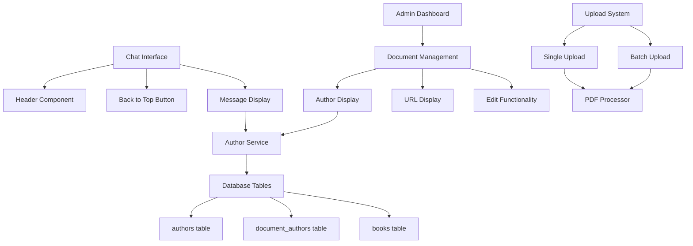

# Design Document

## Overview

This design addresses comprehensive UI improvements and fixes for the MC Press chatbot system. The focus is on removing demo branding, improving navigation with a back-to-top button, updating the admin dashboard to display complete metadata including author URLs and article links, fixing author display issues throughout the system, ensuring edit functionality works properly, and verifying that upload features use the correct processing pipelines.

## Architecture

### System Components



### Data Flow

1. **Chat Interface**: User scrolls → Back to Top Button appears → Smooth scroll to top
2. **Admin Dashboard**: Load documents → Fetch author data → Display complete metadata with URLs
3. **Edit Flow**: User edits → Validate data → Update database → Refresh display
4. **Upload Flow**: File upload → PDF processing → Metadata extraction → Database storage

## Components and Interfaces

### Header Component Updates

**Location**: `frontend/app/page.tsx` - Header section

**Current Issues**:
- Contains hardcoded "Demo Version" text in the header
- Text appears in line 43: `<span className="ml-4 text-sm" style={{ color: 'var(--text-secondary)' }}>Demo Version</span>`

**Required Changes**:
- Remove the "Demo Version" span element entirely
- Preserve all other header functionality and styling
- Maintain responsive layout without the demo text

### Back to Top Button Component

**Location**: New component to be added to `frontend/components/ChatInterface.tsx`

**Implementation Details**:
- Floating button positioned fixed at bottom-right of viewport
- Appears when user scrolls down more than 300px from top
- Smooth scroll animation when clicked
- Uses existing MC Press design system colors and styling
- Accessible with proper ARIA labels and keyboard navigation

**Button Specifications**:
- Position: `fixed bottom-6 right-6`
- Size: 48x48px circular button
- Background: MC Press blue (`var(--mc-blue)`)
- Icon: Up arrow SVG
- Hover effects: Slight scale and shadow increase
- Fade in/out animation based on scroll position

### Admin Dashboard Enhancements

**Location**: `frontend/app/admin/documents/page.tsx`

**Current Issues**:
- Only shows basic metadata (title, author, MC Press URL)
- Missing author website URLs
- Missing article URLs for articles
- Edit functionality may not be persisting changes properly

**Required Changes**:
- Add "Author URLs" column to display author website links
- Add "Article URL" column for articles (separate from MC Press URL)
- Enhance the document fetching to include complete author information
- Update the display to show multiple authors with their respective website URLs
- Fix edit functionality to properly save and refresh data

**New Table Structure**:
```
| Title | Authors | Author URLs | Article URL | MC Press URL | Actions |
```

### Author Display System

**Location**: Multiple components - `frontend/components/CompactSources.tsx`, Admin Dashboard

**Current Issues**:
- Shows "Unknown Author" instead of actual author names
- May not be using the correct database tables (authors, document_authors)
- Inconsistent author display between chat and admin interfaces

**Required Changes**:
- Update source enrichment to properly join author tables
- Ensure both chat and admin interfaces use the same author data source
- Display multiple authors correctly with proper ordering
- Show author website URLs where available

**Database Integration**:
- Use `document_authors` table for author-document relationships
- Join with `authors` table to get author names and website URLs
- Maintain backward compatibility with legacy author field in books table

### Edit Feature Fixes

**Location**: `frontend/app/admin/documents/page.tsx` - Edit functionality

**Current Issues**:
- Changes may not be persisting to database
- Page refresh doesn't show updated information
- Possible transaction or API endpoint issues

**Required Changes**:
- Verify API endpoints are working correctly
- Add proper error handling and user feedback
- Ensure database transactions are committed properly
- Add loading states during edit operations
- Implement optimistic updates with rollback on failure

### Upload System Verification

**Location**: `frontend/app/admin/upload/page.tsx`, `frontend/components/FileUpload.tsx`

**Current Processing Pipeline**:
- Single upload: Uses `/upload` endpoint
- Batch upload: Uses `/batch-upload` endpoint
- Both should use the same PDF processor: `backend/pdf_processor_full.py`

**Verification Requirements**:
- Ensure both upload methods use the same processing pipeline
- Verify PDF text extraction is working correctly
- Confirm embedding generation is consistent
- Check that metadata is properly populated in all required tables
- Validate that uploaded documents appear in both chat results and admin dashboard

## Data Models

### Enhanced Document Display Model
```typescript
interface EnhancedDocument {
  id: string;
  filename: string;
  title: string;
  document_type: 'book' | 'article';
  authors: Author[];
  article_url?: string;
  mc_press_url?: string;
  category?: string;
  total_pages?: number;
  processed_at: string;
}

interface Author {
  id: number;
  name: string;
  site_url?: string;
  order: number;
}
```

### Back to Top Button State
```typescript
interface BackToTopState {
  isVisible: boolean;
  scrollPosition: number;
  isScrolling: boolean;
}
```

## Correctness Properties

*A property is a characteristic or behavior that should hold true across all valid executions of a system-essentially, a formal statement about what the system should do. Properties serve as the bridge between human-readable specifications and machine-verifiable correctness guarantees.*

Based on the prework analysis, here are the key correctness properties for this system:

### Property 1: Functionality Preservation During Demo Removal
*For any* existing chat interface functionality, removing demo branding should not affect the operation of chat features, navigation, or user interactions
**Validates: Requirements 1.3**

### Property 2: Back to Top Button Scroll Behavior
*For any* scroll position greater than 300px from the top, the back to top button should be visible and clicking it should smoothly scroll to position 0
**Validates: Requirements 2.1, 2.2, 2.3**

### Property 3: Admin Dashboard Author URL Display
*For any* document with authors that have website URLs, the admin dashboard should display those URLs alongside the author names
**Validates: Requirements 3.1**

### Property 4: Document Type URL Display Consistency
*For any* document, if it's an article it should show article_url, if it's a book it should show mc_press_url, and the admin dashboard should display the appropriate URL type
**Validates: Requirements 3.2, 3.3**

### Property 5: Search Functionality Preservation
*For any* search query in the admin dashboard, the search functionality should continue to work correctly after UI enhancements are added
**Validates: Requirements 3.4**

### Property 6: Missing Data Graceful Handling
*For any* document with missing metadata fields, the admin dashboard should display appropriate placeholders or "Not Available" indicators instead of empty or broken displays
**Validates: Requirements 3.5**

### Property 7: Author Name Resolution
*For any* document that has authors in the database, the author display should show the actual author names from the authors table instead of "Unknown Author"
**Validates: Requirements 4.1**

### Property 8: Multiple Author Display Ordering
*For any* document with multiple authors, the author display should show all authors in the correct order as specified in the document_authors table
**Validates: Requirements 4.2**

### Property 9: Database Table Consistency
*For any* author information displayed, both chat and admin interfaces should retrieve data from the same database tables (authors and document_authors)
**Validates: Requirements 4.3, 7.1**

### Property 10: Author Data Source Precedence
*For any* document with both legacy author data and multi-author data, the system should use the multi-author data when available
**Validates: Requirements 4.4**

### Property 11: Edit Persistence
*For any* edit operation that reports success, the changes should be saved to the database and visible after page refresh
**Validates: Requirements 5.1, 5.2**

### Property 12: Edit Error Handling
*For any* edit operation that fails, the system should display specific error messages and not leave the interface in an inconsistent state
**Validates: Requirements 5.4**

### Property 13: Input Validation
*For any* invalid input data in edit forms, the system should reject the input with appropriate validation messages before attempting database updates
**Validates: Requirements 5.5**

### Property 14: Upload Processing Consistency
*For any* document uploaded via either single or batch upload, the processing pipeline should extract text, generate embeddings, and populate metadata in the same way
**Validates: Requirements 6.2, 6.3**

### Property 15: Upload Visibility
*For any* successfully uploaded document, it should appear in both chat search results and the admin dashboard document list
**Validates: Requirements 6.4**

### Property 16: Document Type Handling
*For any* uploaded document, the system should correctly classify it as either article or book type and handle the metadata accordingly
**Validates: Requirements 6.5**

### Property 17: Metadata Enrichment Consistency
*For any* document metadata displayed, the admin dashboard should use the same enrichment process as the chat interface to ensure consistent information
**Validates: Requirements 7.2, 7.5**

### Property 18: Edit-Display Data Consistency
*For any* data edited through the admin interface, the changes should update the same database tables that the display components read from
**Validates: Requirements 7.3**

### Property 19: Database Population Consistency
*For any* upload operation, all required database tables should be populated consistently regardless of document type
**Validates: Requirements 7.4**

### Property 20: Author Display Formatting Consistency
*For any* author information displayed, the formatting should be consistent between chat results and admin interface
**Validates: Requirements 8.3**

### Property 21: Error Message Styling Consistency
*For any* error that occurs in the edit feature, the error messages should follow the application's design system and styling patterns
**Validates: Requirements 8.4**

### Property 22: Chat Functionality Preservation
*For any* existing chat feature, adding the back to top button should not interfere with or break the chat functionality
**Validates: Requirements 8.5**

<function_calls>
<invoke name="prework">
<parameter name="featureName">ui-improvements-and-fixes

## Error Handling

### Frontend Error Handling
- **Missing Author Data**: Display "Unknown Author" as fallback, log missing data for debugging
- **Failed API Calls**: Show user-friendly error messages, provide retry options
- **Invalid Edit Data**: Validate inputs client-side, show specific validation errors
- **Network Issues**: Display connection error messages, maintain offline-friendly behavior

### Backend Error Handling
- **Database Connection Failures**: Retry with exponential backoff, return appropriate HTTP status codes
- **Author Table Join Failures**: Fall back to legacy author field, log join issues for debugging
- **Upload Processing Errors**: Return specific error messages, clean up partial uploads
- **Transaction Failures**: Rollback changes, report specific failure reasons

### UI Error States
- **Edit Form Errors**: Highlight invalid fields, show inline validation messages
- **Upload Errors**: Display progress with error states, allow retry of failed uploads
- **Loading States**: Show appropriate spinners and loading indicators
- **Empty States**: Display helpful messages when no data is available

## Testing Strategy

### Unit Tests
- Test back to top button visibility logic with various scroll positions
- Test author display formatting with different author data configurations
- Test edit form validation with various input combinations
- Test URL display logic for different document types
- Test error message formatting and styling consistency

### Property-Based Tests
- Generate random scroll positions and verify back to top button behavior
- Generate random document data and verify author display consistency
- Generate random edit operations and verify persistence
- Generate random upload data and verify processing consistency
- Test metadata enrichment with various document configurations

### Integration Tests
- End-to-end test: Remove demo text → Verify header layout preservation
- End-to-end test: Add back to top button → Verify chat functionality preservation
- End-to-end test: Update admin dashboard → Verify author URLs display correctly
- End-to-end test: Edit author data → Verify changes persist and display correctly
- End-to-end test: Upload document → Verify appears in both chat and admin

### Manual Testing
- Verify demo text removal doesn't break header layout
- Test back to top button on various screen sizes and devices
- Verify admin dashboard shows complete metadata including URLs
- Test edit functionality with various data types and edge cases
- Verify upload system uses correct processing pipeline for both single and batch uploads

### Accessibility Testing
- Verify back to top button is keyboard accessible
- Test screen reader compatibility with new UI elements
- Ensure proper ARIA labels and roles are implemented
- Test color contrast and visual accessibility standards
- Verify focus management and tab order