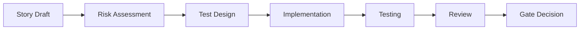

# BMad Method - Agent Reference Guide

**Purpose**: This document serves as a reference for all BMad agents working on the MC Press Chatbot project.  
**Source**: BMad Method User Guide  
**Project Type**: Brownfield (existing codebase)

---

## Quick Reference: BMad Workflow for MC Press Chatbot

### Current Project Status
- ✅ Architecture documented (`docs/architecture.md`)
- ✅ PRD created (`docs/prd.md`)
- 🔄 Next: Shard into epics/stories (PM agent)
- ⏳ Then: Implement Month 0 tasks (Dev agent)

---

## BMad Method Overview

The BMad Method is an agile AI-driven planning and development framework that uses specialized agents for different aspects of software development.

### Core Agents

1. **BMad-Master**: Can do any task except story implementation
2. **BMad-Orchestrator**: Web-only, facilitates team coordination
3. **PM (Product Manager)**: Creates PRDs, shards documents into epics/stories
4. **Architect**: Designs system architecture, technical decisions
5. **Dev**: Implements stories and features
6. **QA (Quinn)**: Test architecture, risk assessment, quality gates

---

## Brownfield Workflow (For Existing Projects Like MC Press Chatbot)

Since MC Press Chatbot is an existing project, follow the brownfield approach:

### Phase 1: Documentation (COMPLETED)
1. ✅ Document existing architecture → `docs/architecture.md`
2. ✅ Create PRD for enhancements → `docs/prd.md`

### Phase 2: Planning (CURRENT)
1. 🔄 PM agent shards PRD into epics
2. ⏳ PM agent creates user stories from epics
3. ⏳ Stories go to `docs/stories/` folder

### Phase 3: Development Cycle


---

## File Structure & Conventions

### Standard BMad Paths
```
project/
├── .bmad-core/           # BMad configuration
│   ├── core-config.yaml  # Critical config
│   ├── agents/           # Agent definitions
│   ├── tasks/            # Task templates
│   └── data/             # Knowledge base
├── docs/
│   ├── prd.md           # Product Requirements
│   ├── architecture.md   # System Architecture
│   ├── epics/           # Sharded epics
│   ├── stories/         # User stories
│   └── qa/
│       ├── assessments/ # Test strategies
│       └── gates/       # Quality gates
```

### MC Press Chatbot Specific Paths
```
mcpress-chatbot/
├── frontend/            # Next.js application
├── backend/             # FastAPI server
├── docs/               # BMad documents
└── .bmad-core/         # BMad configuration
```

---

## Agent Commands Reference

### PM Agent Commands
```bash
*help                    # Show available commands
*create-prd             # Create PRD from requirements
*shard {document}       # Break document into epics/stories
*create-story           # Create user story
*yolo                   # Toggle rapid generation mode
```

### Dev Agent Commands
```bash
*help                   # Show available commands
*implement {story}      # Implement a user story
*fix {issue}           # Fix a bug or issue
*refactor {component}  # Refactor code
```

### QA Agent (Quinn) Commands
```bash
*risk {story}          # Assess implementation risks
*design {story}        # Create test strategy
*trace {story}         # Verify test coverage
*nfr {story}          # Check quality attributes
*review {story}       # Full assessment + gate
*gate {story}         # Update gate status
```

---

## Development Workflow for MC Press Chatbot

### Month 0 Tasks (Technical Debt)
1. **Remove Search Feature** (FR-001)
   - Remove UI component
   - Disable backend endpoints
   - Update routing

2. **Build Admin Dashboard** (FR-002)
   - Authentication system
   - Upload interface
   - Metadata editor
   - Audit logging

### Implementation Process
1. PM creates story from PRD requirement
2. QA runs `*risk` and `*design` before development
3. Dev implements the story
4. QA runs `*trace` during development
5. QA runs `*review` when complete
6. QA issues gate decision

---

## Quality Gates & Testing

### Gate Status Meanings
- **PASS**: All critical requirements met
- **CONCERNS**: Non-critical issues found
- **FAIL**: Critical issues must be addressed
- **WAIVED**: Issues acknowledged but accepted

### Risk Scoring
- Score = Probability × Impact (1-9 scale)
- Scores ≥9 trigger FAIL
- Scores ≥6 trigger CONCERNS

---

## Context Management

### Developer Context Files
The following files should ALWAYS be loaded for the dev agent:
```yaml
devLoadAlwaysFiles:
  - docs/architecture.md
  - docs/architecture/coding-standards.md
  - docs/architecture/tech-stack.md
```

### For MC Press Chatbot
- Keep architecture.md lean and current
- Update technical debt section regularly
- Document patterns as they emerge

---

## Best Practices

### For All Agents
1. Keep context focused and relevant
2. Use appropriate agent for each task
3. Work in small, focused increments
4. Update documents as you go
5. Commit regularly

### For Brownfield Projects
1. Document existing system thoroughly
2. Identify and prioritize technical debt
3. Plan incremental improvements
4. Maintain backward compatibility
5. Test for regressions

### For MC Press Chatbot Specifically
1. Preserve existing PostgreSQL/pgvector setup
2. Maintain Railway deployment compatibility
3. Follow MC Press brand guidelines
4. Consider IBM i developer workflows
5. Focus on productivity features

---

## Communication Between Agents

### Handoff Protocol
1. Complete your task fully
2. Update relevant documents
3. Create clear handoff notes
4. Tag the next agent needed

### Example Handoff
```markdown
## Handoff to Dev Agent
- Story: FR-002 Admin Dashboard
- Risk Assessment: Complete (see qa/assessments/)
- Test Design: Complete (15 test scenarios)
- Ready for: Implementation
- Notes: Focus on security for admin auth
```

---

## MC Press Chatbot Specific Context

### Business Context
- **Owner**: David (MC Press Publisher)
- **Target Users**: IBM i developers
- **Pricing**: $20/$35/$60 per month tiers
- **Unique Value**: Exclusive MC Press content

### Technical Context
- **Frontend**: Next.js + TypeScript + Tailwind
- **Backend**: FastAPI + Python
- **Database**: Supabase PostgreSQL + pgvector
- **Deployment**: Railway
- **AI**: OpenAI GPT-4

### Current Priorities
1. Remove broken search feature
2. Add admin dashboard for David
3. Implement file upload & code analysis
4. Add code generation features

---

## Common Pitfalls to Avoid

### General BMad Pitfalls
- Don't skip QA risk assessment
- Don't implement without stories
- Don't ignore gate decisions
- Don't mix agent responsibilities

### MC Press Chatbot Pitfalls
- Don't break Railway deployment
- Don't lose existing PDF data
- Don't ignore brand guidelines
- Don't add features without David's input

---

## Getting Help

### BMad Resources
- Discord Community: Join BMad Discord
- Documentation: Browse BMad docs
- YouTube: BMadCode Channel

### Project-Specific Help
- Architecture: See `docs/architecture.md`
- Requirements: See `docs/prd.md`
- Roadmap: See `docs/MC-Press-Chatbot-Feature-Roadmap.md`

---

## Appendix: Quick Command Reference

### Switching Agents
```bash
*exit                  # Exit current agent
@pm {command}         # Call PM agent
@architect {command}  # Call Architect
@dev {command}        # Call Developer
@qa {command}         # Call QA (Quinn)
```

### Project Navigation
```bash
cd /Users/kevinvandever/kev-dev/mcpress-chatbot  # Project root
ls docs/              # View documentation
ls .bmad-core/        # View BMad config
```

---

*This guide should be referenced by all agents working on the MC Press Chatbot project. Update it as the project evolves and new patterns emerge.*